# Redis

## 一、Redis安装

```
yum install wget   wget是Linux中的一个下载文件的工具
yum install gcc    安装的是编译c语言的环境 
mkdir soft         创建一个soft目录，用于存放redis相关文件
cd soft            进入到soft目录
wget http://download.redis.io/releases/redis-5.0.5.tar.gz 
                    下载redis
tar xf redis-5.0.5.tar.gz 解压
cd redis-5.0.5     进入redis目录
注意看readme.md
注意：make命令是会调用 Makefile文件
make     执行编译
make install PREFIX=/opt/lijingyu/redis5  将脚本文件安装到指定目录  将文件迁出，和源码分离
cd /opt/lijingyu/  进入到目录 
vi /etc/profile
export REDIS_HOME=/opt/lijingyu/redis5
export PATH=$PATH:$REDIS_HOME/bin
source /etc/profile
进入到redis 的utils 目录
./install_server.sh  默认端口是6379
 cd /etc/init.d  可执行文件会生成到这个目录
 service redis_6379 status  看运行状态
 ps -fe | grep redis  可以查看当前的进程
```


## 二、NIO原理

- 磁盘和数据库索引

  ​        磁盘是4k分页，所以无论取多少数据，每次都是最少4k的读取，所以存在4k对齐现象。数据库数据分页，也是最小单位4k进行分页，索引也是4k分页。将数据和索引维护在磁盘上。在内存中用B+树维护索引和数据的对应关系树状图。

  ​         数据库表很大的情况下，增删改会变慢，因为每次操作都需要重新维护索引。对于查询来讲，单个的或者少量的查询，如果where条件可以命中索引，那么速度依然很快。但是对于并发大的查询，因为会同时命中磁盘上的多条数据，磁盘的访问速度会成为瓶颈，还有网络带宽也会成为瓶颈，最终会影响速度。

  

## 三、epoll


## 四、五大数据类型

### 4.1、String

1. String类型是二进制安全的。意味着Redis的string可以包含任何数据。比如jpg图片或者序列化的对象。一个Redis中字符串value最多可以是512M。

2. 数据结构：简单动态字符串，内部结构类似java中的ArrayList。会进行动态的扩缩容。采用预分配冗余空间的方式来减少内存的频繁分配。内部为字符串分配的空间大小实际上会比字符串的length大一些。当字符串大小小于1M时，发生扩容时，会翻倍扩容。当大于1M时，扩容会以每次增加1M空间的规则来进行扩容。

   

3. 常用命令

   

- set key value ：添加键值对

  set key1 value EX 10 NX  当key1不存在时，设置key1,10秒过期。

  NX：当数据库中key不存在时，可以将key-value添加数据库
  XX：当数据库中key存在时，可以将key-value添加数据库，与NX参数互斥
  EX：key的过期秒数
  PX：key的过期毫秒数，与EX互斥

- get key：查询对应键值

- append key value：将给定的value追加到原值的末尾。

- strlen key：获得值的长度。

- setnx  key value：只有在key不存在时，才能设置key的值。

- incr key：将key中储存的数字值增1，只能对数字值操作，如果为空，新增值为1。

- decr key：将 key 中储存的数字值减1，只能对数字值操作，如果为空，新增值为-1

- incrby / decrby  key amount：将key中储存的数字值增减。自定义步长。 incrby k1 10，增加10。

- 批量操作，原子性，有一个失败则都失败。

- mset  key1 value1 key2 value2 ..... ：同时设置一个或多个key-value对 。

- mget  key1 key2 key3 .....：同时获取一个或多个value。  

- msetnx key1 value1 key2 value2 ..... ：同时设置一个或多个 key-value 对，当且仅当所有给定 key 都不存在时，才会设置成功。

- getrange  key start end：获得值的范围，类似java中的substring，前包，后包。比如value为0123456 那么getrange key 0 1 结果为01，getrange key 2 3结果为23。

- setrange  key offset value：用 value覆写key所储存的字符串值，从offset位置开始(索引从0开始)，进行值的替换。当替换的字符数量超过1时，会对原值从offset开始，批量进行替换，即使超过原值的总长度也可以。

- setex  key seconds value：设置键值的同时，设置过期时间，单位秒。

- getset key value：以新换旧，设置了新值同时获得旧值。

### 4.2、bitmap

1. 一个字节占8位，内存中可以存多个字节，但是也可以用连续的内存空间存储连续的字节。比如010000010000100001  这就算位图bitmap。用于操作具体某一位字节的。

2. setbit k1 1 1  给第一位设置为1  结果就是01000000 最小单位为一个字节。此时strlen 长度，就是1

3. 使用场景示例：

   - 统计最近一段时间某个用户登陆系统的天数，用bitmap  365位代表一年，登陆一次，setbit 当前对应的位置为1 SETBIT sean 7 1

     在最后统计一段区间内1的个数，就是当前用户登陆的天数 bitcount sean 0 -1。

   - 统计一段时间内登陆系统的用户总数，区分僵尸用户和活跃真实用户。

     setbit 20200816 1 1 

     setbit 20200816 5 1 

     setbit 20200817 1 1

     key为日期，value用bitmap记录登陆，bitop or 或操作，统计用户

   

4. 常用指令：

- SETBIT key offset value：给key 的某个偏移量的二进制位设置0或者1，下标从0开始。
- BITPOS key bit [start] [end]： 查找二进制0 或者1  在value对应的二进制字节中，某个区间内第一次出现的位置，比如 BITPOS k5 1 1 5  返回k5对应的value中，1-5字节位区间内，第一个1出现的位置，找不到则返回-1。
- BITCOUNT key [start end]：二进制位1出现的总次数。
- BITOP operation destkey key [key ...] ：二进制位操作  and 与 or 或  将key1  key2... 进行按位操作赋值给destkey。

### 4.3、List

1. 简单的字符串列表，类似java中的ArrayList，按照插入顺序排序，并且可以添加一个元素到列表的头或者尾部，也可以从头、尾部移除元素。

2. 内部实现是一个双向链表。

   

3. 数据结构：

   底层是由quickList+ziplist行程的双向链表。链表的每个节点quickListNode是一个ziplist。

   LinkedList链表每个节点都是一个独立的存储空间，当节点数量比较多的时候，很容易造成空间的不连续，空间浪费。并且当存储的数据很小时，链表的prev、next指针会占用比较大的空间，也会造成空间浪费。所以Redis引入了ziplist压缩列表。

   ziplist 是由一系列特殊编码的内存块构成的列表，表中的每一项都存放在前后连续的内存空间上，每一项因占用的空间不同，而采用变长编码。并且没有prev、next指针，是存储上一个 entry的长度和当前entry的长度，通过长度推算下一个元素在什么地方。牺牲了读取的效率，只适合从头到尾顺序读取，并且字段的值比较小的时候，才适合ziplist。

   quickList是结合了链表、ziplist的有点的链表，每个节点可以看做是一个一个小的ziplist。既满足了快速的插入、删除、读取性能，又不会出现太大的空间冗余。

4. 常用命令：

- lpush/rpush key value1 value2 value3....： 从左边/右边插入一个或多个值。
- lpop/rpop key：从左边/右边弹出一个值，并remove。
- rpoplpush  key1 key2：从key1列表右边弹出一个值，插到key2列表左边。
- lrange key start stop：按照索引下标获得元素(从左到右)，索引下标从0开始，结尾是-1。因为是双向链表，所以正向是从0开始，反向是从-1开始。lrange key1 0 -1，0左边第一个，-1右边第一个，（0，-1表示获取所有）
- lindex key index：按照索引下标获得元素(从左到右)
- llen key：获得列表长度 。
- linsert key BEFORE|AFTER pivot value：在从左边数，第一个pivot（字符匹配项）的左侧插入插入值value，当找不到目标匹配项时，插入失败。
- lrem key count value：从左边删除count个value(从左到右)。
- lset key index value：将列表key下标为index的值替换成value。

### 4.4、Set

1. Redis Set对外提供的功能与list类似，是一个列表的功能，特殊之处在于set是可以自动去重的，当需要存储一个列表数据，又不希望出现重复数据时，set是一个很好的选择，并且set提供了判断某个成员是否在一个set集合内的重要接口，这个也是list所不能提供的。

2. Redis的Set是string类型的无序集合。它底层其实是一个value为null的hash表，所以添加，删除，查找的复杂度都是O(1)。

3. 数据结构：

   Set数据结构是dict字典，字典是用哈希表实现的。
   Java中HashSet的内部实现使用的是HashMap，只不过所有的value都指向同一个对象。Redis的set结构也是一样，它的内部也使用hash结构，所有的value都指向同一个内部值。

4. 常用命令：

- sadd key value1 value2..... ：将一个或多个 member 元素加入到集合 key 中，已经存在的 member 元素将被忽略。
- smembers key：取出该集合的所有值。
- sismember key value：判断集合key是否为含有该value值，有1，没有0。
- scard key：返回该集合的元素个数。
- srem key value1 value2....： 删除集合中的某个元素。
- spop key count：随机从该集合中弹出count个值，并remove。
- srandmember key n：随机从该集合中取出n个值。不会从集合中删除 。
- smove source destination value：把集合中一个值从一个集合移动到另一个集合。
- sinter key1 key2：返回两个集合的交集元素。
- sunion key1 key2：返回两个集合的并集元素。
- sdiff key1 key2：返回两个集合的差集元素(key1中的，不包含key2中的)。

### 4.5、Hash

1. Redis hash 是一个键值对集合。内部存储string类型的field和value的映射表，hash特别适合用于存储对象。类似Java里面的Map<String,Object>。

2. 用户ID为查找的key，存储的value用户对象包含姓名，年龄，生日等信息，如果用普通的key/value结构来存储，主要有以下2种存储方式：

   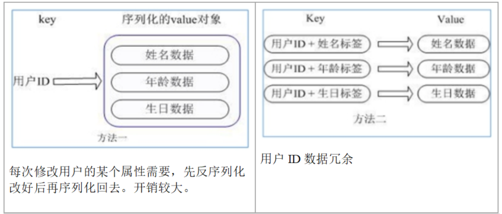

   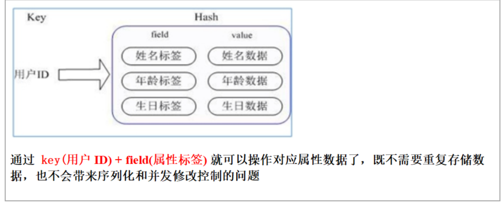

3. 数据结构：

   Hash类型对应的数据结构是两种：ziplist（压缩列表），hashtable（哈希表）。当field-value长度较短且个数较少时，使用ziplist，否则使用hashtable。

4. 常用命令：

- hset key field value：给key集合中的 field键赋值value。
- hget key1 field：从key1集合field取出 value。
- hmset key1 field1 value1 field2 value2...：批量设置hash的值。
- hexists key1 field：查看哈希表 key 中，给定域 field 是否存在。 
- hkeys key：列出该hash集合的所有field。
- hvals key：列出该hash集合的所有value。
- hincrby key field increment：为哈希表 key 中的域 field 的值加上增量 1  -1。
- hsetnx key field value：将哈希表 key 中的域 field 的值设置为 value ，当且仅当域 field 不存在才能设置成功。

### 4.6、Zset

1. Redis有序集合zset与普通集合set非常相似，是一个没有重复元素的字符串集合。不同之处是有序集合的每个成员都关联了一个评分（score）,这个评分（score）被用来按照从最低分到最高分的方式排序集合中的成员。集合的成员是唯一的，但是评分可以是重复了 。

2. 因为元素是有序的, 所以可以很快的根据评分（score）或者次序（position）来获取一个范围的元素。

3. 访问有序集合的中间元素也是非常快的,因此能够使用有序集合作为一个没有重复成员的智能列表。

4. 数据结构：

   SortedSet(zset)是Redis提供的一个非常特别的数据结构，一方面它等价于Java的数据结构Map<String, Double>，可以给每一个元素value赋予一个权重score，另一方面它又类似于TreeSet，内部的元素会按照权重score进行排序，可以得到每个元素的名次，还可以通过score的范围来获取元素的列表。
   zset底层使用了两个数据结构
   （1）hash，hash的作用就是关联元素value和权重score，保障元素value的唯一性，可以通过元素value找到相应的score值。
   （2）跳跃表，跳跃表的目的在于给元素value排序，根据score的范围获取元素列表。

5. 跳表

   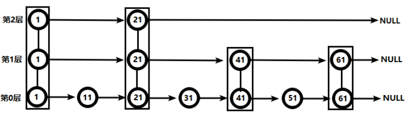

   要查找值为51的元素：

   1、从第2层开始，1节点比51节点小，向后比较。

   2、21节点比51节点小，继续向后比较，后面就是NULL了，所以从21节点向下到第1层

   3、在第1层，41节点比51节点小，继续向后，61节点比51节点大，所以从41向下

   4、在第0层，51节点为要查找的节点，节点被找到，共查找4次。

   如果使用有序链表，需要从链表头开始一次查找比较，查找效率较跳表低。

6. 常用命令：

- 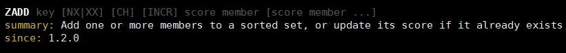

- zadd  key score1 value1 score2 value2…：将一个或多个 member 元素及其 score 值加入到有序集 key 当中。
- zrange key start stop  [WITHSCORES] ：返回有序集 key 中，下标在start、stop之间的元素，带WITHSCORES，可以让分数一起和值返回到结果集。
- zrangebyscore key min max [withscores] [limit offset count]：返回有序集 key 中，所有 score 值介于 min 和 max 之间(包括等于 min 或 max )的成员。有序集成员按 score 值递增(从小到大)次序排列。 
- zrevrangebyscore key max min [withscores] [limit offset count]：同上，改为从大到小排列。 
- zincrby key increment value：为元素的score加上增量。
- zrem  key value：删除该集合下，指定值的元素。
- zcount key min max：统计该集合，分数区间内的元素个数。
- zrank key value：返回该值在集合中的排名，从0开始。

### 4.7、key操作

- keys * ：查看当前库所有key
- exists key ：判断某个key是否存在
- type key ：查看key是什么类型
- del key ：删除指定的key数据
- unlink key ：根据key选择非阻塞删除，仅将key从keyspace元数据中删除，真正的删除会在后续异步操作。
- expire key 10 ：10秒钟，为给定的key设置过期时间
- ttl key ：查看还有多少秒过期，-1表示永不过期，-2表示已过期
- select ：切换数据库，select 1 切换到1号库
- dbsize：查看当前数据库的key的数量
- flushdb：清空当前库
- flushall：通杀全部库

### 4.8、回收策略

1. LRU：回收最少使用的键，也就是未使用时间最长的键
2. LFU：回收同样时间内，访问次数最少的键

### 4.9、key的有效期

- 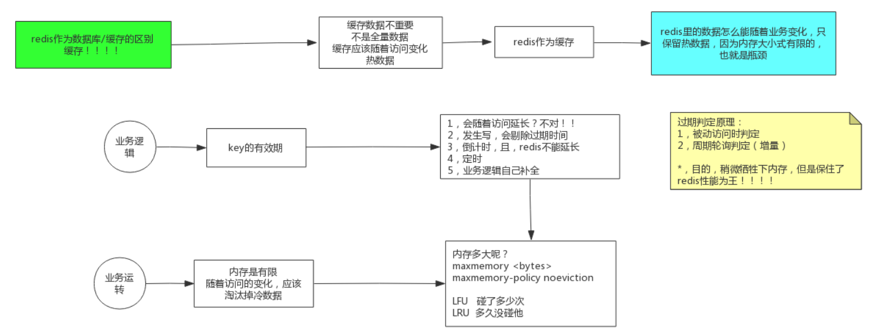

1. 只get操作不会改变过期时间，只有写操作，才会清空过期时间，ttl key  返回的是 -1代表已过期。

2. 设置key的过期时间，超过时间后，将会自动删除该key，但是不会立马删除，会按照一定策略进行删除。key过期之后，将不会再查询到。Redis淘汰过期的key有三种策略。

   - 被动删除：

     当读/写一个已经过期的key时，会触发惰性删除策略，直接删除掉这个过期key。

     但是这样是不够的，因为有些过期的key，永远不会访问他们，所以就不会被清理。但是无论如何，这些key应该过期被清理。所以redis需要主动定期清理过期的key。

   - 主动删除：

     Redis会周期性的随机测试一批设置了过期时间的key并进行处理。测试到的已过期的key将被删除。

     Redis每秒10次做的事情：

     1. 随机测试100个设置了过期时间的key
     2. 删除所有发现的已过期的key
     3. 若删除的key超过25个则重复步骤1

     这是一个基于概率的简单算法，基本的假设是抽出的样本能够代表整个key空间，redis持续清理过期的数据直至将要过期的key的百分比降到了25%以下。这也意味着在任何给定的时刻已经过期但仍占据着内存空间的key的量最多为每秒的写操作量除以4。

   - 当前已用内存超过maxmemory限定时，触发主动清理策略

     当 Redis 的内存占用超过我们设置的 maxmemory 时，会把长时间没有使用的key清理掉。按照 LRU算法，我们需要对所有key（也可以设置成只淘汰有过期时间的key）按照空闲时间进行排序，然后淘汰掉空闲时间最大的那部分数据，使得Redis的内存占用降到一个合理的值。

     LRU算法的缺点：

     1. 我们需要维护一个全部（或只有过期时间）key的列表，还要按照最近使用时间排序。这会消耗大量内存
     2. 每次操作 key 时更新对应维护列表的排序也会占用额外的CPU资源。

     对于Redis这样对性能要求很高的系统来说是不被允许的。因此，Redis采用了一种 近似LRU 的算法。当 Redis 接收到新的写入命令，而内存又不够时，就会触发近似LRU算法来强制清理一些key。

     具体清理的步骤是：

     1. Redis会对 key 进行采样，通常是取5个，然后会把过期的key放到我们上面说的“过期池”中
     2. 过期池中的 key 是按照空闲时间来排序的，Redis 会优先清理掉空闲时间最长的 key，直到内存小于 maxmemory。

     其中 Redis首先是采样了一部分key，这里采样数量 maxmemory_samples 通常是5，我们也可以自己设置，采样数量越大，结果就越接近LRU算法的结果，带来的影响是：性能随之变差。主从模式下，从库不需要清理，主库清理过期数据时，会在AOF文件中增加del操作。

   - 清理策略

     1. noeviction：不会继续处理写请求（DEL可以继续处理）。
     2. allkeys-lru：对所有key的近似LRU
     3. volatile-lru：使用近似LRU算法淘汰设置了过期时间的key
     4. allkeys-random：从所有key中随机淘汰一些key
     5. volatile-random：对所有设置了过期时间的key随机淘汰
     6. volatile-ttl：淘汰有效期最短的一部分key
     7. volatile-lfu：使用LFU算法淘汰设置了过期时间的key
     8. allkeys-lfu：从全部key中进行淘汰，使用LFU

## 五、发布订阅

- Redis 发布订阅 (pub/sub) 是一种消息通信模式：发送者 (pub) 发送消息，订阅者 (sub) 接收消息。

- Redis 客户端可以订阅任意数量的频道。

- 发布的消息没有持久化。订阅者只能收到订阅开始时刻之后发布的消息。

- 订阅模型

  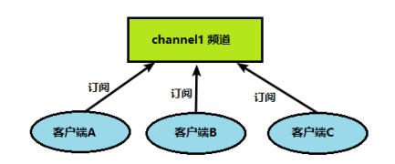

- 发布消息

  

- 命令行

  打开客户端订阅：

  ```
  SUBSCRIBE channel1
  ```

  

  客户端发送：

  ```
  publish channel1 hello
  返回的integer 1 代表有一个客户端订阅此通道
  ```

  

  订阅端收到消息：

  收到的消息包括：message、通道名称、消息体

  

## 六、事务

- Redis事务是一个单独的隔离操作：事务中的所有命令都会序列化、按顺序地执行。事务在执行的过程中，不会被其他客户端发送来的命令请求所打断。

- 从输入Multi命令开始，输入的命令都会依次进入命令队列中，但不会执行，直到输入Exec后，Redis会将之前的命令队列中的命令依次执行。如果多个客户端都开启了事务，并且对同一个key做操作，那么后执行Exec的client的命令会最终生效。但是如果先执行Exec的client，对key做了del操作，那么后面的client事务，就会报错。

- 在向事务队列发送指令过程中，未执行Exec之前。如果发生错误，则执行时，整个队列内的指令操作都会失效。

- 当正常执行Exec时，队列内的每个指令都是彼此独立的，执行结果互不干扰，也就是说某一条指令执行失败报错，不影响其他指令的执行。

- 未执行Exec之前，可以通过命令discard取消事务操作。

  

  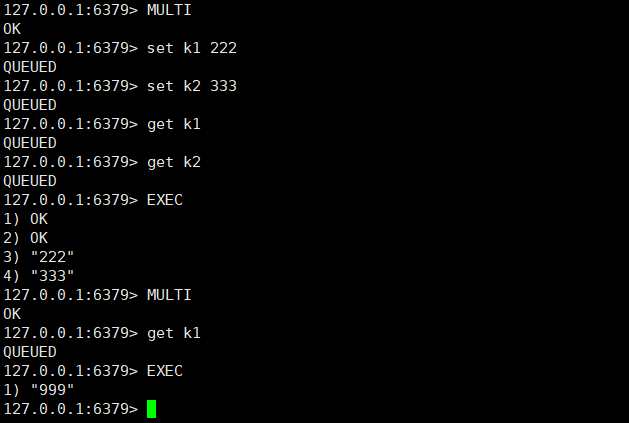

- 悲观锁

  悲观锁(Pessimistic Lock), 顾名思义，就是很悲观，每次去拿数据的时候都认为别人会修改，所以每次在拿数据的时候都会上锁，这样别人想拿这个数据就会block直到它拿到锁。传统的关系型数据库里边就用到了很多这种锁机制，比如行锁，表锁等，读锁，写锁等，都是在做操作之前先上锁。

  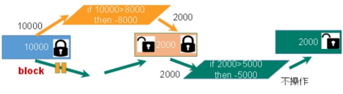

- 乐观锁

  乐观锁(Optimistic Lock), 顾名思义，就是很乐观，每次去拿数据的时候都认为别人不会修改，所以不会上锁，但是在更新的时候会判断一下在此期间别人有没有去更新这个数据，可以使用版本号等机制。乐观锁适用于多读的应用类型，这样可以提高吞吐量。Redis就是利用这种check-and-set机制实现事务的。

  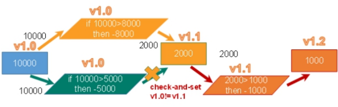

- watch

  ```
  WATCH key [key ...]
    summary: Watch the given keys to determine execution of the MULTI/EXEC block
    since: 2.2.0
    group: transactions
  ```

  在执行multi之前，先执行watch key1 [key2]，可以监控一个(或多个) key ，如果在事务执行之前这个(或这些) key 被其他命令所改动，那么事务将被打断。执行Exec时，事务内所有的指令都将失效。

  在执行Exec之前，执行unwatch指令，可以取消监控。

  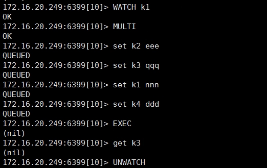

- Redis事务三特性

  1. 单独的隔离操作 

     事务中的所有命令都会序列化、按顺序地执行。事务在执行的过程中，不会被其他客户端发送来的命令请求所打断。 

  2. 没有隔离级别的概念 

     队列中的命令没有提交之前都不会实际被执行。

  3. 不保证原子性 

     事务中如果有一条命令执行失败，其后的命令仍然会被执行，没有回滚。

## 七、持久化

### 7.1、写时复制

- Linux系统创建子进程的时候，会调用fork命令，创建一个与主进程相同的子进程，并将主进程的数据的指针复制一份，此时主子进程的数据不会互相干扰，当主进程或者子进程数据发生改变的时候，才会执行数据的复制，copy on write（内核机制），redis是利用的这一特性实现的数据持久化。

- 比如k1 aaa，k1的指针指向aaa，没有操作改变k1的值的时候，主子进程的k1的指针都是指向aaa。但是如果主进程set k1 bbb将K1修改为bbb了。此时执行的是复制操作，重新开辟一块空间，存放bbb。将主进程的k1的指针指向bbb。子进程进行持久化时，不会受到影响。

  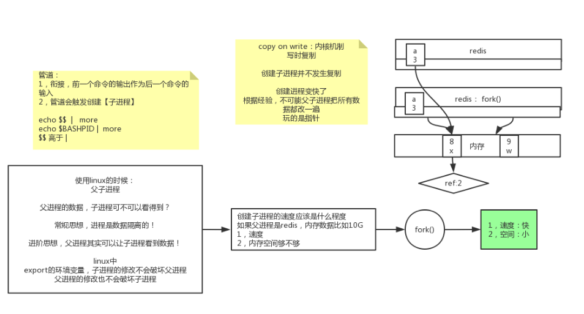

### 7.2、RDB

- 将某一时间节点的内存中全部数据进行快照保存，持久化到磁盘，默认的文件名为dump.rdb。恢复时直接将快照读取到内存中。

- Redis会单独创建（fork）一个子进程来进行持久化，会先将数据写入到 一个临时文件中，待持久化过程都结束了，再用这个临时文件替换上次持久化好的文件。 整个过程中，主进程是不进行任何IO操作的，这就确保了极高的性能。如果需要进行大规模数据的恢复，且对于数据恢复的完整性不是非常敏感，那RDB方式要比AOF方式更加的高效。

  

- 优点是数据全，恢复数据速度比较快.

- RDB的缺点是最后一次持久化后的数据可能丢失。并且rdb文件只会有一个，多次备份的话，需要运维人员手动手动将历史的备份文件拷贝出来。

- 备份操作：

  1. 手动：

     - save指令：

       redis会阻塞住并且停止服务。适用于停机维护的场景下。

     - bgsave指令：

       后台运行，此时redis会调用fork()命令，创建子进程，进行数据持久化。可以通过lastsave 命令获取最后一次成功执行快照的时间。

  2. 自动：

     可以设置N秒内至少有M次的改动才进行持久化，默认是60 10000，60秒内改了一万次会触发自动持久化操作。可以手动更改配置，5分钟内改了10次，或15分钟内改了1次等等配置。

     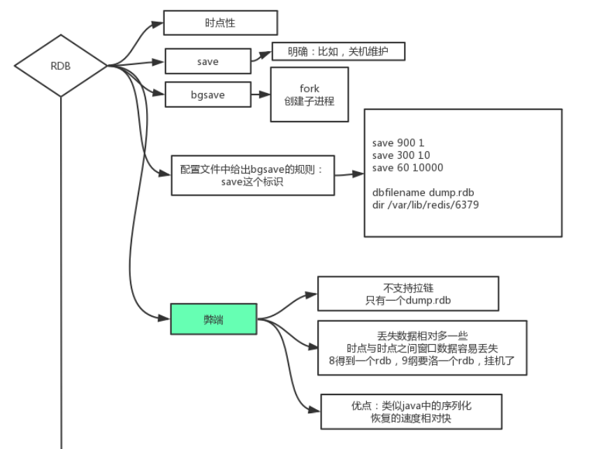

- 备份恢复

  先通过config get dir  查询rdb文件的目录，找到备份的rdb文件。

  拷贝到其他位置，做备份。

  把备份的文件拷贝到redis的工作目录下，备份文件名为dump.rdb。

  启动redis时，会自动执行备份的恢复。

- 持久化相关配置

  配置文件为redis.conf。

  1. RDB文件名称

     

  2. RDB文件保存位置

     默认为Redis启动时命令行所在的目录下。

     dir "/myredis/"

     

  3. 触发自动持久化的条件配置

     save 60 10000  含义是60秒内操作数达到了10000次，就执行持久化
     save 300 10      含义是300秒内操作数达到了10次，就执行持久化
     save 600 1        含义是600秒内才有一次操作，执行持久化，也可以理解成定时600秒做一次持久化。

     

  4. stop-writes-on-bgsave-error

     当Redis无法写入磁盘的时，直接关掉Redis的写操作。推荐yes。

     

  5. rdbcompression 压缩文件

     对于存储到磁盘中的快照，可以设置是否进行压缩存储。如果是的话，redis会采用LZF算法进行压缩。
     如果不想消耗CPU来进行压缩的话，可以设置为关闭此功能。推荐yes。

     

  6. rdbchecksum 检查完整性

     在存储快照后，还可以让redis使用CRC64算法来进行数据校验，但是这样做会增加大约10%的性能消耗，如果希望获取到最大的性能提升，可以关闭此功能。

     

  7. 停止rdb备份

     redis-cli config set save ""#save后给空值，表示禁用保存策略。

### 7.3、AOF

- AOF持久化方式记录每次对服务器写的操作（读操作不记录），当服务器重启的时候会重新执行这些命令来恢复原始的数据，AOF命令以redis协议追加保存每次写的操作到文件末尾。Redis还能对AOF文件进行后台重写，使得AOF文件的体积不至于过大。

- AOF持久化流程：

  -  4.0之前，AOF只会记录对数据的写操作，会追加到appendonly.aof文件内，会导致文件可以无限大，当恢复文件的时候，挨个执行aof文件内的操作就可以了。
  - 4.0之后，是先rdb到aof文件中，再增量增加后续每次执行的指令。

  1. 客户端的请求写命令会被append追加到AOF缓冲区内；

  2. AOF缓冲区根据AOF持久化策略[always,everysec,no]将操作sync同步到磁盘的AOF文件中；

  3. AOF文件大小超过重写策略或手动重写时，会对AOF文件rewrite重写，压缩AOF文件容量；

  4. Redis服务重启时，会重新load加载AOF文件中的写操作达到数据恢复的目的；

     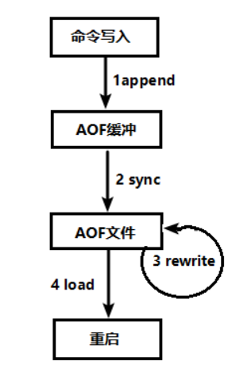

- AOF相关配置

  配置文件为redis.conf。文件路径同RDB。

  1. 开启AOF，默认关闭

     ```
     appendonly  yes
     ```

  2. AOF同步频率

     1. appendfsync always

        每次有新命令就执行一次 fsync，调用flush，将指令追加到 AOF 文件，非常慢，也非常安全，数据完整性比较好。并且在故障时只会丢失 1 条数据

     2. appendfsync no

        从不 fsync，将数据交给操作系统来处理。更快，也更不安全的选择。

     3. appendfsync everysec

        推荐（并且也是默认）的措施为每秒 fsync 一次， 这种 fsync 策略可以兼顾速度和安全性，顶多丢失一个buffer空间的数据。

     4. no-appendfsync-on-rewrite

        设置重写压缩时，是否要aof指令同步持久化。

        如果 no-appendfsync-on-rewrite=yes，新的写入操作，不进行aof文件持久化，只会写入缓存，用户请求不会阻塞，但是在这段时间如果宕机会丢失这段时间的缓存数据。（降低数据安全性，提高性能）。

        如果 no-appendfsync-on-rewrite=no,  代表开启aof，发生新的写入操作时，会把数据往磁盘里刷，但是遇到重写操作，因为两者都会操作磁盘，并且bgrewriteaof往往会涉及大量磁盘操作，这样就会造成主进程在写aof文件的时候出现阻塞的情形（数据安全，但是性能降低）。

     5. auto-aof-rewrite-percentage

        设置重写的基准值，文件达到100%时开始重写（文件是原来重写后文件的2倍时触发）。

     6. auto-aof-rewrite-min-size

        置重写的基准值，最小文件64MB。达到这个值开始重写。

- AOF文件修复

  当aof文件损坏的时候，redis不会加载恢复内容，此时可以备份aof文件，使用redis提供的工具进行修复。

  1. 为现有的 AOF 文件创建一个备份。
  2. 使用 Redis 附带的 redis-check-aof 程序，对原来的 AOF 文件进行修复:
  3. $ redis-check-aof –fix
  4. （可选）使用 diff -u 对比修复后的 AOF 文件和原始 AOF 文件的备份，查看两个文件之间的不同之处。
     重启 Redis 服务器，等待服务器载入修复后的 AOF 文件，并进行数据恢复。

- BGREWRITEAOF压缩

  - AOF采用文件追加方式，文件会越来越大为避免出现此种情况，新增了重写机制，当AOF文件的大小超过所设定的阈值时，Redis就会启动AOF文件的内容压缩， 只保留可以恢复数据的最小指令集。可以使用命令bgrewriteaof。
  - 5.0版本之前，会对aof文件内的指令进行整理，比如多次对KEY设置值，只会保留最后一次的操作记录，5.0版本之后，当调用BGREWRITEAOF 指令，会在aof文件中记录rdb文件，也就是执行RDB操作，后续再有写操作，再进行aof文件的append操作，将写操作记录进去，这样可以提升速度，并且也可以保证数据的完整性。
  - Redis会记录上次重写时的AOF大小，默认配置是当AOF文件大小是上次rewrite后大小的一倍且文件大于64M时触发。
  - 默认64M 100%会进行一次重写。当AOF文件大小达到64M了，就进行压缩重写，当64M即使压缩后，使用也达到100%，就会扩大为128M 100%。

- 重写流程

  1. bgrewriteaof触发重写，判断当前是否有bgsave或bgrewriteaof在运行，如果有，则等待该命令结束后再继续执行。
  2. 主进程fork出子进程执行重写操作，保证主进程不会阻塞。
  3. 子进程遍历redis内存中数据到临时文件，客户端的写请求同时写入aof_buf缓冲区和aof_rewrite_buf重写缓冲区保证原AOF文件完整以及新AOF文件生成期间的新的数据修改动作不会丢失。
  4. 子进程写完新的AOF文件后，向主进程发信号，父进程更新统计信息。
  5. 主进程把aof_rewrite_buf中的数据写入到新的AOF文件。
  6. 使用新的AOF文件覆盖旧的AOF文件，完成AOF重写。

  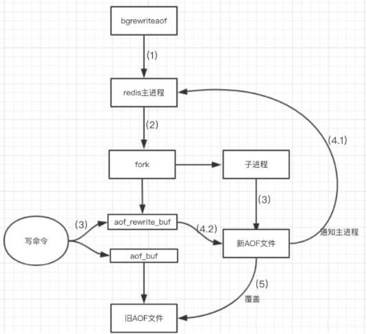

- 

## 八、Redis配置文件

### 8.1、网络相关配置

1. bind

   默认情况bind=127.0.0.1只能接受本机的访问请求，不写的情况下，无限制接受任何ip地址的访问。
   生产环境肯定要写应用服务器的地址；服务器是需要远程访问的，所以需要将其注释掉。
   如果开启了protected-mode，那么在没有设定bind ip且没有设密码的情况下，Redis只允许接受本机的响应。

2. protected-mode

   将本机访问保护模式设置no。

3. Port

   设置端口号，默认6379

   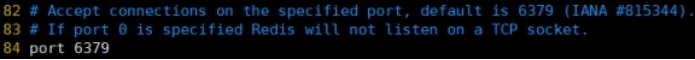

4. tcp-backlog

   设置tcp的backlog，backlog其实是一个连接队列，backlog队列总和=未完成三次握手队列 + 已经完成三次握手队列。
   在高并发环境下需要一个高backlog值来避免慢客户端连接问题。
   注意Linux内核会将这个值减小到/proc/sys/net/core/somaxconn的值（128），所以需要确认增大/proc/sys/net/core/somaxconn和/proc/sys/net/ipv4/tcp_max_syn_backlog（128）两个值来达到想要的效果。

5. timeout

   一个空闲的客户端维持多少秒会关闭，0表示关闭该功能。即永不关闭。

6. tcp-keepalive

   对访问客户端的一种心跳检测，每隔n秒检测一次。
   单位为秒，如果设置为0，则不会进行Keepalive检测，建议设置成60。

### 8.2、通用配置

1. daemonize

   是否为后台进程，设置为yes，守护进程，后台启动。

   

2. pidfile

   存放pid文件的位置，每个实例会产生一个不同的pid文件。

   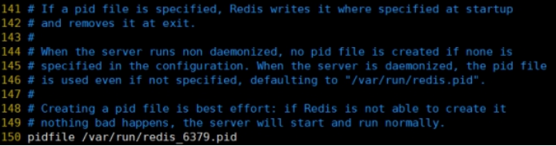

3. loglevel

   指定日志记录级别，Redis总共支持四个级别：debug、verbose、notice、warning，默认为notice。四个级别根据使用阶段来选择，生产环境选择notice 或者warning。

4. logfile

   日志文件名称。

5. databases 16

   设定库的数量，默认16，默认数据库为0，可以使用SELECT dbid命令在连接上指定数据库id。

### 8.3、security

1. requirepass

   设置密码。

   

### 8.4、limits限制

1. maxclients

   设置redis同时可以与多少个客户端进行连接。默认情况下为10000个客户端。如果达到了此限制，redis则会拒绝新的连接请求，并且向这些连接请求方发出“max number of clients reached”以作回应。

2. maxmemory

   - 建议必须设置，否则，将内存占满，造成服务器宕机。

   - 设置redis可以使用的内存量。一旦到达内存使用上限，redis将会试图移除内部数据，移除规则可以通过maxmemory-policy来指定。

   - 如果redis无法根据移除规则来移除内存中的数据，或者设置了“不允许移除”，那么redis则会针对那些需要申请内存的指令返回错误信息，比如SET、LPUSH等。但是对于无内存申请的指令，仍然会正常响应，比如GET等。如果你的redis是主redis（说明你的redis有从redis），那么在设置内存使用上限时，需要在系统中留出一些内存空间给同步队列缓存，只有在你设置的是“不移除”的情况下，才不用考虑这个因素。

     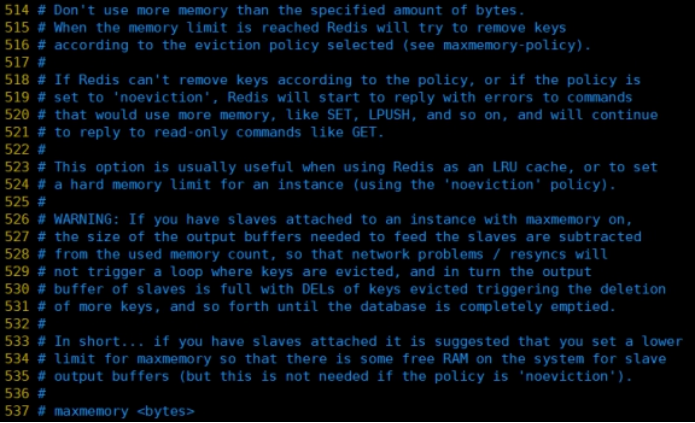

3. maxmemory-policy

   1. volatile-lru：使用LRU算法移除key，只对设置了过期时间的键；（最近最少使用）
   2. allkeys-lru：在所有集合key中，使用LRU算法移除key
   3. volatile-random：在过期集合中移除随机的key，只对设置了过期时间的键
   4. allkeys-random：在所有集合key中，移除随机的key
   5. volatile-ttl：移除那些TTL值最小的key，即那些最近要过期的key
   6. noeviction：不进行移除。针对写操作，只是返回错误信息

4. maxmemory-samples

   设置样本数量，LRU算法和最小TTL算法都并非是精确的算法，而是估算值，所以你可以设置样本的大小，redis默认会检查这么多个key并选择其中LRU的那个。一般设置3到7的数字，数值越小样本越不准确，但性能消耗越小。

   

## 九、集群

