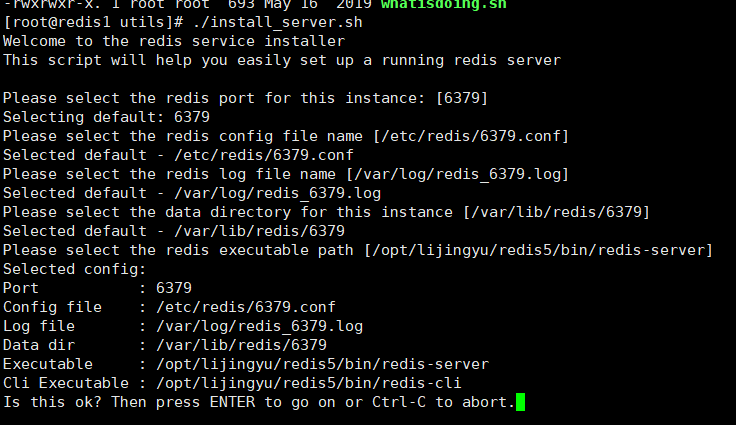
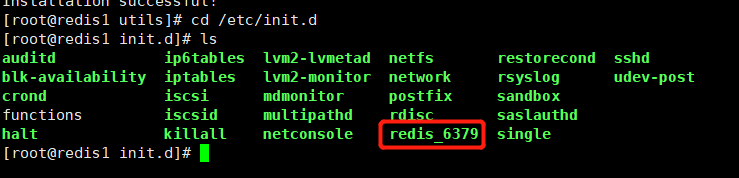
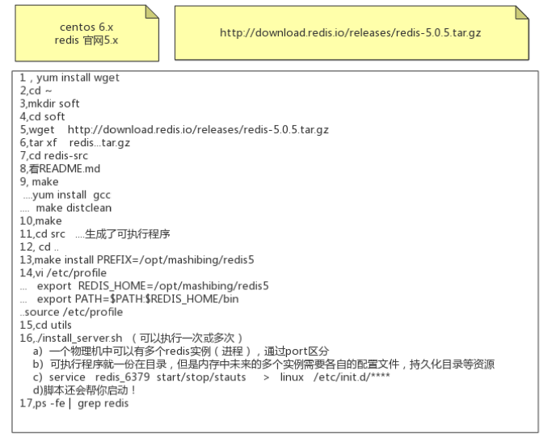
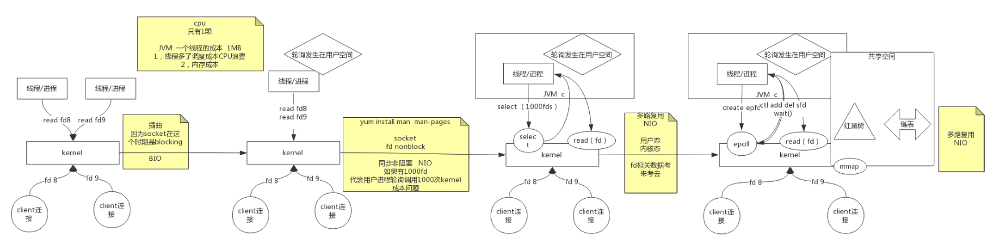

# Redis

## 一、Redis安装

```
yum install wget   wget是Linux中的一个下载文件的工具
yum install gcc    安装的是编译c语言的环境 
mkdir soft         创建一个soft目录，用于存放redis相关文件
cd soft            进入到soft目录
wget http://download.redis.io/releases/redis-5.0.5.tar.gz 
                    下载redis
tar xf redis-5.0.5.tar.gz 解压
cd redis-5.0.5     进入redis目录
注意看readme.md
注意：make命令是会调用 Makefile文件
make     执行编译
make install PREFIX=/opt/lijingyu/redis5  将脚本文件安装到指定目录  将文件迁出，和源码分离
cd /opt/lijingyu/  进入到目录 
vi /etc/profile
export REDIS_HOME=/opt/lijingyu/redis5
export PATH=$PATH:$REDIS_HOME/bin
source /etc/profile
进入到redis 的utils 目录
./install_server.sh  默认端口是6379
 cd /etc/init.d  可执行文件会生成到这个目录
 service redis_6379 status  看运行状态
 ps -fe | grep redis  可以查看当前的进程
```







## 二、NIO原理

- 磁盘和数据库索引

  ​        磁盘是4k分页，所以无论取多少数据，每次都是最少4k的读取，所以存在4k对齐现象。数据库数据分页，也是最小单位4k进行分页，索引也是4k分页。将数据和索引维护在磁盘上。在内存中用B+树维护索引和数据的对应关系树状图。

  ​         数据库表很大的情况下，增删改会变慢，因为每次操作都需要重新维护索引。对于查询来讲，单个的或者少量的查询，如果where条件可以命中索引，那么速度依然很快。但是对于并发大的查询，因为会同时命中磁盘上的多条数据，磁盘的访问速度会成为瓶颈，还有网络带宽也会成为瓶颈，最终会影响速度。

  

## 三、epoll



## 四、五大数据类型

### 4.1、String

1. String类型是二进制安全的。意味着Redis的string可以包含任何数据。比如jpg图片或者序列化的对象。一个Redis中字符串value最多可以是512M。

2. 数据结构：简单动态字符串，内部结构类似java中的ArrayList。会进行动态的扩缩容。采用预分配冗余空间的方式来减少内存的频繁分配。内部为字符串分配的空间大小实际上会比字符串的length大一些。当字符串大小小于1M时，发生扩容时，会翻倍扩容。当大于1M时，扩容会以每次增加1M空间的规则来进行扩容。

   

3. 常用命令

   

- set key value ：添加键值对

  set key1 value EX 10 NX  当key1不存在时，设置key1,10秒过期。

  NX：当数据库中key不存在时，可以将key-value添加数据库
  XX：当数据库中key存在时，可以将key-value添加数据库，与NX参数互斥
  EX：key的过期秒数
  PX：key的过期毫秒数，与EX互斥

- get key：查询对应键值

- append key value：将给定的value追加到原值的末尾。

- strlen key：获得值的长度。

- setnx  key value：只有在key不存在时，才能设置key的值。

- incr key：将key中储存的数字值增1，只能对数字值操作，如果为空，新增值为1。

- decr key：将 key 中储存的数字值减1，只能对数字值操作，如果为空，新增值为-1

- incrby / decrby  key amount：将key中储存的数字值增减。自定义步长。 incrby k1 10，增加10。

- 批量操作，原子性，有一个失败则都失败。

- mset  key1 value1 key2 value2 ..... ：同时设置一个或多个key-value对 。

- mget  key1 key2 key3 .....：同时获取一个或多个value。  

- msetnx key1 value1 key2 value2 ..... ：同时设置一个或多个 key-value 对，当且仅当所有给定 key 都不存在时，才会设置成功。

- getrange  key start end：获得值的范围，类似java中的substring，前包，后包。比如value为0123456 那么getrange key 0 1 结果为01，getrange key 2 3结果为23。

- setrange  key offset value：用 value覆写key所储存的字符串值，从offset位置开始(索引从0开始)，进行值的替换。当替换的字符数量超过1时，会对原值从offset开始，批量进行替换，即使超过原值的总长度也可以。

- setex  key seconds value：设置键值的同时，设置过期时间，单位秒。

- getset key value：以新换旧，设置了新值同时获得旧值。

### 4.2、List

1. 简单的字符串列表，类似java中的ArrayList，按照插入顺序排序，并且可以添加一个元素到列表的头或者尾部，也可以从头、尾部移除元素。

2. 内部实现是一个双向链表。

   

3. 数据结构：

   底层是由quickList+ziplist行程的双向链表。链表的每个节点quickListNode是一个ziplist。

   LinkedList链表每个节点都是一个独立的存储空间，当节点数量比较多的时候，很容易造成空间的不连续，空间浪费。并且当存储的数据很小时，链表的prev、next指针会占用比较大的空间，也会造成空间浪费。所以Redis引入了ziplist压缩列表。

   ziplist 是由一系列特殊编码的内存块构成的列表，表中的每一项都存放在前后连续的内存空间上，每一项因占用的空间不同，而采用变长编码。并且没有prev、next指针，是存储上一个 entry的长度和当前entry的长度，通过长度推算下一个元素在什么地方。牺牲了读取的效率，只适合从头到尾顺序读取，并且字段的值比较小的时候，才适合ziplist。

   quickList是结合了链表、ziplist的有点的链表，每个节点可以看做是一个一个小的ziplist。既满足了快速的插入、删除、读取性能，又不会出现太大的空间冗余。

4. 常用命令：

- lpush/rpush key value1 value2 value3....： 从左边/右边插入一个或多个值。
- lpop/rpop key：从左边/右边弹出一个值，并remove。
- rpoplpush  key1 key2：从key1列表右边弹出一个值，插到key2列表左边。
- lrange key start stop：按照索引下标获得元素(从左到右)，索引下标从0开始，结尾是-1。因为是双向链表，所以正向是从0开始，反向是从-1开始。lrange key1 0 -1，0左边第一个，-1右边第一个，（0，-1表示获取所有）
- lindex key index：按照索引下标获得元素(从左到右)
- llen key：获得列表长度 。
- linsert key BEFORE|AFTER pivot value：在从左边数，第一个pivot（字符匹配项）的左侧插入插入值value，当找不到目标匹配项时，插入失败。
- lrem key count value：从左边删除count个value(从左到右)。
- lset key index value：将列表key下标为index的值替换成value。

### 4.3、Set

### 4.4、Hash

### 4.5、Zset

### 4.6、key操作

- keys * ：查看当前库所有key
- exists key ：判断某个key是否存在
- type key ：查看key是什么类型
- del key ：删除指定的key数据
- unlink key ：根据key选择非阻塞删除，仅将key从keyspace元数据中删除，真正的删除会在后续异步操作。
- expire key 10 ：10秒钟，为给定的key设置过期时间
- ttl key ：查看还有多少秒过期，-1表示永不过期，-2表示已过期
- select ：切换数据库，select 1 切换到1号库
- dbsize：查看当前数据库的key的数量
- flushdb：清空当前库
- flushall：通杀全部库
