# RocketMQ

## 安装

## 角色

### 1、Broker

- Broker面向producer和consumer接收和发送消息。
  1. 向nameserver提交自己的信息。
  2. 是消息中间件的消息存储、转发服务器。
  3. 每个Broker节点，在启动时，都会遍历NameServer列表，与每个NameServer建立长连接，注册自己的信息，之后定时上报。
  
- 集群broker
  1. Broker高可用，可以配成Master/Slave结构，Master可写可读，Slave只可以读，Master将写入的数据同步给Slave。一个Master可以对应多个Slave，但是一个Slave只能对应一个Master。Master与Slave的对应关系通过指定相同的BrokerName，不同的BrokerId来定义。
  2. BrokerId为0表示Master，非0表示Slave。
  3. Master多机负载，可以部署多个broker，每个Broker与nameserver集群中的所有节点建立长连接，定时注册Topic信息到所有nameserver。
  
  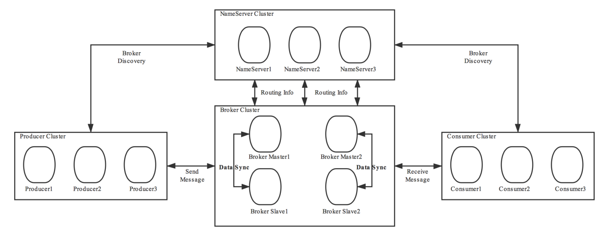
  
- Broker功能模块划分：

  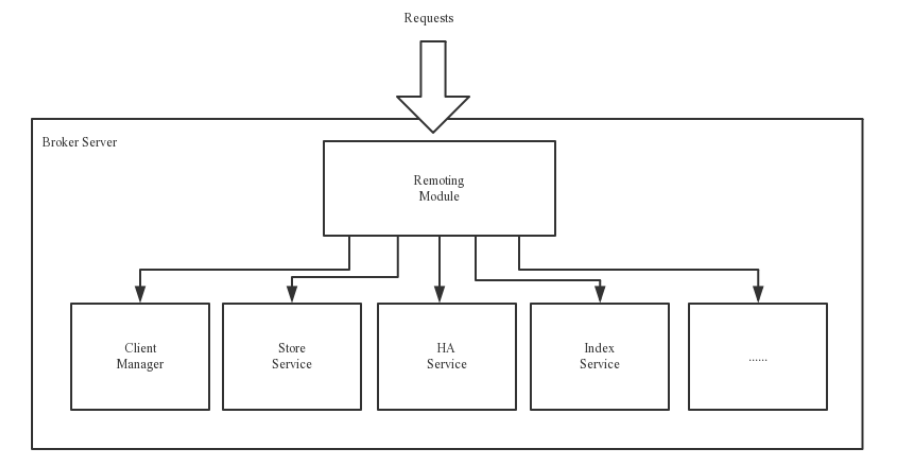

  1. Remoting Module：整个Broker的实体，负责处理来自clients端的请求。而这个Broker实体则由以下模块构成。
  2. Client Manager：客户端管理器。负责接收、解析客户端(Producer/Consumer)请求，管理客户端。例如，维护Consumer的Topic订阅信息。
  3. Store Service：存储服务。提供方便简单的API接口，处理消息存储到物理硬盘和消息查询功能。
  4. HA Service：高可用服务，提供Master Broker 和 Slave Broker之间的数据同步功能。
  5. Index Service：索引服务。根据特定的Message key，对投递到Broker的消息进行索引服务，同时也提供根据Message Key对消息进行快速查询的功能。

### 2、NameServer

- NameServer是注册中心、服务发现者。集群中的各个角色（producer、broker、consumer等）都需要定时向nameserver上报自己的状态，以便互相发现彼此，超时不上报的话，nameserver会把它从列表中剔除。
- Broker管理：接受Broker集群的注册信息并且保存下来作为路由信息的基本数据；提供心跳检测机制，检查Broker是否还存活。
- 路由信息管理：每个NameServer中都保存着Broker集群的整个路由信息和用于客户端查询的队列信息。Producer和Conumser通过NameServer可以获取整个Broker集群的路由信息，从而进行消息的投递和消费。

#### 路由注册

- NameServer通常也是以集群的方式部署，不过，NameServer是无状态的，即NameServer集群中的各个节点间是无差异的，各节点间相互不进行信息通讯，也没有主备的概念。
- 在Broker节点启动时，轮询NameServer列表，与每个NameServer节点建立长连接，发起注册请求。在NameServer内部维护着⼀个Broker列表，是内存式的内部存储，用来动态存储Broker、Topic的信息，并且不会进行持久化。
- 对于Broker，必须明确指出所有NameServer地址。否则未指出的将不会去注册。也正因为如此，NameServer并不能随便扩容。因为，若Broker不重新配置，新增的NameServer对于Broker来说是不可见的，其不会向这个NameServer进行注册。
- Broker节点为了证明自己是活着的，会维护与NameServer间的长连接，将最新的信息以心跳包的方式上报给NameServer，每30秒发送一次心跳。心跳包中包含 BrokerId、Broker地址(IP+Port)、Broker名称、Broker所属集群名称等等。NameServer在接收到心跳包后，会更新心跳时间戳，记录这个Broker的最新存活时间。

#### 路由发现

- RocketMQ的路由发现采用的是Pull模型。当Topic路由信息出现变化时，NameServer不会主动推送给客户端，而是客户端定时拉取主题最新的路由。默认客户端每30秒会拉取一次最新的路由。
  1. Push模型：推送模型。其实时性较好，是一个“发布-订阅”模型，需要维护一个长连接。而长连接的维护是需要资源成本的。该模型适合于的场景：实时性要求较高、Client数量不多，Server数据变化较频繁
  2. Pull模型：拉取模型。存在的问题是，实时性较差。
  3. Long Polling模型：长轮询模型。其是对Push与Pull模型的整合，充分利用了这两种模型的优势，屏蔽了它们的劣势。

#### 路由剔除

- 由于Broker关机、宕机或网络抖动等原因，NameServer没有收到Broker的心跳，NameServer可能会将其从Broker列表中剔除。
- NameServer中有⼀个定时任务，每隔10秒就会扫描⼀次Broker表，查看每一个Broker的最新心跳时间戳距离当前时间是否超过120秒，如果超过，则会判定Broker失效，然后将其从Broker列表中剔除。
- 当需要做Broker升级、运维等工作时，首先需要把Broker的读写权限关掉，一旦client(Consumer或Producer)向broker发送请求，都会收到broker的NO_PERMISSION响应，然后client会进行对其它Broker的重试。慢慢观察，直到Broker的流量为空时，就可以进行停机维护了。

#### 客户端选择策略

- 客户端在配置时必须要写上NameServer集群的地址，客户端连接NameServer节点时，首先会生产一个随机数，然后再与NameServer节点数量取模，此时得到的就是所要连接的节点索引，然后就会进行连接。如果连接失败，则会采用round-robin轮训策略，逐个尝试着去连接其它节点。
- 首先采用的是随机策略进行的选择，失败后采用的是轮询策略。

### 3、Producer

- 消息生产者，负责生产消息。Producer首先连接到nameServer，并通过MQ的负载均衡模块选择相应的Broker集群队列进行消息投递，投递的过程支持快速失败并且低延迟。
- RocketMQ中的消息生产者都是以生产者组（Producer Group）的形式出现的。生产者组Group是同一类生产者的集合，这类Producer的相关配置需要保持相同。一个生产者组可以同时发送多个主题的消息。
- Producer与nameServer集群中的其中一个节点（随机选择）建立长连接，获得Topic的路由信息，包括Topic下面有哪些Queue，这些Queue分布在哪些Broker上等，接下来与提供Topic服务的Master建立长连接，且定时向Master发送心跳。
- 每次需要连接broker的时候。都要先连接nameserver，通过nameserver获取分配的broker地址。
- Producer只会与master建立连接，因为只有master才会允许消息写入。

### 4、Consumer

- 消息的消费者，通过NameServer集群获得Topic的路由信息，连接到对应的Broker上消费消息。

- 由于Master和Slave都可以读取消息，因此Consumer会与Master和Slave都建立连接。

- RocketMQ中的消息消费者都是以消费者组（Consumer Group）的形式出现的。消费者组是同一类消
  费者的集合，这类Consumer必须消费的是同一个Topic类型的消息，并且每个Consumer的配置都应该相同。消费者组使得在消息消费方面，实现负载均衡和容错的目标变得非常容易。

- 负载均衡：默认的负载均衡策略将一个Topic中的不同的Queue平均分配给同一个Consumer Group的不同的Consumer，注意，并不是将消息负载均衡。

- 消费者组中Consumer的数量应该小于等于订阅Topic的Queue数量。如果超出Queue数量，则多出的Consumer将不能消费消息。

  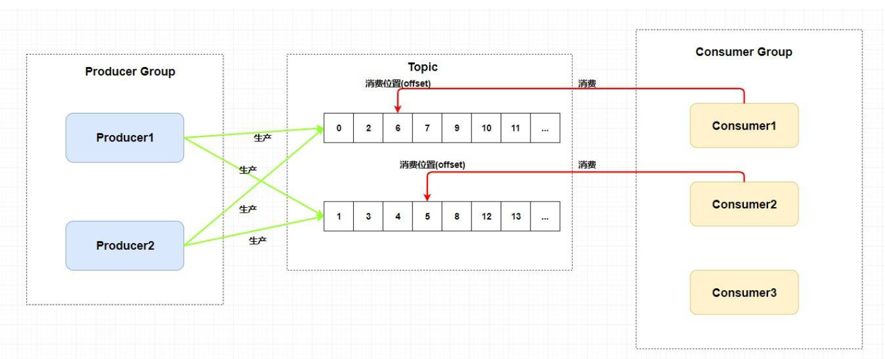

- 容错：一个Consmer挂了，该Consumer Group中的其它Consumer可以接着消费原Consumer消费的Queue。

- 一个Topic类型的消息可以被多个消费者组同时消费。

- 消费者组只能消费一个Topic的消息，不能同时消费多个Topic消息。

### 5、系统架构

- 主要由Producer、NameServer、Broker、Consumer组成。

  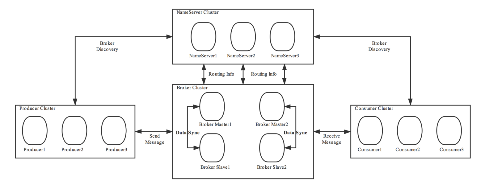

## 基本概念

### Message

- 消息：消息系统所传输信息的物理载体，生产和消费数据的最小单位，每条消息必须属于一个主题。

### Topic

- Topic表示一类消息的集合，每个主题包含若干条消息，每条消息只能属于一个主题，是RocketMQ进行消息订阅的基本单位。

- 一个生产者可以同时发送多种Topic的消息，而一个消费者只可以订阅一个Topic。

- Topic属于逻辑上的概念，实际上在Broker中是以queue队列的形式进行存储的。一个topic可以对应多个队列。并且可以在创建topic时进行队列数的指定。

  
  
- 手动创建Topic时，有两种模式：

  1. 集群模式：该模式下创建的Topic在该集群中，所有Broker中的Queue数量是相同的。

  2. Broker模式：该模式下创建的Topic在该集群中，每个Broker中的Queue数量可以不同。

     自动创建Topic时，默认采用的是Broker模式，会为每个Broker默认创建4个Queue。

- 读/写队列

  1. 从物理上来讲，读/写队列是同一个队列。所以，不存在读/写队列数据同步问题。读/写队列是逻辑上进行区分的概念。一般情况下，读/写队列数量是相同的。例如，创建Topic时设置的写队列数量为8，读队列数量为4，此时系统会创建8个Queue，分别是0 1 2 3 4 5 6 7。Producer会将消息写入到这8个队列，但Consumer只会消费0 1 2 3这4个队列中的消息，4 5 6 7中的消息是不会被消费到的。再如，创建Topic时设置的写队列数量为4，读队列数量为8，此时系统会创建8个Queue，分别是0 1 2 3 4 5 6 7。Producer会将消息写入到0 1 2 3 这4个队列，但Consumer只会消费0 1 2 3 4 5 6 7这8个队列中的消息，但是4 5 6 7中是没有消息的。此时假设Consumer Group中包含两个Consumer，Consumer1消费0 1 2 3，而Consumer2消费4 5 6 7。但实际情况是，Consumer2是没有消息可消费的。也就是说，队列数会以读写队列的最大数进行设置，并且当读/写队列数量设置不同时，总是有问题的。
  2. 那么，为什么要这样设计呢？其这样设计的目的是为了，方便Topic的Queue的缩容。
     例如，原来创建的Topic中包含16个Queue，如何能够使其Queue缩容为8个，还不会丢失消息？可以动态修改写队列数量为8，读队列数量不变。此时新的消息只能写入到前8个队列，而消费都消费的却是16个队列中的数据。当发现后8个Queue中的消息消费完毕后，就可以再将读队列数量动态设置为8。整个缩容过程，没有丢失任何消息。

- perm用于设置对当前创建Topic的操作权限：2表示只写，4表示只读，6表示读写。

### Queue

- 存储消息的物理实体。一个Topic中可以包含多个Queue，每个Queue中存放的就是该Topic的消息。一个Topic的Queue也被称为一个Topic中消息的分区（Partition）。
- 一个Topic的Queue中的消息只能被一个消费者组中的一个消费者消费。一个Queue中的消息不允许同一个消费者组中的多个消费者同时消费。
- Queue存在于commitLog中。

### Tag

- Tag是为消息设置的标签，用于同一主题下区分不同类型的消息。来自同一业务单元的消息，可以根据不同业务目的在同一主题下设置不同标签。
- 标签能够有效地保持代码的清晰度和连贯性，并优化RocketMQ提供的查询系统。消费者可以根据Tag实现对不同子主题的不同消费逻辑，实现更好的扩展性。
- Topic是消息的一级分类，Tag是消息的二级分类。
- 比如城市消费金额统计数据信息，Topic是消费金额统计，Tag就可以是二级分类，比如北京、上海、长春等。

### Key

- 每条消息可以设置按照业务逻辑，设置相关的业务的key。


## 消息的存储机制

### 1、消息的流转过程

- RocketMQ中的消息存储在本地文件系统中，这些相关文件默认在当前用户主目录下的store目录中。一般都需要自定义存储位置。

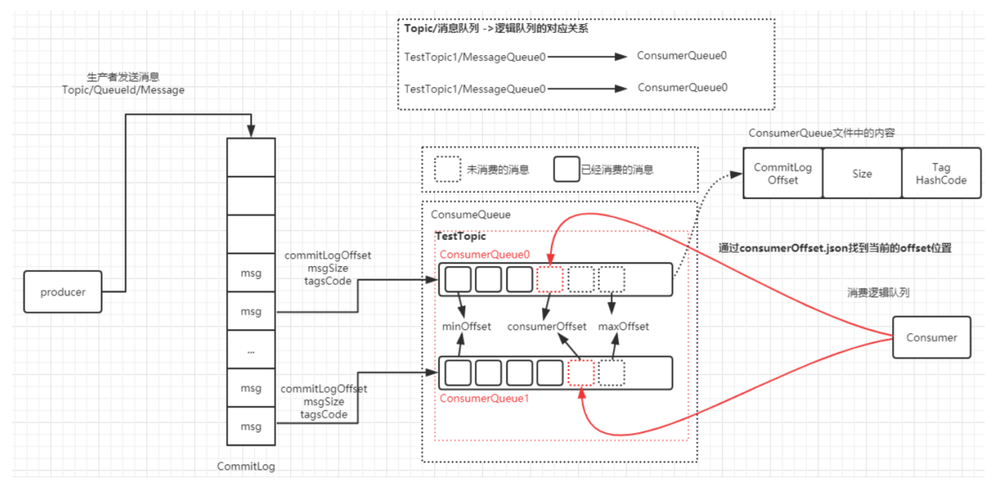

Producer发送数据到Broker，数据会被记录到commitLog里，并且会更新当前offset消费记录。

### 2、文件列表

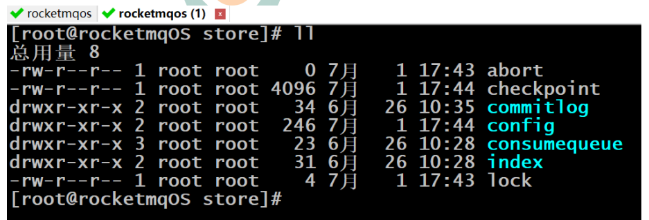

#### 2.1、abort

- 该文件在Broker启动后会自动创建，正常关闭Broker，该文件会自动消失。若在没有启动Broker的情况下，发现这个文件是存在的，则说明之前Broker的关闭是非正常关闭。

#### 2.2、checkpoint

- 其中存储着commitlog、consumequeue、index文件的最后刷盘时间戳。

#### 2.3、commitLog

- 数据存储真正的物理单元。一个commitLog大小为1g，commitLog目录中存放着很多的mappedFile文件，当前Broker中的所有消息都是落盘到这些mappedFile文件中的。mappedFile文件大小为1G（小于等于1G），文件名由20位十进制数构成，表示当前文件的第一条消息的起始位移偏移量。

  ```
  第一个文件名一定是20位0构成的。因为第一个文件的第一条消息的偏移量commitlog offset为0
  当第一个文件放满时，则会自动生成第二个文件继续存放消息。假设第一个文件大小是1073741820字节（1G = 1073741824字节），则第二个文件名就是00000000001073741824。
  以此类推，第n个文件名应该是前n-1个文件大小之和。
  一个Broker中所有mappedFile文件的commitlog offset是连续的
  ```

  需要注意的是，一个Broker中仅包含一个commitlog目录，所有的mappedFile文件都是存放在该目录中的。即无论当前Broker中存放着多少Topic的消息，这些消息都是被顺序写入到了mappedFile文件中的。也就是说，这些消息在Broker中存放时并没有被按照Topic进行分类存放。

  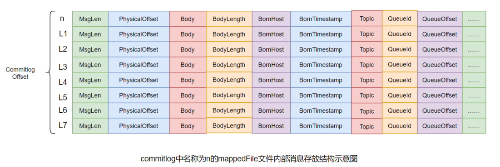

  mappedFile文件内容由一个个的消息单元构成。每个消息单元中包含消息总长度MsgLen、消息的物理位置physicalOffset、消息体内容Body、消息体长度BodyLength、消息主题Topic、Topic长度TopicLength、消息生产者BornHost、消息发送时间戳BornTimestamp、消息所在的队列QueueId、消息在Queue中存储的偏移量QueueOffset等近20余项消息相关属性。

#### 2.4、config

- 存放着Broker运行期间的一些配置数据。

  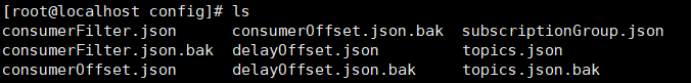

  1. consumerFilter.json：消息过滤器

  2. consumerOffset.json：客户端的消费进度

     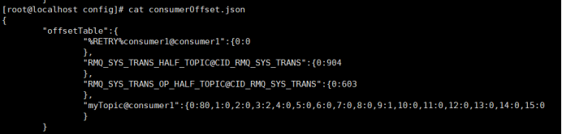

  3. delayOffset.json：延迟消息进度

  4. subscriptionGroup.json：group的订阅数据

     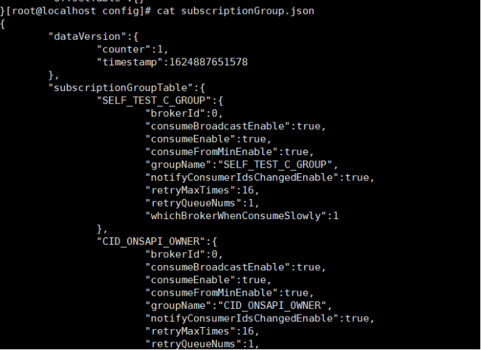

  5. topics.json：Topic的配置信息

     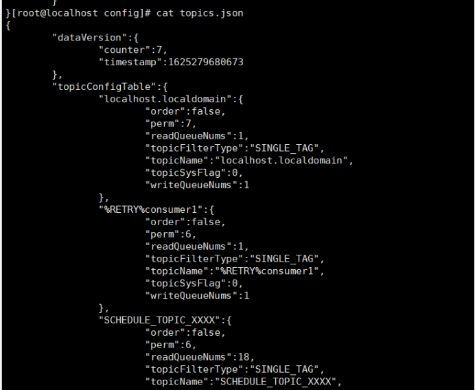


#### 2.5、consumequeue

- consumequeue的物理结构是按照每个topic的名称进行分类，树状结构的文件夹，每个topic下还会按照每个queue的queueId进行分类，每个queue下是具体的文件。

- consumequeue文件名也由20位数字构成，表示当前文件的第一个索引条目的起始位移偏移量。与mappedFile文件名不同的是，其后续文件名是固定的。因为consumequeue文件大小是固定不变

  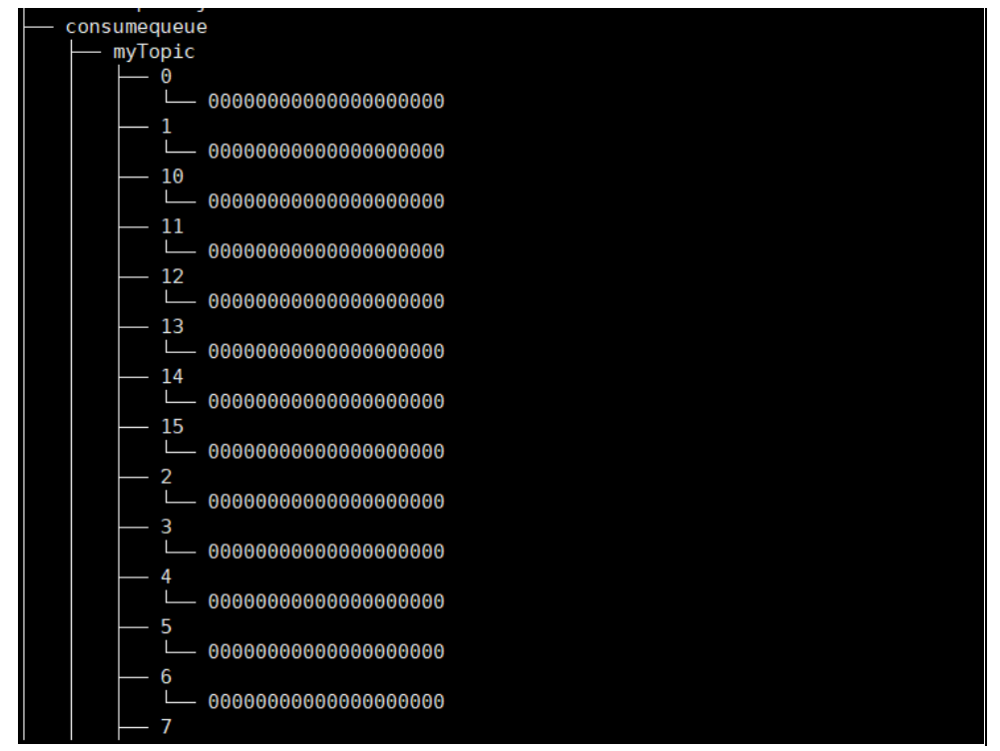

- 每个consumequeue文件可以包含30w个索引条目，每个索引条目包含了三个消息重要属性：消息在mappedFile文件中的偏移量CommitLog Offset、消息长度、消息Tag的hashcode值。这三个属性占20个字节，所以每个文件的大小是固定的30w * 20字节

  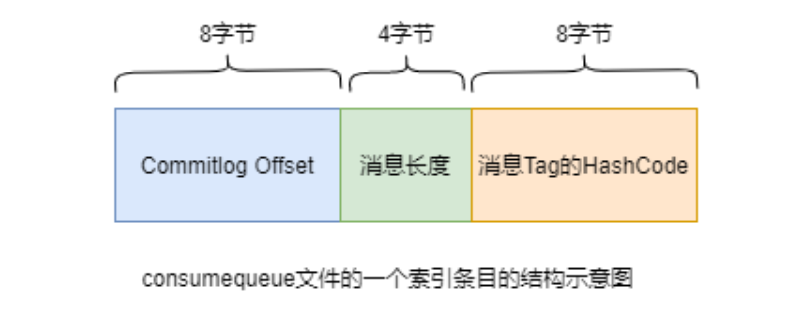


#### 2.6、index

- index目录中存放着indexFile文件，indexFile文件提供了通过key和时间戳来查找消息的功能。

- 索引条目结构

  每个Broker中会包含一组indexFile，每个indexFile都是以一个时间戳命名的（这个indexFile被创建时的时间戳）。每个indexFile文件由三部分构成：indexHeader，slots槽位，indexes索引数据。每个indexFile文件中包含500w个slot槽。而每个slot槽又可能会挂载很多的index索引单元。

  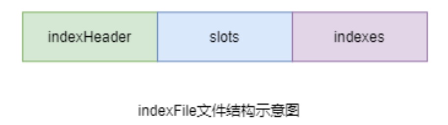

  indexHeader固定40个字节，其中存放着如下数据：

  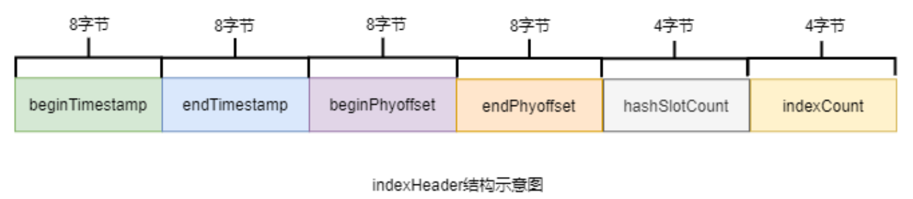

  1. beginTimestamp：该indexFile中第一条消息的存储时间
  2. endTimestamp：该indexFile中最后一条消息存储时间
  3. beginPhyoffset：该indexFile中第一条消息在commitlog中的偏移量commitlog offset
  4. endPhyoffset：该indexFile中最后一条消息在commitlog中的偏移量commitlog offset
  5. hashSlotCount：已经填充有index的slot数量（并不是每个slot槽下都挂载有index索引单元，这里统计的是所有挂载了index索引单元的slot槽的数量
  6. indexCount：该indexFile中包含的索引单元个数（统计出当前indexFile中所有slot槽下挂载的所有index索引单元的数量之和）

  indexFile中最复杂的是Slots与Indexes间的关系。在实际存储时，Indexes是在Slots后面的，但为了便于理解，将它们的关系展示为如下形式：

  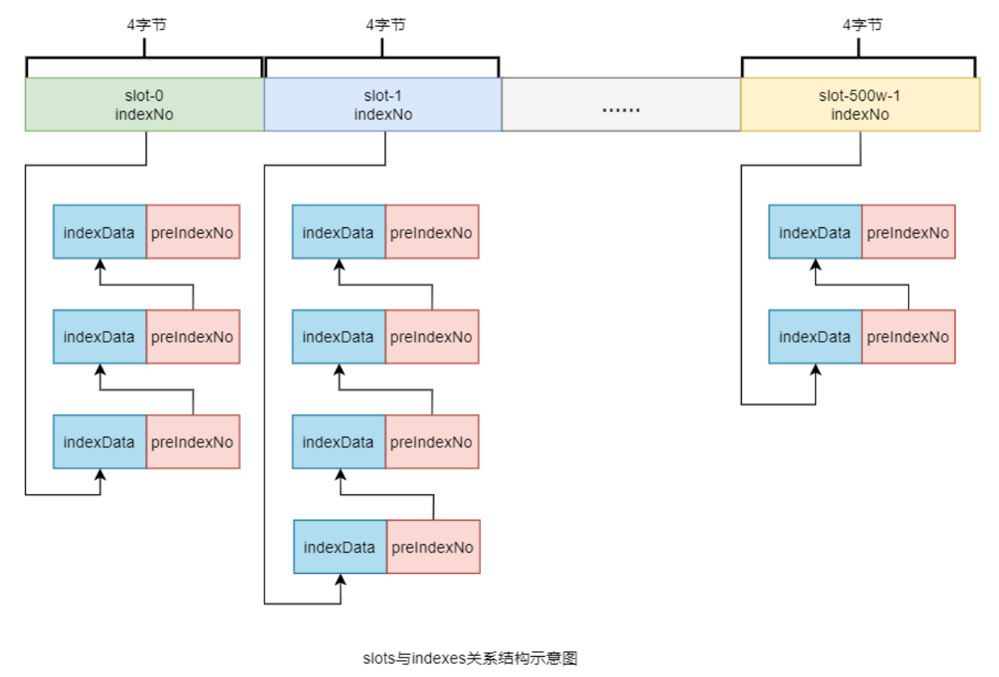

  key的hash值 % 500w的结果即为slot槽位，然后将该slot值修改为该index索引单元的indexNo，根据这个indexNo可以计算出该index单元在indexFile中的位置。不过，该取模结果的重复率是很高的，为了解决该问题，在每个index索引单元中增加了preIndexNo，用于指定该slot中当前index索引单元的前一个index索引单元。而slot中始终存放的是其下最新的index索引单元的indexNo，这样的话，只要找到了slot就可以找到其最新的index索引单元，而通过这个index索引单元就可以找到其之前的所有index索引单元。

  index索引单元默写20个字节，其中存放着以下四个属性：

  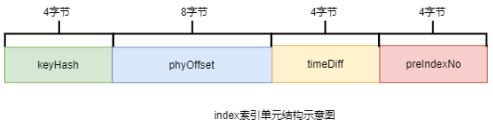

  1. keyHash：消息中指定的业务key的hash值
  2. phyOffset：当前key对应的消息在commitlog中的偏移量commitlog offset
  3. timeDiff：当前key对应消息的存储时间与当前indexFile创建时间的时间差
  4. preIndexNo：当前slot下当前index索引单元的前一个index索引单元的indexNo

- indexFile的创建

  1. 当第一条带key的消息发送来后，系统发现没有indexFile，此时会创建第一个indexFile文件。
  2. 当一个indexFile中挂载的index索引单元数量超出2000w个时，会创建新的indexFile。当带key的消息发送到来后，系统会找到最新的indexFile，并从其indexHeader的最后4字节中读取到indexCount。若indexCount >= 2000w时，会创建新的indexFile。
  3. 一个indexFile的最大大小是：(40 + 500w * 4 + 2000w * 20)字节

#### 2.7、lock

- 运行期间使用到的全局资源锁。

## 消息刷盘机制

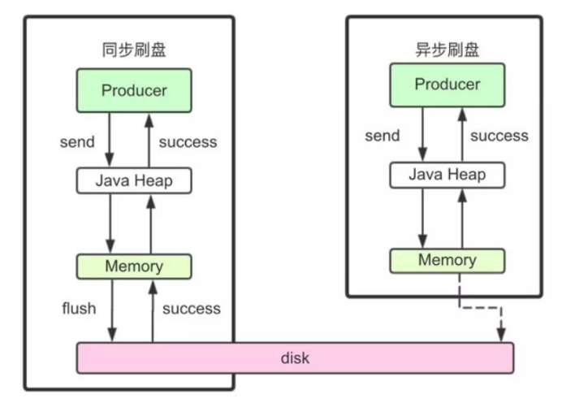

### 1、同步刷盘

- 消息发送到broker之后，持久化到磁盘上，再返回给producer响应。

### 2、异步刷盘

- 消息发送到broker之后，直接返回给producer响应，当内存中的消息堆积到一定程度再执行刷盘持久化操作。
- 通过参数可以控制。Broker配置文件里的flushDiskType参数设置的，这个参数被配置成SYNC_FLUSH(同步)、ASYNC_FLUSH(异步)中的一个。

## 数据零拷贝

### 1、机制

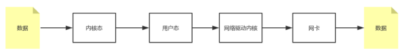

1. 从磁盘复制数据到内核态内存。
2. 从内核态内存复制到用户态内存。
3. 然后从用户态内存复制到网络驱动的内核态内存。
4. 最后是从网络驱动的内核态内存复制到网卡中进行传输。

- MappedByteBuffer底层使用了操作系统的mmap机制，可以省略掉将数据复制到用户态这一步骤，可以直接从内核kernel将文件发送到网卡。但是MappedByteBuffer内存映射只能映射1.5G-2G大小，使用的是虚拟内存，所以RocketMq设定commitLog大小为1G.

### 2、RocketMq实现

- 首先，RocketMQ通过mmap零拷贝对文件进行读写操作，将对文件的操作转化为直接对内存地址进行操作，从而极大地提高了文件的读写效率。
- 其次，consumequeue中的数据是顺序存放的，还引入了PageCache的预读取机制，使得对consumequeue文件的读取几乎接近于内存读取，即使在有消息堆积情况下也不会影响性能。

### 3、PageCache

- PageCache机制，页缓存机制，是OS对文件的缓存机制，用于加速对文件的读写操作。一般来说，程序对文件进行顺序读写 的速度几乎接近于内存读写速度，主要原因是由于OS使用PageCache机制对读写访问操作进行性能优化，将一部分的内存用作PageCache。
- 写操作：OS会先将数据写入到PageCache中，随后会以异步方式由pdflush（page dirty flush)内核线程将Cache中的数据刷盘到物理磁盘
- 读操作：若用户要读取数据，其首先会从PageCache中读取，若没有命中，则OS在从物理磁盘上加载该数据到PageCache的同时，也会顺序对其相邻数据块中的数据进行预读取。

## 消息的消费

### 1、消息的获取方式

#### 1.1、pull主动拉取

- Consumer主动从Broker中拉取消息，主动权由Consumer控制。一旦获取了批量消息，就会启动消费过程。不过，该方式的实时性较弱，即Broker中有了新的消息时消费者并不能及时发现并消费。
- 由于拉取时间间隔是由用户指定的，所以在设置该间隔时需要注意平稳：间隔太短，空请求比例会增加；间隔太长，消息的实时性太差。

#### 1.2、push被动推送

- 该模式下Broker收到数据后会主动推送给Consumer。该获取方式一般实时性较高。
- 该获取方式是典型的发布-订阅模式，即Consumer向其关联的Queue注册了监听器，一旦发现有新的消息到来就会触发回调的执行，回调方法是Consumer去Queue中拉取消息。而这些都是基于Consumer与Broker间的长连接的。长连接的维护是需要消耗系统资源的。

### 2、消息的消费模式

#### 2.1、集群消费Clustering

- 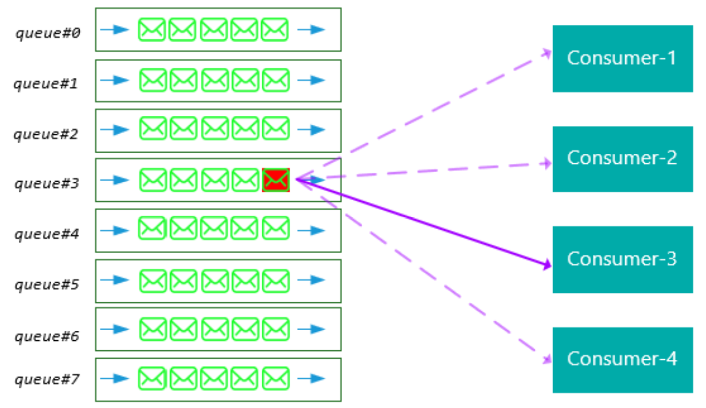
- 当使用集群消费模式时，MQ认为任意一条消息只需要被集群内的任意一个消费者处理即可。
- 集群消费模式下，相同Consumer Group的每个Consumer实例平均分摊同一个Topic的消息。即每条消息只会被发送到Consumer Group中的某个Consumer。
- 特点：
  1. 每条消息只需要被处理一次，broker只会把消息发送给消费集群中的一个消费者。
  2. 在消息重投时，不能保证路由到同一台机器上。
  3. 消费状态由broker维护。

#### 2.2、广播消费Broadcasting

- 
- 广播模式下，MQ会将每条消息推送给集群内所有注册过的客户端，保证消息至少被每台机器消费一次。
- 相同Consumer Group的每个Consumer实例都接收同一个Topic的全量消息。即每条消息都会被发送到Consumer Group中的每个Consumer。
- 特点：
  1. 消费进度由consumer维护
  2. 费者消费一次消息
  3. 消费失败的消息不会重投

#### 2.3、消息消费进度保存

- 广播模式：消费进度保存在consumer端。因为广播模式下consumer group中每个consumer都会消费所有消息，但它们的消费进度是不同。所以consumer各自保存各自的消费进度。

- 集群模式：消费进度保存在broker中。consumer group中的所有consumer共同消费同一个Topic中的消息，同一条消息只会被消费一次。消费进度会参与到消费的负载均衡中，故消费进度是需要共享的。消费进度在config/consumerOffset.json文件中保存。

- 0:8,1:7,2:7,3:8----代表的含义是queueid为0的队列，消费进度为8，queueId为1的队列，消费进度为7。以此类推。

  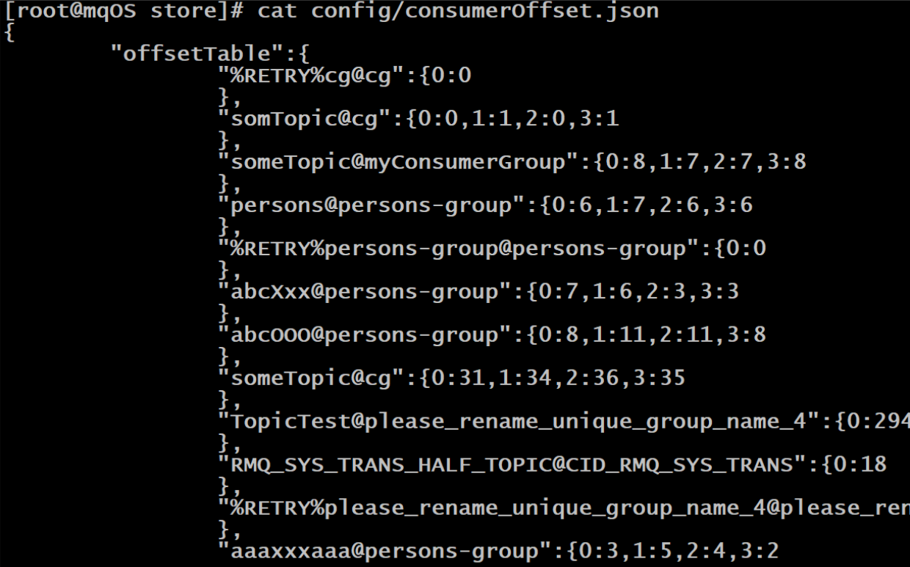

### 3、集群下Queue分配

#### 3.1、Rebalance机制

- 将⼀个Topic下的多个Queue在同⼀个Consumer Group中的多个Consumer间进行重新分配。
- ⼀个队列同一时间最多分配给⼀个消费者，因此当某个消费者组下的消费者实例数量大于队列的数量时，多余的消费者实例将分配不到任何队列。

#### 3.2、Queue分配算法

- 一个Topic中的Queue只能由Consumer Group中的一个Consumer进行消费，而一个Consumer可以同时消费多个Queue中的消息。那么Queue与Consumer间的配对关系是如何确定的，即Queue要分配给哪个Consumer进行消费，也是有算法策略的。
- 常见的有四种策略。这些策略是通过在创建Consumer时的构造器传进去的。

##### 3.2.1、平均分配策略

##### 3.2.2、环形平均策略

##### 3.2.3、一致性hash

##### 3.2.4、同机房策略
