# RocketMQ

## 角色

### 1、Broker

- Broker面向producer和consumer接收和发送消息。

  1. 向nameserver提交自己的信息。
  2. 是消息中间件的消息存储、转发服务器。
  3. 每个Broker节点，在启动时，都会遍历NameServer列表，与每个NameServer建立长连接，注册自己的信息，之后定时上报。

- 集群broker

  1. Broker高可用，可以配成Master/Slave结构，Master可写可读，Slave只可以读，Master将写入的数据同步给Slave。一个Master可以对应多个Slave，但是一个Slave只能对应一个Master。Master与Slave的对应关系通过指定相同的BrokerName，不同的BrokerId来定义。
  2. BrokerId为0表示Master，非0表示Slave。
  3. Master多机负载，可以部署多个broker，每个Broker与nameserver集群中的所有节点建立长连接，定时注册Topic信息到所有nameserver。

  

- Broker功能模块划分：

  

  1. Remoting Module：整个Broker的实体，负责处理来自clients端的请求。而这个Broker实体则由以下模块构成。
  2. Client Manager：客户端管理器。负责接收、解析客户端(Producer/Consumer)请求，管理客户端。例如，维护Consumer的Topic订阅信息。
  3. Store Service：存储服务。提供方便简单的API接口，处理消息存储到物理硬盘和消息查询功能。
  4. HA Service：高可用服务，提供Master Broker 和 Slave Broker之间的数据同步功能。
  5. Index Service：索引服务。根据特定的Message key，对投递到Broker的消息进行索引服务，同时也提供根据Message Key对消息进行快速查询的功能。

### 2、NameServer

- NameServer是注册中心、服务发现者。集群中的各个角色（producer、broker、consumer等）都需要定时向nameserver上报自己的状态，以便互相发现彼此，超时不上报的话，nameserver会把它从列表中剔除。
- Broker管理：接受Broker集群的注册信息并且保存下来作为路由信息的基本数据；提供心跳检测机制，检查Broker是否还存活。
- 路由信息管理：每个NameServer中都保存着Broker集群的整个路由信息和用于客户端查询的队列信息。Producer和Conumser通过NameServer可以获取整个Broker集群的路由信息，从而进行消息的投递和消费。

#### 路由注册

- NameServer通常也是以集群的方式部署，不过，NameServer是无状态的，即NameServer集群中的各个节点间是无差异的，各节点间相互不进行信息通讯，也没有主备的概念。
- 在Broker节点启动时，轮询NameServer列表，与每个NameServer节点建立长连接，发起注册请求。在NameServer内部维护着⼀个Broker列表，是内存式的内部存储，用来动态存储Broker、Topic的信息，并且不会进行持久化。
- 对于Broker，必须明确指出所有NameServer地址。否则未指出的将不会去注册。也正因为如此，NameServer并不能随便扩容。因为，若Broker不重新配置，新增的NameServer对于Broker来说是不可见的，其不会向这个NameServer进行注册。
- Broker节点为了证明自己是活着的，会维护与NameServer间的长连接，将最新的信息以心跳包的方式上报给NameServer，每30秒发送一次心跳。心跳包中包含 BrokerId、Broker地址(IP+Port)、Broker名称、Broker所属集群名称等等。NameServer在接收到心跳包后，会更新心跳时间戳，记录这个Broker的最新存活时间。

#### 路由发现

- RocketMQ的路由发现采用的是Pull模型。当Topic路由信息出现变化时，NameServer不会主动推送给客户端，而是客户端定时拉取主题最新的路由。默认客户端每30秒会拉取一次最新的路由。
  1. Push模型：推送模型。其实时性较好，是一个“发布-订阅”模型，需要维护一个长连接。而长连接的维护是需要资源成本的。该模型适合于的场景：实时性要求较高、Client数量不多，Server数据变化较频繁
  2. Pull模型：拉取模型。存在的问题是，实时性较差。
  3. Long Polling模型：长轮询模型。其是对Push与Pull模型的整合，充分利用了这两种模型的优势，屏蔽了它们的劣势。

#### 路由剔除

- 由于Broker关机、宕机或网络抖动等原因，NameServer没有收到Broker的心跳，NameServer可能会将其从Broker列表中剔除。
- NameServer中有⼀个定时任务，每隔10秒就会扫描⼀次Broker表，查看每一个Broker的最新心跳时间戳距离当前时间是否超过120秒，如果超过，则会判定Broker失效，然后将其从Broker列表中剔除。
- 当需要做Broker升级、运维等工作时，首先需要把Broker的读写权限关掉，一旦client(Consumer或Producer)向broker发送请求，都会收到broker的NO_PERMISSION响应，然后client会进行对其它Broker的重试。慢慢观察，直到Broker的流量为空时，就可以进行停机维护了。

#### 客户端选择策略

- 客户端在配置时必须要写上NameServer集群的地址，客户端连接NameServer节点时，首先会生产一个随机数，然后再与NameServer节点数量取模，此时得到的就是所要连接的节点索引，然后就会进行连接。如果连接失败，则会采用round-robin轮训策略，逐个尝试着去连接其它节点。
- 首先采用的是随机策略进行的选择，失败后采用的是轮询策略。

### 3、Producer

- 消息生产者，负责生产消息。Producer首先连接到nameServer，并通过MQ的负载均衡模块选择相应的Broker集群队列进行消息投递，投递的过程支持快速失败并且低延迟。
- RocketMQ中的消息生产者都是以生产者组（Producer Group）的形式出现的。生产者组Group是同一类生产者的集合，这类Producer的相关配置需要保持相同。一个生产者组可以同时发送多个主题的消息。
- Producer与nameServer集群中的其中一个节点（随机选择）建立长连接，获得Topic的路由信息，包括Topic下面有哪些Queue，这些Queue分布在哪些Broker上等，接下来与提供Topic服务的Master建立长连接，且定时向Master发送心跳。
- 每次需要连接broker的时候。都要先连接nameserver，通过nameserver获取分配的broker地址。
- Producer只会与master建立连接，因为只有master才会允许消息写入。

### 4、Consumer

- 消息的消费者，通过NameServer集群获得Topic的路由信息，连接到对应的Broker上消费消息。

- 由于Master和Slave都可以读取消息，因此Consumer会与Master和Slave都建立连接。

- RocketMQ中的消息消费者都是以消费者组（Consumer Group）的形式出现的。消费者组是同一类消
  费者的集合，这类Consumer必须消费的是同一个Topic类型的消息，并且每个Consumer的配置都应该相同。消费者组使得在消息消费方面，实现负载均衡和容错的目标变得非常容易。

- 负载均衡：默认的负载均衡策略将一个Topic中的不同的Queue平均分配给同一个Consumer Group的不同的Consumer，注意，并不是将消息负载均衡。

- 消费者组中Consumer的数量应该小于等于订阅Topic的Queue数量。如果超出Queue数量，则多出的Consumer将不能消费消息。

  

- 容错：一个Consmer挂了，该Consumer Group中的其它Consumer可以接着消费原Consumer消费的Queue。

- 一个Topic类型的消息可以被多个消费者组同时消费。

- 消费者组只能消费一个Topic的消息，不能同时消费多个Topic消息。

### 5、系统架构

- 主要由Producer、NameServer、Broker、Consumer组成。

  

## 基本概念

### Message

- 消息：消息系统所传输信息的物理载体，生产和消费数据的最小单位，每条消息必须属于一个主题。

### Topic

- Topic表示一类消息的集合，每个主题包含若干条消息，每条消息只能属于一个主题，是RocketMQ进行消息订阅的基本单位。

- 一个生产者可以同时发送多种Topic的消息，而一个消费者只可以订阅一个Topic。

- Topic属于逻辑上的概念，实际上在Broker中是以queue队列的形式进行存储的。一个topic可以对应多个队列。并且可以在创建topic时进行队列数的指定。

  

- 手动创建Topic时，有两种模式：

  1. 集群模式：该模式下创建的Topic在该集群中，所有Broker中的Queue数量是相同的。

  2. Broker模式：该模式下创建的Topic在该集群中，每个Broker中的Queue数量可以不同。

     自动创建Topic时，默认采用的是Broker模式，会为每个Broker默认创建4个Queue。

- 读/写队列

  1. 从物理上来讲，读/写队列是同一个队列。所以，不存在读/写队列数据同步问题。读/写队列是逻辑上进行区分的概念。一般情况下，读/写队列数量是相同的。例如，创建Topic时设置的写队列数量为8，读队列数量为4，此时系统会创建8个Queue，分别是0 1 2 3 4 5 6 7。Producer会将消息写入到这8个队列，但Consumer只会消费0 1 2 3这4个队列中的消息，4 5 6 7中的消息是不会被消费到的。再如，创建Topic时设置的写队列数量为4，读队列数量为8，此时系统会创建8个Queue，分别是0 1 2 3 4 5 6 7。Producer会将消息写入到0 1 2 3 这4个队列，但Consumer只会消费0 1 2 3 4 5 6 7这8个队列中的消息，但是4 5 6 7中是没有消息的。此时假设Consumer Group中包含两个Consumer，Consumer1消费0 1 2 3，而Consumer2消费4 5 6 7。但实际情况是，Consumer2是没有消息可消费的。也就是说，队列数会以读写队列的最大数进行设置，并且当读/写队列数量设置不同时，总是有问题的。
  2. 那么，为什么要这样设计呢？其这样设计的目的是为了，方便Topic的Queue的缩容。
     例如，原来创建的Topic中包含16个Queue，如何能够使其Queue缩容为8个，还不会丢失消息？可以动态修改写队列数量为8，读队列数量不变。此时新的消息只能写入到前8个队列，而消费都消费的却是16个队列中的数据。当发现后8个Queue中的消息消费完毕后，就可以再将读队列数量动态设置为8。整个缩容过程，没有丢失任何消息。

- perm用于设置对当前创建Topic的操作权限：2表示只写，4表示只读，6表示读写。

### Queue

- 存储消息的物理实体。一个Topic中可以包含多个Queue，每个Queue中存放的就是该Topic的消息。一个Topic的Queue也被称为一个Topic中消息的分区（Partition）。
- 一个Topic的Queue中的消息只能被一个消费者组中的一个消费者消费。一个Queue中的消息不允许同一个消费者组中的多个消费者同时消费。
- Queue存在于commitLog中。

### Tag

- Tag是为消息设置的标签，用于同一主题下区分不同类型的消息。来自同一业务单元的消息，可以根据不同业务目的在同一主题下设置不同标签。
- 标签能够有效地保持代码的清晰度和连贯性，并优化RocketMQ提供的查询系统。消费者可以根据Tag实现对不同子主题的不同消费逻辑，实现更好的扩展性。
- Topic是消息的一级分类，Tag是消息的二级分类。
- 比如城市消费金额统计数据信息，Topic是消费金额统计，Tag就可以是二级分类，比如北京、上海、长春等。

### Key

- 每条消息可以设置按照业务逻辑，设置相关的业务的key。


## 消息的存储机制

### 1、消息的流转过程

- RocketMQ中的消息存储在本地文件系统中，这些相关文件默认在当前用户主目录下的store目录中。一般都需要自定义存储位置。


Producer发送数据到Broker，数据会被记录到commitLog里，并且会更新当前offset消费记录。

### 2、文件列表


#### 2.1、abort

- 该文件在Broker启动后会自动创建，正常关闭Broker，该文件会自动消失。若在没有启动Broker的情况下，发现这个文件是存在的，则说明之前Broker的关闭是非正常关闭。

#### 2.2、checkpoint

- 其中存储着commitlog、consumequeue、index文件的最后刷盘时间戳。

#### 2.3、commitLog

- 数据存储真正的物理单元。一个commitLog大小为1g，commitLog目录中存放着很多的mappedFile文件，当前Broker中的所有消息都是落盘到这些mappedFile文件中的。mappedFile文件大小为1G（小于等于1G），文件名由20位十进制数构成，表示当前文件的第一条消息的起始位移偏移量。

  ```
  第一个文件名一定是20位0构成的。因为第一个文件的第一条消息的偏移量commitlog offset为0
  当第一个文件放满时，则会自动生成第二个文件继续存放消息。假设第一个文件大小是1073741820字节（1G = 1073741824字节），则第二个文件名就是00000000001073741824。
  以此类推，第n个文件名应该是前n-1个文件大小之和。
  一个Broker中所有mappedFile文件的commitlog offset是连续的
  ```

  需要注意的是，一个Broker中仅包含一个commitlog目录，所有的mappedFile文件都是存放在该目录中的。即无论当前Broker中存放着多少Topic的消息，这些消息都是被顺序写入到了mappedFile文件中的。也就是说，这些消息在Broker中存放时并没有被按照Topic进行分类存放。

  

  mappedFile文件内容由一个个的消息单元构成。每个消息单元中包含消息总长度MsgLen、消息的物理位置physicalOffset、消息体内容Body、消息体长度BodyLength、消息主题Topic、Topic长度TopicLength、消息生产者BornHost、消息发送时间戳BornTimestamp、消息所在的队列QueueId、消息在Queue中存储的偏移量QueueOffset等近20余项消息相关属性。

#### 2.4、config

- 存放着Broker运行期间的一些配置数据。

  

  1. consumerFilter.json：消息过滤器

  2. consumerOffset.json：客户端的消费进度

     

  3. delayOffset.json：延迟消息进度

  4. subscriptionGroup.json：group的订阅数据

     

  5. topics.json：Topic的配置信息

     


#### 2.5、consumequeue

- consumequeue的物理结构是按照每个topic的名称进行分类，树状结构的文件夹，每个topic下还会按照每个queue的queueId进行分类，每个queue下是具体的文件。

- consumequeue文件名也由20位数字构成，表示当前文件的第一个索引条目的起始位移偏移量。与mappedFile文件名不同的是，其后续文件名是固定的。因为consumequeue文件大小是固定不变

  

- 每个consumequeue文件可以包含30w个索引条目，每个索引条目包含了三个消息重要属性：消息在mappedFile文件中的偏移量CommitLog Offset、消息长度、消息Tag的hashcode值。这三个属性占20个字节，所以每个文件的大小是固定的30w * 20字节

  


#### 2.6、index

- index目录中存放着indexFile文件，indexFile文件提供了通过key和时间戳来查找消息的功能。

- 索引条目结构

  每个Broker中会包含一组indexFile，每个indexFile都是以一个时间戳命名的（这个indexFile被创建时的时间戳）。每个indexFile文件由三部分构成：indexHeader，slots槽位，indexes索引数据。每个indexFile文件中包含500w个slot槽。而每个slot槽又可能会挂载很多的index索引单元。

  

  indexHeader固定40个字节，其中存放着如下数据：

  

  1. beginTimestamp：该indexFile中第一条消息的存储时间
  2. endTimestamp：该indexFile中最后一条消息存储时间
  3. beginPhyoffset：该indexFile中第一条消息在commitlog中的偏移量commitlog offset
  4. endPhyoffset：该indexFile中最后一条消息在commitlog中的偏移量commitlog offset
  5. hashSlotCount：已经填充有index的slot数量（并不是每个slot槽下都挂载有index索引单元，这里统计的是所有挂载了index索引单元的slot槽的数量
  6. indexCount：该indexFile中包含的索引单元个数（统计出当前indexFile中所有slot槽下挂载的所有index索引单元的数量之和）

  indexFile中最复杂的是Slots与Indexes间的关系。在实际存储时，Indexes是在Slots后面的，但为了便于理解，将它们的关系展示为如下形式：

  

  key的hash值 % 500w的结果即为slot槽位，然后将该slot值修改为该index索引单元的indexNo，根据这个indexNo可以计算出该index单元在indexFile中的位置。不过，该取模结果的重复率是很高的，为了解决该问题，在每个index索引单元中增加了preIndexNo，用于指定该slot中当前index索引单元的前一个index索引单元。而slot中始终存放的是其下最新的index索引单元的indexNo，这样的话，只要找到了slot就可以找到其最新的index索引单元，而通过这个index索引单元就可以找到其之前的所有index索引单元。

  index索引单元默写20个字节，其中存放着以下四个属性：

  

  1. keyHash：消息中指定的业务key的hash值
  2. phyOffset：当前key对应的消息在commitlog中的偏移量commitlog offset
  3. timeDiff：当前key对应消息的存储时间与当前indexFile创建时间的时间差
  4. preIndexNo：当前slot下当前index索引单元的前一个index索引单元的indexNo

- indexFile的创建

  1. 当第一条带key的消息发送来后，系统发现没有indexFile，此时会创建第一个indexFile文件。
  2. 当一个indexFile中挂载的index索引单元数量超出2000w个时，会创建新的indexFile。当带key的消息发送到来后，系统会找到最新的indexFile，并从其indexHeader的最后4字节中读取到indexCount。若indexCount >= 2000w时，会创建新的indexFile。
  3. 一个indexFile的最大大小是：(40 + 500w * 4 + 2000w * 20)字节

#### 2.7、lock

- 运行期间使用到的全局资源锁。

## 消息刷盘机制


### 1、同步刷盘

- 消息发送到broker之后，持久化到磁盘上，再返回给producer响应。

### 2、异步刷盘

- 消息发送到broker之后，直接返回给producer响应，当内存中的消息堆积到一定程度再执行刷盘持久化操作。
- 通过参数可以控制。Broker配置文件里的flushDiskType参数设置的，这个参数被配置成SYNC_FLUSH(同步)、ASYNC_FLUSH(异步)中的一个。

## 数据零拷贝

### 1、机制


1. 从磁盘复制数据到内核态内存。
2. 从内核态内存复制到用户态内存。
3. 然后从用户态内存复制到网络驱动的内核态内存。
4. 最后是从网络驱动的内核态内存复制到网卡中进行传输。

- MappedByteBuffer底层使用了操作系统的mmap机制，可以省略掉将数据复制到用户态这一步骤，可以直接从内核kernel将文件发送到网卡。但是MappedByteBuffer内存映射只能映射1.5G-2G大小，使用的是虚拟内存，所以RocketMq设定commitLog大小为1G.

### 2、RocketMq实现

- 首先，RocketMQ通过mmap零拷贝对文件进行读写操作，将对文件的操作转化为直接对内存地址进行操作，从而极大地提高了文件的读写效率。
- 其次，consumequeue中的数据是顺序存放的，还引入了PageCache的预读取机制，使得对consumequeue文件的读取几乎接近于内存读取，即使在有消息堆积情况下也不会影响性能。

### 3、PageCache

- PageCache机制，页缓存机制，是OS对文件的缓存机制，用于加速对文件的读写操作。一般来说，程序对文件进行顺序读写 的速度几乎接近于内存读写速度，主要原因是由于OS使用PageCache机制对读写访问操作进行性能优化，将一部分的内存用作PageCache。
- 写操作：OS会先将数据写入到PageCache中，随后会以异步方式由pdflush（page dirty flush)内核线程将Cache中的数据刷盘到物理磁盘
- 读操作：若用户要读取数据，其首先会从PageCache中读取，若没有命中，则OS在从物理磁盘上加载该数据到PageCache的同时，也会顺序对其相邻数据块中的数据进行预读取。

## 消息的消费

### 1、消息的获取方式

#### 1.1、pull主动拉取

- Consumer主动从Broker中拉取消息，主动权由Consumer控制。一旦获取了批量消息，就会启动消费过程。不过，该方式的实时性较弱，即Broker中有了新的消息时消费者并不能及时发现并消费。
- 由于拉取时间间隔是由用户指定的，所以在设置该间隔时需要注意平稳：间隔太短，空请求比例会增加；间隔太长，消息的实时性太差。

#### 1.2、push被动推送

- 该模式下Broker收到数据后会主动推送给Consumer。该获取方式一般实时性较高。
- 该获取方式是典型的发布-订阅模式，即Consumer向其关联的Queue注册了监听器，一旦发现有新的消息到来就会触发回调的执行，回调方法是Consumer去Queue中拉取消息。而这些都是基于Consumer与Broker间的长连接的。长连接的维护是需要消耗系统资源的。

### 2、消息的消费模式

#### 2.1、集群消费Clustering

- 
- 当使用集群消费模式时，MQ认为任意一条消息只需要被集群内的任意一个消费者处理即可。
- 集群消费模式下，相同Consumer Group的每个Consumer实例平均分摊同一个Topic的消息。即每条消息只会被发送到Consumer Group中的某个Consumer。
- 特点：
  1. 每条消息只需要被处理一次，broker只会把消息发送给消费集群中的一个消费者。
  2. 在消息重投时，不能保证路由到同一台机器上。
  3. 消费状态由broker维护。

#### 2.2、广播消费Broadcasting

- 
- 广播模式下，MQ会将每条消息推送给集群内所有注册过的客户端，保证消息至少被每台机器消费一次。
- 相同Consumer Group的每个Consumer实例都接收同一个Topic的全量消息。即每条消息都会被发送到Consumer Group中的每个Consumer。
- 特点：
  1. 消费进度由consumer维护
  2. 费者消费一次消息
  3. 消费失败的消息不会重投

#### 2.3、消息消费进度保存

- 广播模式：消费进度保存在consumer端。因为广播模式下consumer group中每个consumer都会消费所有消息，但它们的消费进度是不同。所以consumer各自保存各自的消费进度。

- 集群模式：消费进度保存在broker中。consumer group中的所有consumer共同消费同一个Topic中的消息，同一条消息只会被消费一次。消费进度会参与到消费的负载均衡中，故消费进度是需要共享的。消费进度在config/consumerOffset.json文件中保存。

- 0:8,1:7,2:7,3:8----代表的含义是queueid为0的队列，消费进度为8，queueId为1的队列，消费进度为7。以此类推。

  

### 3、集群下Queue分配

#### 3.1、Rebalance机制

- 将⼀个Topic下的多个Queue在同⼀个Consumer Group中的多个Consumer间进行重新分配。
- ⼀个队列同一时间最多分配给⼀个消费者，因此当某个消费者组下的消费者实例数量大于队列的数量时，多余的消费者实例将分配不到任何队列。

#### 3.2、Queue分配算法

- 一个Topic中的Queue只能由Consumer Group中的一个Consumer进行消费，而一个Consumer可以同时消费多个Queue中的消息。那么Queue与Consumer间的配对关系是如何确定的，即Queue要分配给哪个Consumer进行消费，也是有算法策略的。
- 常见的有四种策略。这些策略是通过在创建Consumer时的构造器传进去的。

##### 3.2.1、平均分配策略

- queue比client多的情况下：

  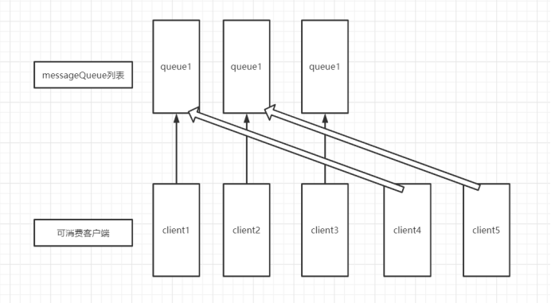

- queue比client少的情况下：

  

- 该算法是要根据avg = QueueCount / ConsumerCount 的计算结果进行分配的。如果能够整除，则按顺序将avg个Queue逐个分配Consumer；如果不能整除，则将多余出的Queue按照Consumer顺序逐个分配。

- 该算法即，先计算好每个Consumer应该分得几个Queue，然后再依次将这些数量的Queue逐个分配个Consumer。

##### 3.2.2、环形平均策略

- queue比client多的情况下：

  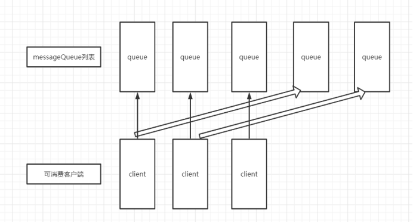

- queue比client少的情况下：

  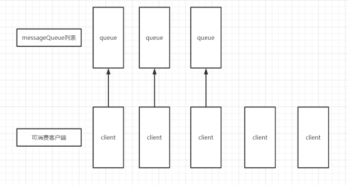

- 环形平均算法是指，根据消费者的顺序，依次在由queue队列组成的环形图中逐个分配。

- 当client多时，会存在不工作的client。

##### 3.2.3、一致性hash

- 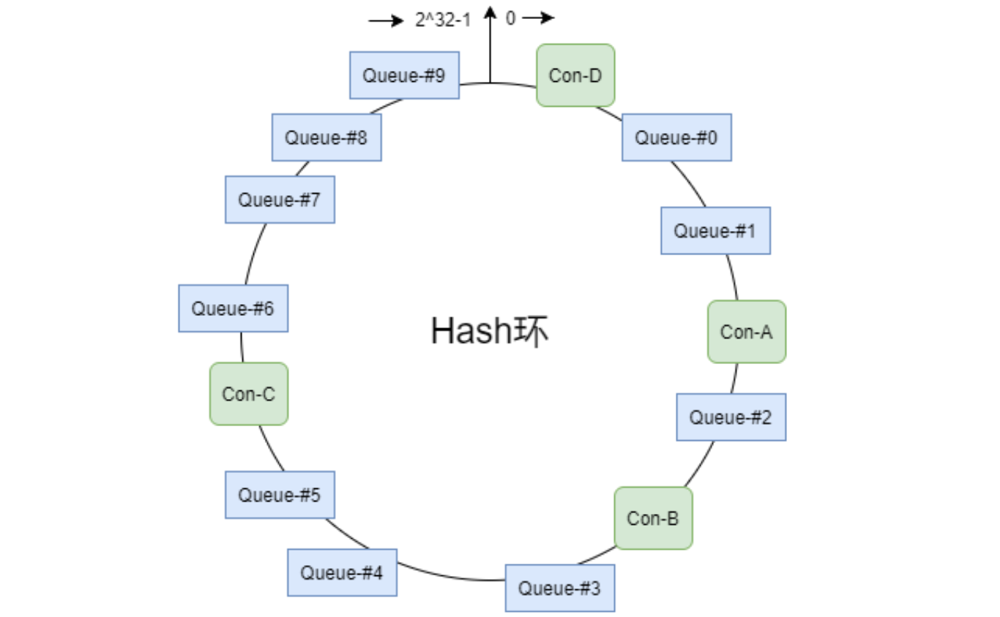
- 该算法会将consumer的hash值作为Node节点存放到hash环上，然后将queue的hash值也放到hash环上，通过顺时针方向，距离queue最近的那个consumer就是该queue要分配的consumer。
- 该算法存在的问题：分配不均。
- 优点：可以有效减少由于消费者组扩容或缩容所带来的大量的Rebalance。

##### 3.2.4、同机房策略

- 
- 该算法会根据queue的部署机房位置和consumer的位置，过滤出当前consumer相同机房的queue。然后按照平均分配策略或环形平均策略对同机房queue进行分配。如果没有同机房queue，则按照平均分配策略或环形平均策略对所有queue进行分配。

### 4、offset管理

消费进度offset是用来记录每个Queue的不同消费组的消费进度的。根据消费进度记录器的不同，可以分为两种模式：本地模式和远程模式。

#### 4.1、offset的存储模式

- offset本地管理模式

  当消费模式为广播消费时，offset使用本地模式存储。因为每条消息会被所有的消费者消费，每个消费者管理自己的消费进度，各个消费者之间不存在消费进度的交集。
  Consumer在广播消费模式下offset相关数据以json的形式持久化到Consumer本地磁盘文件中，默认文件路径为当前用户主目录下的

  ```bash
  .rocketmq_offsets/${clientId}/${group}/Offsets.json 。
  ```

  其中${clientId}为当前消费者id，默认为ip@DEFAULT；${group}为消费者组名称。

- offset远程管理模式
  当消费模式为集群消费时，offset使用远程模式管理。因为所有Cosnumer实例对消息采用的是均衡消费，所有Consumer共享Queue的消费进度。
  Consumer在集群消费模式下offset相关数据以json的形式持久化到Broker磁盘文件中，文件路径为当前用户主目录下的

  ```bash
  store/config/consumerOffset.json
  ```

  Broker启动时会加载这个文件，并写入到一个双层Map（ConsumerOffsetManager）。外层map的key为topic@group，value为内层map。内层map的key为queueId，value为offset。当发生Rebalance时，新的Consumer会从该Map中获取到相应的数据来继续消费。

  <font color="red">集群模式下offset采用远程管理模式，主要是为了保证Rebalance机制。</font>

- offset用途

  消费者是如何从最开始持续消费消息的？消费者要消费的第一条消息的起始位置是用户自己通过consumer.setConsumeFromWhere()方法指定的。

  在Consumer启动后，其要消费的第一条消息的起始位置常用的有三种，这三种位置可以通过枚举类型常量设置。这个枚举类型为ConsumeFromWhere。

  ```bash
  #从queue的当前最后一条消息开始消费
  ConsumeFromWhere.CONSUME_FROM_LAST_OFFSET
  #从queue的第一条消息开始消费
  ConsumeFromWhere.CONSUME_FROM_FIRST_OFFSET
  #从指定的具体时间戳位置的消息开始消费。这个具体时间戳是通过另外一个语句指定的。
  ConsumeFromWhere.CONSUME_FROM_TIMESTAMP
  #指定时间戳 yyyyMMddHHmmss
  consumer.setConsumeTimestamp(“20210701080000”)
  ```

  当消费完一批消息后，Consumer会提交其消费进度offset给Broker，Broker在收到消费进度后会将其更新到那个双层Map（ConsumerOffsetManager）及consumerOffset.json文件中，然后向该Consumer进行ACK，而ACK内容中包含三项数据：

  ```java
  当前消费队列的最小offset（minOffset）
  最大offset（maxOffset）
  及下次消费的起始offset（nextBeginOffset）
  ```

#### 4.2、offset的提交模式

集群消费模式下，Consumer消费完消息后会向Broker提交消费进度offset，其提交方式分为两种：

- 同步提交：消费者在消费完一批消息后会向broker提交这些消息的offset，然后等待broker的成功响应。若在等待超时之前收到了成功响应，则继续读取下一批消息进行消费（从ACK中获取nextBeginOffset）。若没有收到响应，则会重新提交，直到获取到响应。而在这个等待过程中，消费者是阻塞的。其严重影响了消费者的吞吐量。
- 异步提交：消费者在消费完一批消息后向broker提交offset，但无需等待Broker的成功响应，可以继续读取并消费下一批消息。这种方式增加了消费者的吞吐量。但需要注意，broker在收到提交的offset后，还是会向消费者进行响应的。可能还没有收到ACK，此时Consumer会从Broker中直接获取nextBeginOffset。

#### 4.3、重试队列的offset存储

- 当rocketMQ对消息的消费出现异常时，会将发生异常的消息的offset提交到Broker中的重试队列。系统在发生消息消费异常时会为当前的topic@group创建一个重试队列，该队列以%RETRY%开头，到达重试时间后进行消费重试。
- 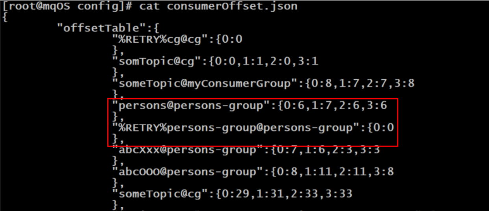

### 5、消息的清理

- 消息被消费过后会被清理掉吗？不会的。
- 消息是被顺序存储在commitlog文件的，且消息大小不定长，所以消息的清理是不可能以消息为单位进行清理的，而是以commitlog文件为单位进行清理的。否则会急剧下降清理效率，并实现逻辑复杂。
- commitlog文件存在一个过期时间，默认为72小时，即三天。除了用户手动清理外，在以下情况下也会被自动清理，无论文件中的消息是否被消费过：
  1. 文件过期，且到达清理时间点（默认为凌晨4点）后，自动清理过期文件。
  2. 文件过期，且磁盘空间占用率已达过期清理警戒线（默认75%）后，无论是否达到清理时间点，都会自动清理过期文件。
  3. 磁盘占用率达到清理警戒线（默认85%）后，开始按照设定好的规则清理文件，无论是否过期。默认会从最老的文件开始清理。
  4. 磁盘占用率达到系统危险警戒线（默认90%）后，Broker将拒绝消息写入
- 需要注意以下几点：
  1. 对于RocketMQ系统来说，删除一个1G大小的文件，是一个压力巨大的IO操作。在删除过程中，系统性能会骤然下降。所以，其默认清理时间点为凌晨4点，访问量最小的时间。也正因如此，我们要保障磁盘空间的空闲率，不要使系统出现在其它时间点删除commitlog文件的情况。
  2. 官方建议RocketMQ服务的Linux文件系统采用ext4。因为对于文件删除操作，ext4要比ext3性能更好

## 消息的分类

### 1、普通消息

- 同步发送消息

  同步发送消息是指，Producer发出⼀条消息后，会在收到MQ返回的ACK之后才发下⼀条消息。该方式的消息可靠性最高，但消息发送效率太低。

  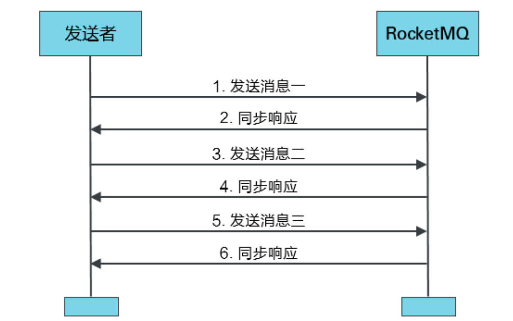

- 异步发送消息

  异步发送消息是指，Producer发出消息后无需等待MQ返回ACK，直接发送下⼀条消息。该方式的消息可靠性可以得到保障，消息发送效率也可以。

  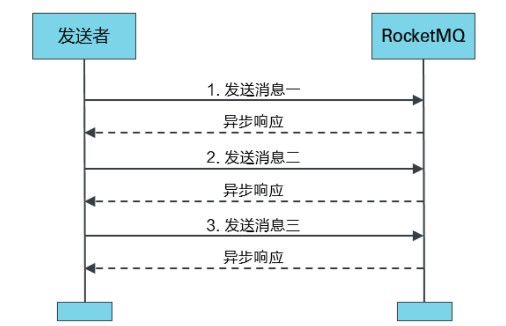

### 2、顺序消息

- 什么是顺序消息

  顺序消息指的是，严格按照消息的发送顺序进行消费的消息(FIFO)。
  默认情况下生产者会把消息以Round Robin轮询方式发送到不同的Queue分区队列；而消费消息时会从多个Queue上拉取消息，这种情况下的发送和消费是不能保证顺序的。如果将消息仅发送到同一个Queue中，消费时也只从这个Queue上拉取消息，就严格保证了消息的顺序性。

- 为什么需要顺序消息

  例如，现在有TOPIC->ORDER_STATUS (订单状态)，其下有4个Queue队列，该Topic中的不同消息用于描述当前订单的不同状态。假设订单有状态：未支付、已支付、发货中、发货成功、发货失败。根据以上订单状态，生产者从时序上可以生成如下几个消息：

  订单T0000001:未支付 --> 订单T0000001:已支付 --> 订单T0000001:发货中 --> 订单T0000001:发货失败
  消息发送到MQ中之后，Queue的选择如果采用轮询策略，消息在MQ的存储可能如下：

  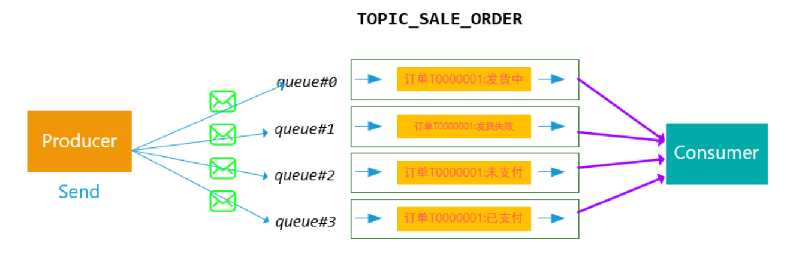

  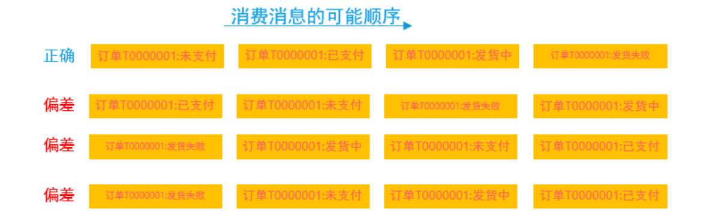

  这种情况下，我们希望Consumer消费消息的顺序和我们发送是一致的，然而上述MQ的投递和消费方式，我们无法保证顺序是正确的。对于顺序异常的消息，Consumer即使设置有一定的状态容错，也不能完全处理好这么多种随机出现组合情况。

- 顺序消息解决

  对于相同订单号的消息，通过一定的策略，将其放置在一个Queue中，然后消费者再采用一定的策略（例如，一个线程独立处理一个queue，保证处理消息的顺序性），能够保证消费的顺序性。

  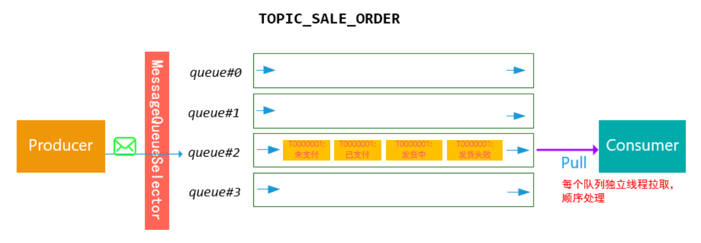


### 3、分区有序

- 如果有多个Queue参与，仅可保证在该Queue分区队列上的消息顺序，则称为分区有序。

- 在定义Producer时可以指定消息队列选择器，实现Queue的选择。这个选择器是实现MessageQueueSelector接口自定义的。

  在定义选择器的选择算法时，一般需要使用“select--key”。这个key可以是消息key也可以是其它数据。但无论谁做select--key，都不能重复，都是唯一的。一般性的选择算法是，让select--key（或其hash值）与该Topic所包含的Queue的数量取模，其结果即为选择出的Queue的QueueId。

### 4、延时消息

- 当消息写入到Broker后，在指定的时长后才可被消费处理的消息，称为延时消息。

- 延时消息的延迟时长不支持随意时长的延迟，是通过特定的延迟等级来指定的。延时等级定义在RocketMQ服务端的MessageStoreConfig类中的如下变量中：

  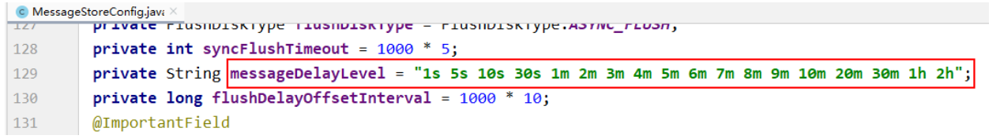

  即，若指定的延时等级为3，则表示延迟时长为10s，即延迟等级是从1开始计数的。
  当然，如果需要自定义的延时等级，可以通过在broker加载的配置中新增如下配置（例如下面增加了1天这个等级1d）。配置文件在RocketMQ安装目录下的conf目录中。

  ```properties
  messageDelayLevel = 1s 5s 10s 30s 1m 2m 3m 4m 5m 6m 7m 8m 9m 10m 20m 30m 1h 2h 1d
  ```

- 延时消息的原理

  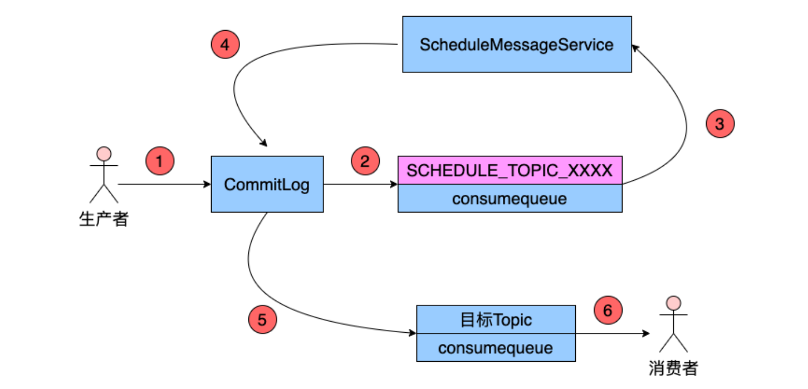

  Producer将消息发送到Broker后，Broker会首先将消息写入到commitlog文件，然后需要将其分发到相应的consumequeue。不过，在分发之前，系统会先判断消息中是否带有延时等级。若没有，则直接正常分发；

  若有则需要经历一个复杂的过程：

  1. 修改消息的Topic为SCHEDULE_TOPIC_XXXX

  2. 根据延时等级，在consumequeue目录中SCHEDULE_TOPIC_XXXX主题下创建出相应的queueId目录与consumequeue文件（如果没有这些目录与文件的话）。

     - 延迟等级delayLevel与queueId的对应关系为queueId = delayLevel -1
     - 需要注意，在创建queueId目录时，并不是一次性地将所有延迟等级对应的目录全部创建完毕，而是用到哪个延迟等级创建哪个目录。

  3. 修改消息索引单元内容。

     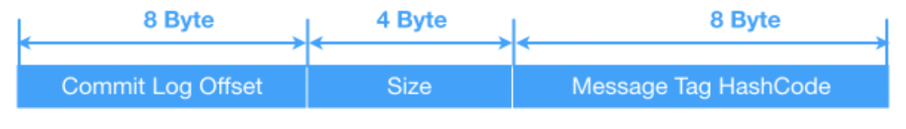

     索引单元中的Message Tag HashCode部分原本存放的是消息的Tag的Hash值。现修改为消息的投递时间。投递时间是指该消息被重新修改为原Topic后再次被写入到commitlog中的时间。投递时间 = 消息存储时间 + 延时等级时间。消息存储时间指的是消息被发送到Broker时的时间戳。

  4. 将消息索引写入到SCHEDULE_TOPIC_XXXX主题下相应的consumequeue中

     - SCHEDULE_TOPIC_XXXX目录中各个延时等级Queue中的消息是如何排序的？
     - 是按照消息投递时间排序的。一个Broker中同一等级的所有延时消息会被写入到consumequeue目录中SCHEDULE_TOPIC_XXXX目录下相同Queue中。即一个Queue中消息投递时间的延迟等级时间是相同的。那么投递时间就取决于于 消息存储时间了。即按照消息被发送到Broker的时间进行排序的。

  5. 投递延时消息

     - Broker内部有⼀个延迟消息服务类ScheuleMessageService，其会消费SCHEDULE_TOPIC_XXXX中的消息，即按照每条消息的投递时间，将延时消息投递到⽬标Topic中。不过，在投递之前会从commitlog中将原来写入的消息再次读出，并将其原来的延时等级设置为0，即原消息变为了一条不延迟的普通消息。然后再次将消息投递到目标Topic中。
     - ScheuleMessageService在Broker启动时，会创建并启动一个定时器Timer，用于执行相应的定时任务。系统会根据延时等级的个数，定义相应数量的TimerTask，每个TimerTask负责一个延迟等级消息的消费与投递。每个TimerTask都会检测相应Queue队列的第一条消息是否到期。若第一条消息未到期，则后面的所有消息更不会到期（消息是按照投递时间排序的）；若第一条消息到期了，则将该消息投递到目标Topic，即消费该消息。

  6. 将消息重新写入commitlog

     延迟消息服务类ScheuleMessageService将延迟消息再次发送给了commitlog，并再次形成新的消息索引条目，分发到相应Queue。
     这其实就是一次普通消息发送。只不过这次的消息Producer是延迟消息服务类ScheuleMessageService。

### 5、事务消息

#### 5.1、事务消息原理

- RocketMQ提供了类似X/Open XA的分布式事务功能，通过事务消息能达到分布式事务的最终一致。XA是一种分布式事务解决方案，一种分布式事务处理模式。

- RocketMQ使用两阶段提交。

  1. producer产生消息之后，产生事务，此时将消息发送给broker。写入broker的HF半消息队列。消息的状态是不可用的，消费者也是不可见。写入到HF队列之后，会刷到磁盘中，此时broker给producer发送确认消息。
  2. producer收到确认消息之后，代表HFM消息发送成功，此时可以开启本地真正的事务。一系列操作成功之后，再给broker发送成功确认的消息，HFM消息变成可用状态，消费端可以进行消费。
  3. 如果本地事务执行时间比较久，broker会开启一个定时任务，定时向producer发送消息，确认程序是执行失败了，还是就是执行时间比较久。此时producer会有一个回调方法，可以手动编码返回给定时任务程序执行的状况。如果定时任务一直拿不到结果，这条半消息就会被废弃了。
  4. 如果本地事务执行失败，会在回调方法内向broker发送消息状态。HF队列中的消息会写到磁盘中进行保存，定时任务会定时进行清除。

- 描述本地事务执行状态

  ```java
  public enum LocalTransactionState {
      COMMIT_MESSAGE, // 本地事务执行成功
      ROLLBACK_MESSAGE, // 本地事务执行失败
      UNKNOW, // 不确定，表示需要进行回查以确定本地事务的执行结果
  }
  ```

- RocketMQ中的消息回查设置

  关于消息回查，有三个常见的属性设置。它们都在broker加载的配置文件中设置

  1. transactionTimeout=20，指定TM在20秒内应将最终确认状态发送给TC，否则引发消息回查。默认为60秒。
  2. transactionCheckMax=5，指定最多回查5次，超过后将丢弃消息并记录错误日志。默认15次。
  3. transactionCheckInterval=10，指定设置的多次消息回查的时间间隔为10秒。默认为60秒。

- Half Message

  预处理消息，当broker收到此类消息后，会存储到RMQ_SYS_TRANS_HALF_TOPIC的消息消费队列中

- 检查事务状态：Broker会开启一个定时任务，消费RMQ_SYS_TRANS_HALF_TOPIC队列中的消息，每次执行任务会向消息发送者确认事务执行状态（提交、回滚、未知），如果是未知，等待下一次回调。

- 超时：如果超过回查次数，默认回滚消息

#### 5.2、使用限制

- 事务消息不支持延时消息和批量消息。
- 为了避免单个消息被检查太多次而导致半队列消息累积，默认将单个消息的检查次数限制为 15 次，但是用户可以通过 Broker 配置文件的 transactionCheckMax参数来修改此限制。如果已经检查某条消息超过 N 次的话（ N = transactionCheckMax ） 则 Broker 将丢弃此消息，并在默认情况下同时打印错误日志。可以通过重写 AbstractTransactionCheckListener 类来修改这个行为。
- 事务消息将在 Broker 配置文件中的参数 transactionMsgTimeout 这样的特定时间长度之后被检查。当发送事务消息时，用户还可以通过设置用户属性 CHECK_IMMUNITY_TIME_IN_SECONDS 来改变这个限制，该参数优先于 transactionMsgTimeout 参数。
- 事务性消息可能不止一次被检查或消费，对于事务消息要做好幂等性检查。
- 提交给用户的目标主题消息可能会失败。它的高可用性通过 RocketMQ 本身的高可用性机制来保证，如果希望确保事务消息不丢失、并且事务完整性得到保证，建议使用同步的双重写入机制。
- 事务消息的生产者 ID 不能与其他类型消息的生产者 ID 共享。与其他类型的消息不同，事务消息允许反向查询、MQ服务器能通过它们的生产者 ID 查询到消费者。

### 6、批量消息

#### 6.1、批量发送

- 生产者进行消息发送时可以一次发送多条消息，这可以大大提升Producer的发送效率。不过需要注意以下几点：

  - 批量发送的消息必须具有相同的Topic
  - 批量发送的消息必须具有相同的刷盘策略
  - 批量发送的消息不能是延时消息与事务消息

- 默认情况下，一批发送的消息总大小不能超过4MB字节。如果想超出该值，有两种解决方案：

  - 方案一：将批量消息进行拆分，拆分为若干不大于4M的消息集合分多次批量发送
  - 方案二：在Producer端与Broker端修改属性
  - Producer端需要在发送之前设置Producer的maxMessageSize属性
  - Broker端需要修改其加载的配置文件中的maxMessageSize属性

- 生产者发送的消息大小

  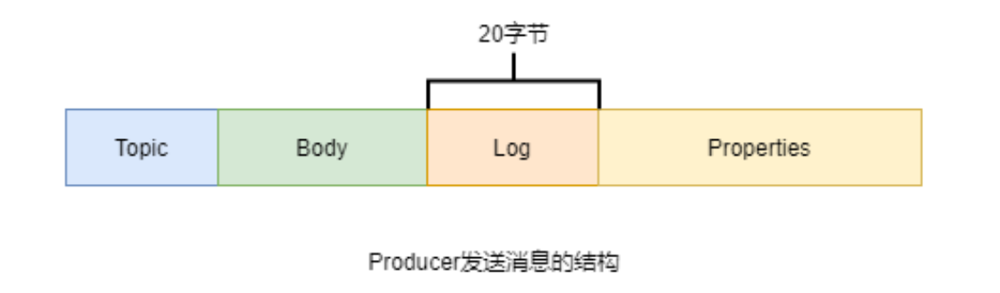

  生产者通过send()方法发送的Message，并不是直接将Message序列化后发送到网络上的，而是通过这个Message生成了一个字符串发送出去的。这个字符串由四部分构成：Topic、消息Body、消息日志（占20字节），及用于描述消息的一堆属性key-value。这些属性中包含例如生产者地址、生产时间、要发送的QueueId等。最终写入到Broker中消息单元中的数据都是来自于这些属性。

#### 6.2、批量消费

- Consumer的MessageListenerConcurrently监听接口的consumeMessage()方法的第一个参数为消息列表，但默认情况下每次只能消费一条消息。若要使其一次可以消费多条消息，则可以通过修改Consumer的consumeMessageBatchMaxSize属性来指定。不过，该值不能超过32。因为默认情况下消费者每次可以拉取的消息最多是32条。若要修改一次拉取的最大值，则可通过修改Consumer的pullBatchSize属性来指定。
- 存在的问题
  1. pullBatchSize值设置的越大，Consumer每拉取一次需要的时间就会越长，且在网络上传输出现问题的可能性就越高。若在拉取过程中若出现了问题，那么本批次所有消息都需要全部重新拉取。
  2. consumeMessageBatchMaxSize值设置的越大，Consumer的消息并发消费能力越低，且这批被消费的消息具有相同的消费结果。因为consumeMessageBatchMaxSize指定的一批消息只会使用一个线程进行处理，且在处理过程中只要有一个消息处理异常，则这批消息需要全部重新再次消费处理。

### 7、消息过滤

对于指定Topic消息的过滤有两种过滤方式：Tag过滤与SQL过滤。

- Tag过滤
  通过consumer的subscribe()方法指定要订阅消息的Tag。如果订阅多个Tag的消息，Tag间使用或运算符(双竖线||)连接。
  
  ```java
  DefaultMQPushConsumer consumer = new DefaultMQPushConsumer("CID_EXAMPLE");
  consumer.subscribe("TOPIC", "TAGA || TAGB || TAGC");
  ```
  
- SQL过滤
  SQL过滤是一种通过特定表达式对事先埋入到消息中的用户属性进行筛选过滤的方式。通过SQL过滤，可以实现对消息的复杂过滤。不过，只有使用PUSH模式的消费者才能使用SQL过滤。SQL过滤表达式中支持多种常量类型与运算符。
  支持的常量类型：

  - 数值：比如：123，3.1415
  - 字符：必须用单引号包裹起来，比如：'abc'
  - 布尔：TRUE 或 FALSE
  - NULL：特殊的常量，表示空

  支持的运算符有：

  - 数值比较：>，>=，<，<=，BETWEEN，=
  - 字符比较：=，<>，IN
  - 逻辑运算 ：AND，OR，NOTNULL
  - 判断：IS NULL 或者 IS NOT NULL

- 默认情况下Broker没有开启消息的SQL过滤功能，需要在Broker加载的配置文件中添加如下属性，以开启该功能

  ```properties
  enablePropertyFilter = true
  ```


## 消息重投

- Producer对发送失败的消息进行重新发送的机制，称为消息发送重试机制，也称为消息重投机制。对于消息重投，需要注意以下几点：

  1. 生产者在发送消息时，若采用同步或异步发送方式，发送失败会重试，但oneway消息发送方式发送失败是没有重试机制的。
  2. 只有普通消息具有发送重试机制，顺序消息是没有的。
  3. 消息重投机制可以保证消息尽可能发送成功、不丢失，但可能会造成消息重复。消息重复在RocketMQ中是无法避免的问题。
  4. 消息重复在一般情况下不会发生，当出现消息量大、网络抖动，消息重复就会成为大概率事件
  5. producer主动重发、consumer负载变化（发生Rebalance，不会导致消息重复，但可能出现重复消费）也会导致重复消息
     消息重复无法避免，但要避免消息的重复消费。
  6. 避免消息重复消费的解决方案是，为消息添加唯一标识（例如消息key），使消费者对消息进行消费判断来避免重复消费
  7. 消息发送重试有三种策略可以选择：同步发送失败策略、异步发送失败策略、消息刷盘失败策略

- 同步发送失败策略

  对于普通消息，消息发送默认采用round-robin策略来选择所发送到的队列。如果发送失败，默认重试2次。但在重试时是不会选择上次发送失败的Broker，而是选择其它Broker。当然，若只有一个Broker其也只能发送到该Broker，但其会尽量发送到该Broker上的其它Queue。

  ```java
  // 创建一个producer，参数为Producer Group名称
  DefaultMQProducer producer = new DefaultMQProducer("pg");
  // 指定nameServer地址
  producer.setNamesrvAddr("rocketmqOS:9876");
  // 设置同步发送失败时重试发送的次数，默认为2次
  producer.setRetryTimesWhenSendFailed(3);
  // 设置发送超时时限为5s，默认3s
  producer.setSendMsgTimeout(5000);
  ```

  同时，Broker还具有失败隔离功能，使Producer尽量选择未发生过发送失败的Broker作为目标Broker。其可以保证其它消息尽量不发送到问题Broker，提升消息发送效率，降低消息发送耗时。

  如果超过重试次数，则抛出异常，由Producer去保证消息不丢。当然当生产者出现RemotingException、MQClientException和MQBrokerException时，Producer会自动重投消息。

- 异步发送失败策略

  异步发送失败重试时，异步重试不会选择其他broker，仅在同一个broker上做重试，所以该策略无法保证消息不丢。

  ```java
  DefaultMQProducer producer = new DefaultMQProducer("pg");
  producer.setNamesrvAddr("rocketmqOS:9876");
  // 指定异步发送失败后不进行重试发送
  producer.setRetryTimesWhenSendAsyncFailed(0);
  ```

- 消息刷盘失败策略

  消息刷盘超时（Master或Slave）或slave不可用（slave在做数据同步时向master返回状态不是SEND_OK）时，默认是不会将消息尝试发送到其他Broker的。不过，对于重要消息可以通过在Broker的配置文件设置retryAnotherBrokerWhenNotStoreOK属性为true来开启。

## 消息消费重试机制

### 1、顺序消息的消费重试

- 对于顺序消息，当Consumer消费消息失败后，为了保证消息的顺序性，其会自动不断地进行消息重试，直到消费成功。消费重试默认间隔时间为1000毫秒。重试期间应用会出现消息消费被阻塞的情况。

  ```java
  DefaultMQPushConsumer consumer = new DefaultMQPushConsumer("cg");
  // 顺序消息消费失败的消费重试时间间隔，单位毫秒，默认为1000，其取值范围为[10,30000]
  consumer.setSuspendCurrentQueueTimeMillis(100);
  ```

- 由于对顺序消息的重试是无休止的，不间断的，直至消费成功，所以，对于顺序消息的消费，务必要保证应用能够及时监控并处理消费失败的情况，避免消费被永久性阻塞。

- 顺序消息没有发送失败重试机制，但具有消费失败重试机制。

### 2、无序消息的消费重试

- 对于无序消息（普通消息、延时消息、事务消息），当Consumer消费消息失败时，可以通过设置返回状态达到消息重试的效果。不过需要注意，无序消息的重试只对集群消费方式生效，广播消费方式不提供失败重试特性。即对于广播消费，消费失败后，失败消息不再重试，继续消费后续消息。

### 3、消费重试次数与间隔

- 对于无序消息集群消费下的重试消费，每条消息默认最多重试16次，但每次重试的间隔时间是不同的，会逐渐变长。每次重试的间隔时间如下表。

  | 重试次数 | 与上次重试的间隔时间 | 重试次数 | 与上次重试的间隔时间 |
  | -------- | -------------------- | -------- | -------------------- |
  | 1        | 10秒                 | 9        | 7分钟                |
  | 2        | 30秒                 | 10       | 8分钟                |
  | 3        | 1分钟                | 11       | 9分钟                |
  | 4        | 2分钟                | 12       | 10分钟               |
  | 5        | 3分钟                | 13       | 20分钟               |
  | 6        | 4分钟                | 14       | 30分钟               |
  | 7        | 5分钟                | 15       | 1小时                |
  | 8        | 6分钟                | 16       | 2小时                |

- 若一条消息在一直消费失败的前提下，将会在正常消费后的第 4小时46分后进行第16次重试。若仍然失败，则将消息投递到死信队列。

- 修改消费重试次数

  ```java
  DefaultMQPushConsumer consumer = new DefaultMQPushConsumer("cg");
  // 修改消费重试次数
  consumer.setMaxReconsumeTimes(10);
  ```

  - 对于修改过的重试次数，将按照以下策略执行：
    1. 若修改值小于16，则按照指定间隔进行重试
    2. 若修改值大于16，则超过16次的重试时间间隔均为2小时
  - 对于Consumer Group，若仅修改了一个Consumer的消费重试次数，则会应用到该Group中所有其它Consumer实例。若出现多个Consumer均做了修改的情况，则采用覆盖方式生效。即最后被修改的值会覆盖前面设置的值。

### 4、重试队列

- 对于需要重试消费的消息，并不是Consumer在等待了指定时长后再次去拉取原来的消息进行消费，而是将这些需要重试消费的消息放入到了一个特殊Topic的队列中，而后进行再次消费的。这个特殊的队列就是重试队列。

- 当出现需要进行重试消费的消息时，Broker会为每个消费组都设置一个Topic名称为%RETRY%consumerGroup@consumerGroup 的重试队列。

  1. 这个重试队列是针对消费者组的，而不是针对每个Topic设置的（一个Topic的消息可以让多个消费者组进行消费，所以会为这些消费者组各创建一个重试队列）
  2. 只有当出现需要进行重试消费的消息时，才会为该消费者组创建重试队列

  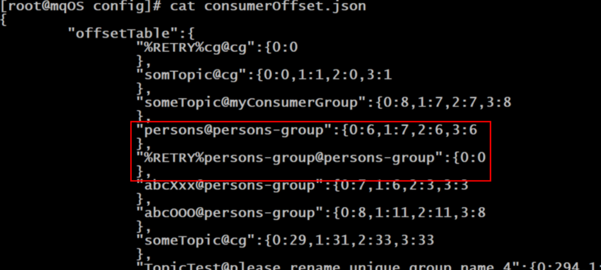

- 消费重试的时间间隔与延时消费的延时等级十分相似，除了没有延时等级的前两个时间外，其它的时间都是相同的。

- Broker对于重试消息的处理是通过延时消息实现的。先将消息保存到SCHEDULE_TOPIC_XXXX延迟队列中，延迟时间到后，会将消息投递到%RETRY%consumerGroup@consumerGroup重试队列中。

### 5、消息重试的配置方式

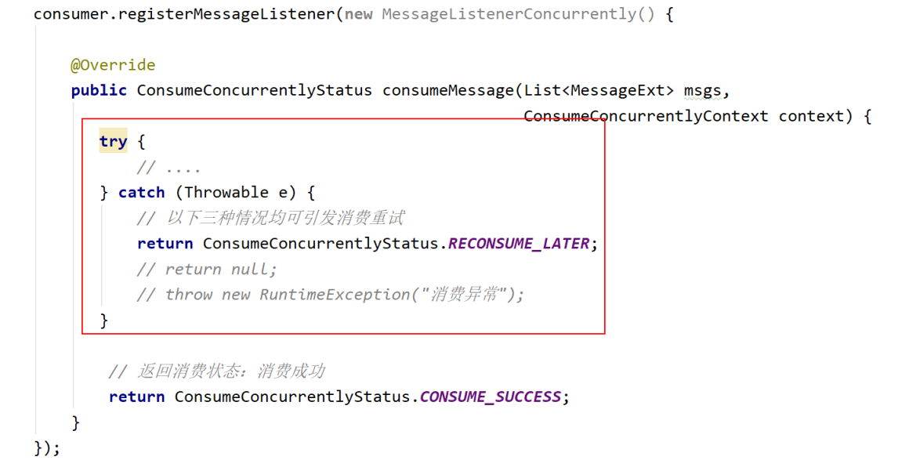

- 集群消费方式下，消息消费失败后若希望消费重试，则需要在消息监听器接口的实现中明确进行如下三种方式之一的配置：
  1. 返回ConsumeConcurrentlyStatus.RECONSUME_LATER（推荐）
  2. 返回Null
  3. 抛出异常

### 6、消费不重试配置方式

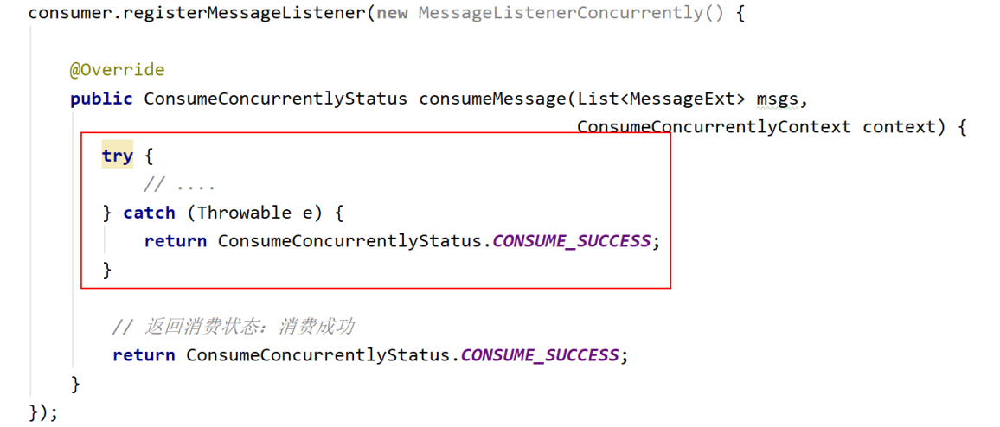

集群消费方式下，消息消费失败后若不希望消费重试，则在捕获到异常后同样也返回与消费成功后的相同的结果，即ConsumeConcurrentlyStatus.CONSUME_SUCCESS，则不进行消费重试。

## 死信队列

### 1、什么是死信队列

- 当一条消息初次消费失败，消息队列会自动进行消费重试。达到最大重试次数后，若消费依然失败，则表明消费者在正常情况下无法正确地消费该消息，此时，消息队列不会立刻将消息丢弃，而是将其发送到该消费者对应的特殊队列中。这个队列就是死信队列（Dead-Letter Queue，DLQ），而其中的消息则称为死信消息（Dead-Letter Message，DLM）。
- 死信队列是用于处理无法被正常消费的消息的。

### 2、死信队列的特征

- 死信队列中的消息不会再被消费者正常消费，即DLQ对于消费者是不可见的
- 死信存储有效期与正常消息相同，均为 3 天（commitlog文件的过期时间），3 天后会被自动删除
- 死信队列就是一个特殊的Topic，名称为%DLQ%consumerGroup@consumerGroup ，即每个消费者组都有一个死信队列
- 如果⼀个消费者组未产生死信消息，则不会为其创建相应的死信队列

### 3、死信消息的处理

实际上，当⼀条消息进入死信队列，就意味着系统中某些地方出现了问题，从而导致消费者无法正常消费该消息，比如代码中原本就存在Bug。因此，对于死信消息，通常需要开发人员进行特殊处理。最关键的步骤是要排查可疑因素，解决代码中可能存在的Bug，然后再将原来的死信消息再次进行投递消费。

## 集群搭建理论

### 1、数据复制与刷盘策略

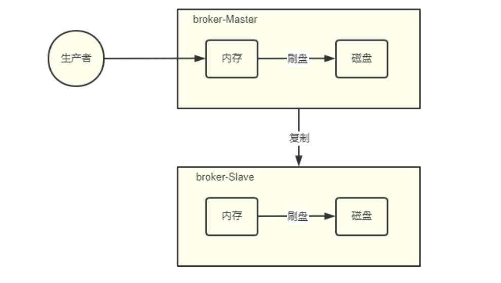

1. 复制策略

   复制策略是Broker的Master与Slave间的数据同步方式。分为同步复制与异步复制：

   - 同步复制：消息写入master后，master会等待slave同步数据成功后才向producer返回成功ACK。
   - 异步复制：消息写入master后，master立即向producer返回成功ACK，无需等待slave同步数据成功。异步复制策略会降低系统的写入延迟，RT变小，提高了系统的吞吐量。

2. 刷盘策略

   刷盘策略指的是broker中消息的落盘方式，即消息发送到broker内存后消息持久化到磁盘的方式。分为同步刷盘与异步刷盘：

   - 同步刷盘：当消息持久化到broker的磁盘后才算是消息写入成功。
   - 异步刷盘：当消息写入到broker的内存后即表示消息写入成功，无需等待消息持久化到磁盘。

   异步刷盘策略会降低系统的写入延迟，RT变小，提高了系统的吞吐量。

   消息写入到Broker的内存，一般是写入到了PageCache

   对于异步刷盘策略，消息会写入到PageCache后立即返回成功ACK。但并不会立即做落盘操作，而是当PageCache到达一定量时会自动进行落盘。

### 2、Broker集群模式

根据Broker集群中各个节点间关系的不同，Broker集群可以分为以下几类：

#### 2.1、单Master

只有一个broker（其本质上就不能称为集群）。这种方式也只能是在测试时使用，生产环境下不能使用，因为存在单点问题。

#### 2.2、多Master

broker集群仅由多个master构成，不存在Slave。同一Topic的各个Queue会平均分布在各个master节点上。

- 优点：配置简单，单个Master宕机或重启维护对应用无影响，在磁盘配置为RAID10时，即使机器宕机不可恢复情况下，由于RAID10磁盘非常可靠，消息也不会丢（异步刷盘丢失少量消息，同步刷盘一条不丢），性能最高；
- 缺点：单台机器宕机期间，这台机器上未被消费的消息在机器恢复之前不可订阅（不可消费），消息实时性会受到影响。
  以上优点的前提是，这些Master都配置了RAID磁盘阵列。如果没有配置，一旦出现某Master宕机，则会发生大量消息丢失的情况。

#### 2.3、多Master多Slave模式-异步复制

broker集群由多个master构成，每个master又配置了多个slave（在配置了RAID磁盘阵列的情况下，一个master一般配置一个slave即可）。master与slave的关系是主备关系，即master负责处理消息的读写请求，而slave仅负责消息的备份与master宕机后的角色切换。

异步复制即前面所讲的复制策略中的异步复制策略，即消息写入master成功后，master立即向producer返回成功ACK，无需等待slave同步数据成功。

该模式的最大特点之一是，当master宕机后slave能够自动切换为master。不过由于slave从master的同步具有短暂的延迟（毫秒级），所以当master宕机后，这种异步复制方式可能会存在少量消息的丢失问题。

- Slave从Master同步的延迟越短，其可能丢失的消息就越少
- 对于Master的RAID磁盘阵列，若使用的也是异步复制策略，同样也存在延迟问题，同样也可能会丢失消息。但RAID阵列的秘诀是微秒级的（因为是由硬盘支持的），所以其丢失的数据量会更少。

#### 2.4、多Master多Slave模式-同步双写

该模式是多Master多Slave模式的同步复制实现。所谓同步双写，指的是消息写入master成功后，master会等待slave同步数据成功后才向producer返回成功ACK，即master与slave都要写入成功后才会返回成功ACK，也即双写。该模式与异步复制模式相比，优点是消息的安全性更高，不存在消息丢失的情况。但单个消息的RT略高，从而导致性能要略低（大约低10%）。

该模式存在一个大的问题：对于目前的版本，Master宕机后，Slave不会自动切换到Master。使用dledger插件可以实现自动切换。

最佳实践：一般会为Master配置RAID10磁盘阵列，然后再为其配置二个Slave。即利用了RAID10磁盘阵列的高效、安全性，又解决了可能会影响订阅的问题。

1. RAID磁盘阵列的效率要高于Master-Slave集群。因为RAID是硬件支持的。也正因为如此，所以RAID阵列的搭建成本较高。

2. 多Master+RAID阵列，与多Master多Slave集群的区别是什么？
   多Master+RAID阵列，其仅仅可以保证数据不丢失，即不影响消息写入，但其可能会影响到消息的订阅。但其执行效率要远高于多Master多Slave集群

   多Master多Slave集群，其不仅可以保证数据不丢失，也不会影响消息写入。其运行效率要低于多Master+RAID阵列。
