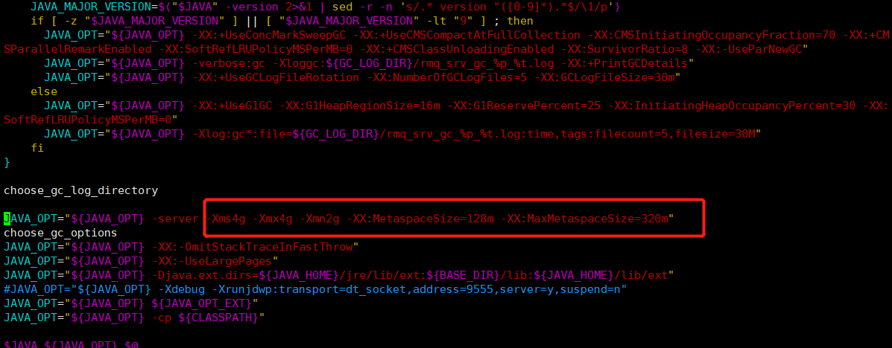
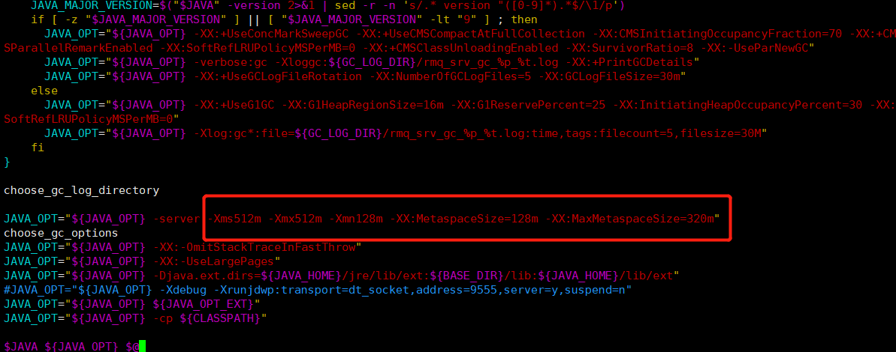
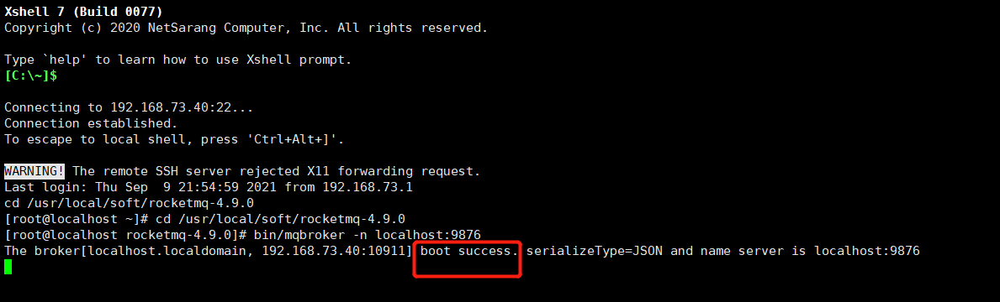
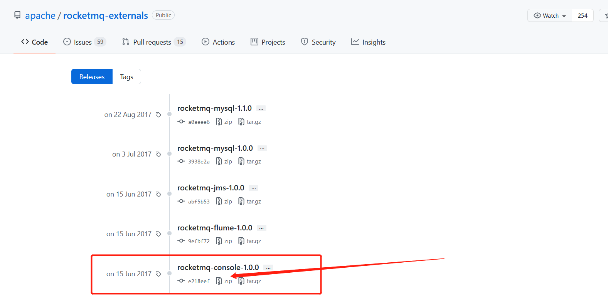
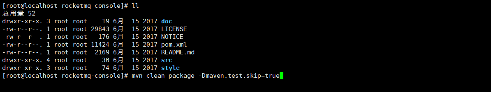
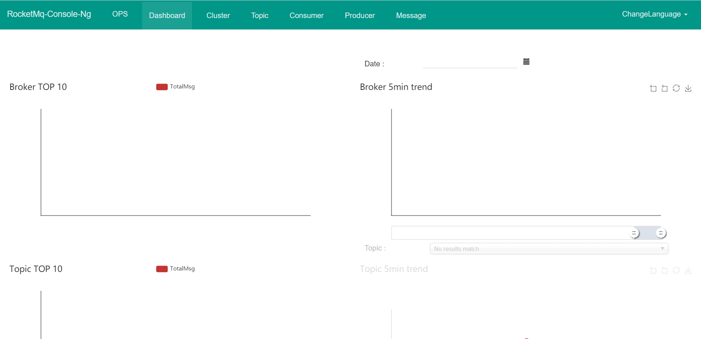
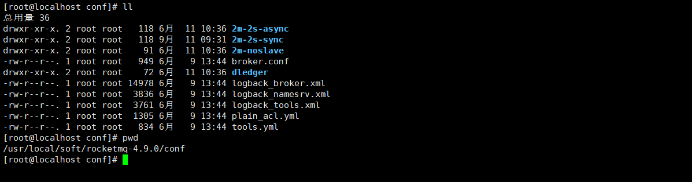
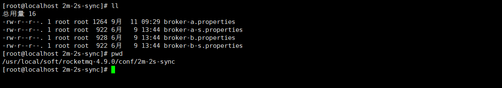
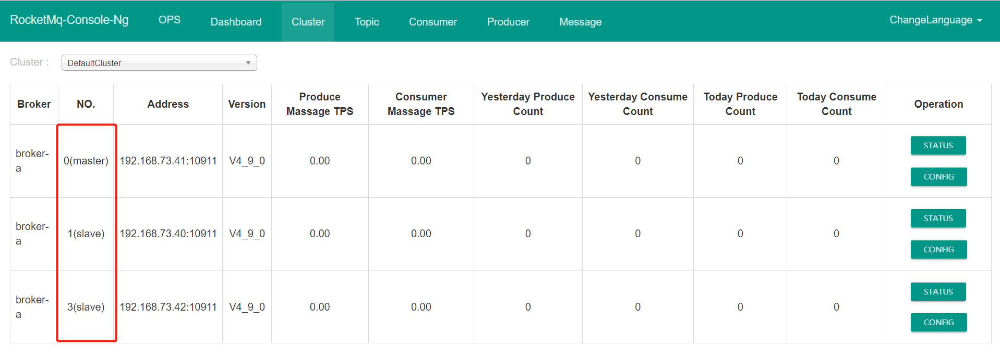
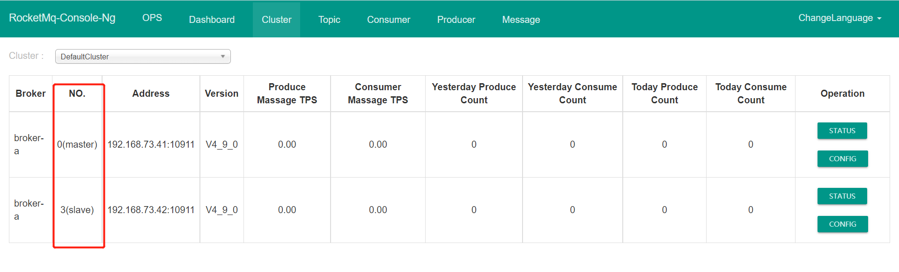

# RocketMQ安装

## 一、单机安装

- ```bash
  #1、创建目录
  mkdir /usr/local/soft
  #2、进入目录
  cd /usr/local/soft
  #3、下载
  wget https://archive.apache.org/dist/rocketmq/4.9.0/rocketmq-all-4.9.0-bin-release.zip
  #4、解压
  unzip rocketmq-all-4.9.0-bin-release.zip
  #5、重命名
  mv rocketmq-all-4.9.0-bin-release rocketmq-4.9.0
  #6、进入目录
  cd rocketmq-4.9.0
  #7.修改初始内存
  vim bin/runserver.sh
  #将虚拟机配置减小
  -Xms512m -Xmx512m -Xmn128m
  vim bin/runbroker.sh
  #将虚拟机配置减小
  -Xms512m -Xmx512m -Xmn128m
  #8、启动nameserver
  bin/mqnamesrv
  #9、启动broker
  bin/mqbroker -n localhost:9876 #连接nameserver 9876
  #10、关闭
  bin/mqshutdown nameserver  bin/mqshutdown namesrv
  ```

- 修改初始内存

  默认的启动参数虚拟机内存设置过大，不适合平时demo练习

  

- 修改后

  

- 启动nameserver

  

- 启动broker

  

## 二、dashboard安装

- 下载地址：https://github.com/apache/rocketmq-externals/releases 

  

- ```bash
  #1.创建路径，将zip拷贝到目录下
  mkdir /usr/local/soft
  #2.解压缩
  unzip rocketmq-externals-rocketmq-console-1.0.0.zip
  #3.修改配置文件端口，改为非8080。因为8080太常用了，担心会冲突
  src/main/resources application.properties
  #4.rocketmq-console目录下执行maven打包
  mvn clean package -Dmaven.test.skip=true #执行编译
  #5.进入到target目录下找编译好的jar包
  rocketmq-console-ng-1.0.1.jar
  #6.移动到soft下
  mv rocketmq-console-ng-1.0.0.jar /usr/local/soft
  #7.启动
  java -jar rocketmq-console-ng-1.0.1.jar --rocketmq.config.namesrvAddr=127.0.0.1:9876
  ```

- maven打包界面

  

- 启动成功

  

## 三、集群搭建

1. rocketMq提供了集群搭建的参考配置，目录在rocketmq-4.9.0/conf

   

   默认提供的是两主两从。不过如果想要高可用，自动选举。一般都要是一主搭配两个从。而不是一主搭配一个从。

   

2. dledger

   rockerMq默认是不支持主节点宕机，自动选举的。引入dledger插件，可实现自动选举功能。

3. 配置修改

   主节点修改broker-a.properties

   ```bash
   #整体集群的名称，如果是两个主，那么两个主的集群名称需要相同
   brokerClusterName=DefaultCluster
   #broker名称，一主两从搭建高可用集群，brokerName需要相同
   brokerName=broker-a
   brokerId=0
   deleteWhen=04
   fileReservedTime=48
   #角色，master、slaver
   brokerRole=SYNC_MASTER
   #刷版机制，同步、异步
   flushDiskType=ASYNC_FLUSH
   namesrvAddr=192.168.73.40:9876;192.168.73.41:9876;192.168.73.42:9876;
   # dleger
   #启用
   enableDLegerCommitLog = true
   dLegerGroup = broker-a
   # 兄弟节点的地址
   dLegerPeers = n0-192.168.73.40:40911;n1-192.168.73.41:40911;n2-192.168.73.42:40911
   #自己的id
   dLegerSelfId = n0
   #发送消息的线程数量
   sendMessageThreadPoolNums = 4
   ```

   两个从节点修改broker-a-s.properties

   ```bash
   brokerClusterName=DefaultCluster
   brokerName=broker-a
   brokerId=1
   deleteWhen=04
   fileReservedTime=48
   brokerRole=SLAVE
   flushDiskType=ASYNC_FLUSH
   namesrvAddr=192.168.73.40:9876;192.168.73.41:9876;192.168.73.42:9876;
   # dleger
   #启用
   enableDLegerCommitLog = true
   dLegerGroup = broker-a
   # 兄弟节点的地址
   dLegerPeers = n0-192.168.73.40:40911;n1-192.168.73.41:40911;n2-192.168.73.42:40911
   #自己的id
   dLegerSelfId = n1
   #发送消息的线程数量
   sendMessageThreadPoolNums = 4
   ```

   分别启动

   ```bash
   #主节点，bin目录下
   ./mqbroker -c ../conf/2m-2s-sync/broker-a.properties
   #从节点，bin目录下
   ./mqbroker -c ../conf/2m-2s-sync/broker-a-s.properties
   #分别启动nameserver
   #查看控制台
   ```

4. 集群搭建效果

   

5. 主节点宕机。触发自动选举

   

## 四、集群配置详解

```bash
#指定整个broker集群的名称，或者说是RocketMQ集群的名称
brokerClusterName=rocket-MS
#指定master-slave集群的名称。一个RocketMQ集群可以包含多个master-slave集群
brokerName=broker-a
#0 表示 Master，>0 表示 Slave
brokerId=0
#nameServer地址，分号分割
namesrvAddr=nameserver1:9876;nameserver2:9876
#默认为新建Topic所创建的队列数
defaultTopicQueueNums=4
#是否允许 Broker 自动创建Topic，建议生产环境中关闭
autoCreateTopicEnable=true
#是否允许 Broker 自动创建订阅组，建议生产环境中关闭
autoCreateSubscriptionGroup=true
#Broker对外提供服务的端口，即Broker与producer与consumer通信的端口
listenPort=10911
#HA高可用监听端口，即Master与Slave间通信的端口，默认值为listenPort+1
haListenPort=10912
#指定删除消息存储过期文件的时间为凌晨4点
deleteWhen=04
#指定未发生更新的消息存储文件的保留时长为48小时，48小时后过期，将会被删除
fileReservedTime=48
#指定commitLog目录中每个文件的大小，默认1G
mapedFileSizeCommitLog=1073741824
#指定ConsumeQueue的每个Topic的每个Queue文件中可以存放的消息数量，默认30w条
mapedFileSizeConsumeQueue=300000
#在清除过期文件时，如果该文件被其他线程所占用（引用数大于0，比如读取消息），此时会阻止
此次删除任务，同时在第一次试图删除该文件时记录当前时间戳。该属性则表示从第一次拒绝删除
后开始计时，该文件最多可以保留的时长。在此时间内若引用数仍不为0，则删除仍会被拒绝。不过
时间到后，文件将被强制删除
destroyMapedFileIntervalForcibly=120000
#指定commitlog、consumequeue所在磁盘分区的最大使用率，超过该值，则需立即清除过期文
件 di
skMaxUsedSpaceRatio=88
#指定store目录的路径，默认在当前用户主目录中
storePathRootDir=/usr/local/rocketmq-all-4.5.0/store
#commitLog目录路径
storePathCommitLog=/usr/local/rocketmq-all-4.5.0/store/commitlog
#consumeueue目录路径
storePathConsumeQueue=/usr/local/rocketmq-all-4.5.0/store/consumequeue
#index目录路径
storePathIndex=/usr/local/rocketmq-all-4.5.0/store/index
#checkpoint文件路径
storeCheckpoint=/usr/local/rocketmq-all-4.5.0/store/checkpoint
#abort文件路径
abortFile=/usr/local/rocketmq-all-4.5.0/store/abort
#指定消息的最大大小
maxMessageSize=65536
#Broker的角色
# - ASYNC_MASTER 异步复制Master
# - SYNC_MASTER 同步双写Master
# - SLAVE
brokerRole=SYNC_MASTER
#刷盘策略
# - ASYNC_FLUSH 异步刷盘
# - SYNC_FLUSH 同步刷盘
flushDiskType=SYNC_FLUSH
#发消息线程池数量
sendMessageThreadPoolNums=128
#拉消息线程池数量
pullMessageThreadPoolNums=128
#强制指定本机IP，需要根据每台机器进行修改。官方介绍可为空，系统默认自动识别，但多网卡时IP地址可能读取错误
brokerIP1=192.168.3.105
```

