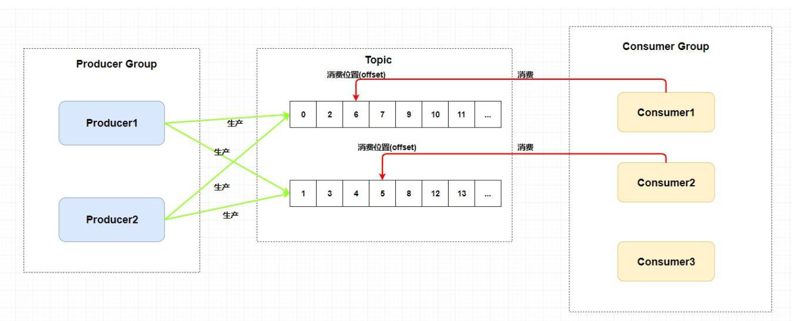
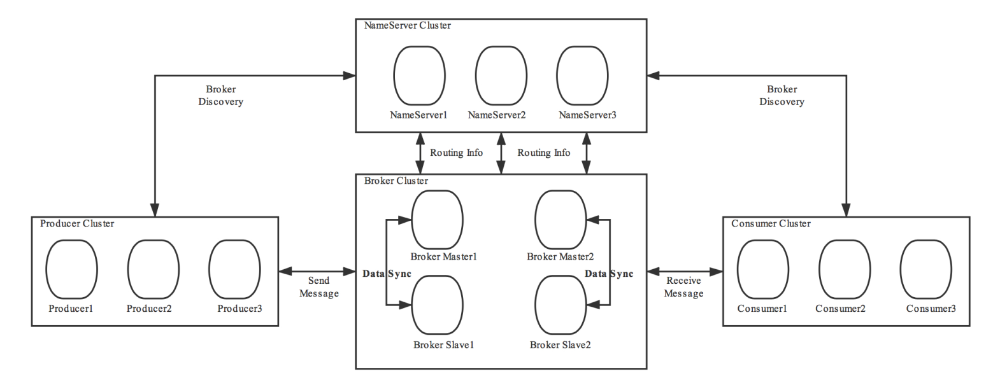

# RocketMQ

## 安装

## 角色

### 1、Broker

### 2、NameServer

- NameServer是注册中心、服务发现者。集群中的各个角色（producer、broker、consumer等）都需要定时向nameserver上报自己的状态，以便互相发现彼此，超时不上报的话，nameserver会把它从列表中剔除。
- Broker管理：接受Broker集群的注册信息并且保存下来作为路由信息的基本数据；提供心跳检测机制，检查Broker是否还存活。
- 路由信息管理：每个NameServer中都保存着Broker集群的整个路由信息和用于客户端查询的队列信息。Producer和Conumser通过NameServer可以获取整个Broker集群的路由信息，从而进行消息的投递和消费。

​      nameserver是无状态的。可以部署多个，当多个nameserver存在的时候，其他角色同时向他们上报信息，以保证高可用。
​      nameServer因为是无状态的，所以集群间互不通信，没有主备的概念。
​      nameserver内存式存储，nameserver中的broker、topic等信息默认不会持久化。

#### 路由注册

#### 路由发现

#### 客户端选择策略

### 3、Producer

- 消息生产者，负责生产消息。Producer首先连接到nameServer，并通过MQ的负载均衡模块选择相应的Broker集群队列进行消息投递，投递的过程支持快速失败并且低延迟。
- RocketMQ中的消息生产者都是以生产者组（Producer Group）的形式出现的。生产者组Group是同一类生产者的集合，这类Producer的相关配置需要保持相同。一个生产者组可以同时发送多个主题的消息。
- Producer与nameServer集群中的其中一个节点（随机选择）建立长连接，获得Topic的路由信息，包括Topic下面有哪些Queue，这些Queue分布在哪些Broker上等，接下来与提供Topic服务的Master建立长连接，且定时向Master发送心跳。
- 每次需要连接broker的时候。都要先连接nameserver，通过nameserver获取分配的broker地址。
- Producer只会与master建立连接，因为只有master才会允许消息写入。

### 4、Consumer

- 消息的消费者，通过NameServer集群获得Topic的路由信息，连接到对应的Broker上消费消息。

- 由于Master和Slave都可以读取消息，因此Consumer会与Master和Slave都建立连接。

- RocketMQ中的消息消费者都是以消费者组（Consumer Group）的形式出现的。消费者组是同一类消
  费者的集合，这类Consumer必须消费的是同一个Topic类型的消息，并且每个Consumer的配置都应该相同。消费者组使得在消息消费方面，实现负载均衡和容错的目标变得非常容易。

- 负载均衡：默认的负载均衡策略将一个Topic中的不同的Queue平均分配给同一个Consumer Group的不同的Consumer，注意，并不是将消息负载均衡。

- 消费者组中Consumer的数量应该小于等于订阅Topic的Queue数量。如果超出Queue数量，则多出的Consumer将不能消费消息。

  

- 容错：一个Consmer挂了，该Consumer Group中的其它Consumer可以接着消费原Consumer消费的Queue。

- 一个Topic类型的消息可以被多个消费者组同时消费。

- 消费者组只能消费一个Topic的消息，不能同时消费多个Topic消息。

### 5、系统架构

- 主要由Producer、NameServer、Broker、Consumer组成。

  

## 基本概念

### Message

### Topic

### Queue

tags

key

commitlog
