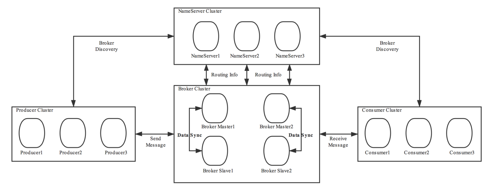

# RocketMQ

## 安装

## 角色

### 1、Broker

- Broker面向producer和consumer接收和发送消息。
  1. 向nameserver提交自己的信息。
  2. 是消息中间件的消息存储、转发服务器。
  3. 每个Broker节点，在启动时，都会遍历NameServer列表，与每个NameServer建立长连接，注册自己的信息，之后定时上报。
  
- 集群broker
  1. Broker高可用，可以配成Master/Slave结构，Master可写可读，Slave只可以读，Master将写入的数据同步给Slave。一个Master可以对应多个Slave，但是一个Slave只能对应一个Master。Master与Slave的对应关系通过指定相同的BrokerName，不同的BrokerId来定义。
  2. BrokerId为0表示Master，非0表示Slave。
  3. Master多机负载，可以部署多个broker，每个Broker与nameserver集群中的所有节点建立长连接，定时注册Topic信息到所有nameserver。
  
  
  
- Broker功能模块划分：

  

  1. Remoting Module：整个Broker的实体，负责处理来自clients端的请求。而这个Broker实体则由以下模块构成。
  2. Client Manager：客户端管理器。负责接收、解析客户端(Producer/Consumer)请求，管理客户端。例如，维护Consumer的Topic订阅信息。
  3. Store Service：存储服务。提供方便简单的API接口，处理消息存储到物理硬盘和消息查询功能。
  4. HA Service：高可用服务，提供Master Broker 和 Slave Broker之间的数据同步功能。
  5. Index Service：索引服务。根据特定的Message key，对投递到Broker的消息进行索引服务，同时也提供根据Message Key对消息进行快速查询的功能。

### 2、NameServer

- NameServer是注册中心、服务发现者。集群中的各个角色（producer、broker、consumer等）都需要定时向nameserver上报自己的状态，以便互相发现彼此，超时不上报的话，nameserver会把它从列表中剔除。
- Broker管理：接受Broker集群的注册信息并且保存下来作为路由信息的基本数据；提供心跳检测机制，检查Broker是否还存活。
- 路由信息管理：每个NameServer中都保存着Broker集群的整个路由信息和用于客户端查询的队列信息。Producer和Conumser通过NameServer可以获取整个Broker集群的路由信息，从而进行消息的投递和消费。

#### 路由注册

- NameServer通常也是以集群的方式部署，不过，NameServer是无状态的，即NameServer集群中的各个节点间是无差异的，各节点间相互不进行信息通讯，也没有主备的概念。
- 在Broker节点启动时，轮询NameServer列表，与每个NameServer节点建立长连接，发起注册请求。在NameServer内部维护着⼀个Broker列表，是内存式的内部存储，用来动态存储Broker、Topic的信息，并且不会进行持久化。
- 对于Broker，必须明确指出所有NameServer地址。否则未指出的将不会去注册。也正因为如此，NameServer并不能随便扩容。因为，若Broker不重新配置，新增的NameServer对于Broker来说是不可见的，其不会向这个NameServer进行注册。
- Broker节点为了证明自己是活着的，会维护与NameServer间的长连接，将最新的信息以心跳包的方式上报给NameServer，每30秒发送一次心跳。心跳包中包含 BrokerId、Broker地址(IP+Port)、Broker名称、Broker所属集群名称等等。NameServer在接收到心跳包后，会更新心跳时间戳，记录这个Broker的最新存活时间。

#### 路由发现

- RocketMQ的路由发现采用的是Pull模型。当Topic路由信息出现变化时，NameServer不会主动推送给客户端，而是客户端定时拉取主题最新的路由。默认客户端每30秒会拉取一次最新的路由。
  1. Push模型：推送模型。其实时性较好，是一个“发布-订阅”模型，需要维护一个长连接。而长连接的维护是需要资源成本的。该模型适合于的场景：实时性要求较高、Client数量不多，Server数据变化较频繁
  2. Pull模型：拉取模型。存在的问题是，实时性较差。
  3. Long Polling模型：长轮询模型。其是对Push与Pull模型的整合，充分利用了这两种模型的优势，屏蔽了它们的劣势。

#### 路由剔除

- 由于Broker关机、宕机或网络抖动等原因，NameServer没有收到Broker的心跳，NameServer可能会将其从Broker列表中剔除。
- NameServer中有⼀个定时任务，每隔10秒就会扫描⼀次Broker表，查看每一个Broker的最新心跳时间戳距离当前时间是否超过120秒，如果超过，则会判定Broker失效，然后将其从Broker列表中剔除。
- 当需要做Broker升级、运维等工作时，首先需要把Broker的读写权限关掉，一旦client(Consumer或Producer)向broker发送请求，都会收到broker的NO_PERMISSION响应，然后client会进行对其它Broker的重试。慢慢观察，直到Broker的流量为空时，就可以进行停机维护了。

#### 客户端选择策略

- 客户端在配置时必须要写上NameServer集群的地址，客户端连接NameServer节点时，首先会生产一个随机数，然后再与NameServer节点数量取模，此时得到的就是所要连接的节点索引，然后就会进行连接。如果连接失败，则会采用round-robin轮训策略，逐个尝试着去连接其它节点。
- 首先采用的是随机策略进行的选择，失败后采用的是轮询策略。

### 3、Producer

- 消息生产者，负责生产消息。Producer首先连接到nameServer，并通过MQ的负载均衡模块选择相应的Broker集群队列进行消息投递，投递的过程支持快速失败并且低延迟。
- RocketMQ中的消息生产者都是以生产者组（Producer Group）的形式出现的。生产者组Group是同一类生产者的集合，这类Producer的相关配置需要保持相同。一个生产者组可以同时发送多个主题的消息。
- Producer与nameServer集群中的其中一个节点（随机选择）建立长连接，获得Topic的路由信息，包括Topic下面有哪些Queue，这些Queue分布在哪些Broker上等，接下来与提供Topic服务的Master建立长连接，且定时向Master发送心跳。
- 每次需要连接broker的时候。都要先连接nameserver，通过nameserver获取分配的broker地址。
- Producer只会与master建立连接，因为只有master才会允许消息写入。

### 4、Consumer

- 消息的消费者，通过NameServer集群获得Topic的路由信息，连接到对应的Broker上消费消息。

- 由于Master和Slave都可以读取消息，因此Consumer会与Master和Slave都建立连接。

- RocketMQ中的消息消费者都是以消费者组（Consumer Group）的形式出现的。消费者组是同一类消
  费者的集合，这类Consumer必须消费的是同一个Topic类型的消息，并且每个Consumer的配置都应该相同。消费者组使得在消息消费方面，实现负载均衡和容错的目标变得非常容易。

- 负载均衡：默认的负载均衡策略将一个Topic中的不同的Queue平均分配给同一个Consumer Group的不同的Consumer，注意，并不是将消息负载均衡。

- 消费者组中Consumer的数量应该小于等于订阅Topic的Queue数量。如果超出Queue数量，则多出的Consumer将不能消费消息。

  

- 容错：一个Consmer挂了，该Consumer Group中的其它Consumer可以接着消费原Consumer消费的Queue。

- 一个Topic类型的消息可以被多个消费者组同时消费。

- 消费者组只能消费一个Topic的消息，不能同时消费多个Topic消息。

### 5、系统架构

- 主要由Producer、NameServer、Broker、Consumer组成。

  

## 基本概念

### Message

- 消息：消息系统所传输信息的物理载体，生产和消费数据的最小单位，每条消息必须属于一个主题。

### Topic

- Topic表示一类消息的集合，每个主题包含若干条消息，每条消息只能属于一个主题，是RocketMQ进行消息订阅的基本单位。

- 一个生产者可以同时发送多种Topic的消息，而一个消费者只可以订阅一个Topic。

- Topic属于逻辑上的概念，实际上在Broker中是以queue队列的形式进行存储的。一个topic可以对应多个队列。并且可以在创建topic时进行队列数的指定。

  

### Queue

- 队列

### tags

### key

### commitlog
