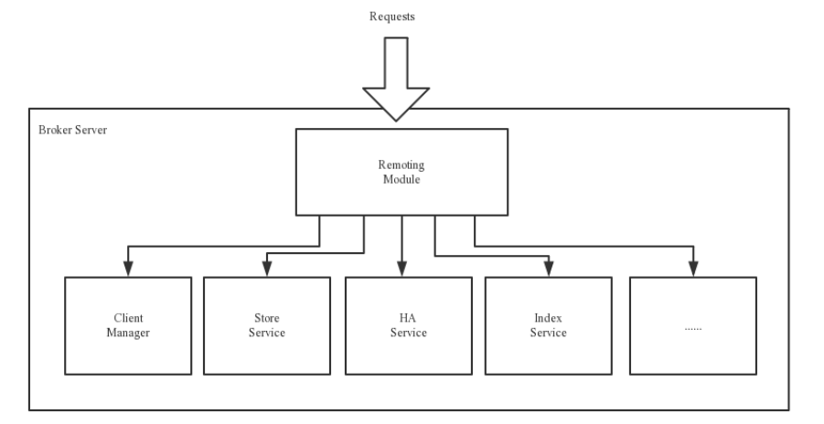
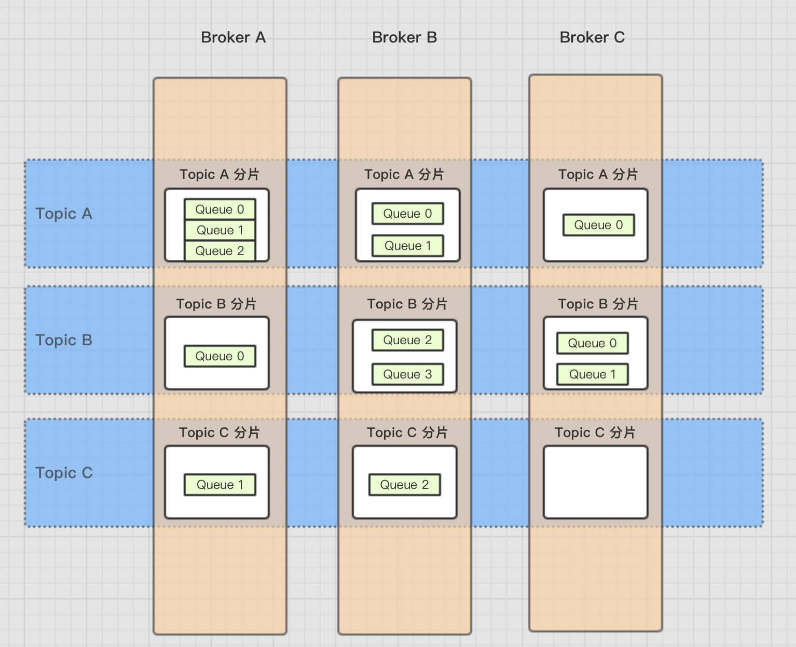
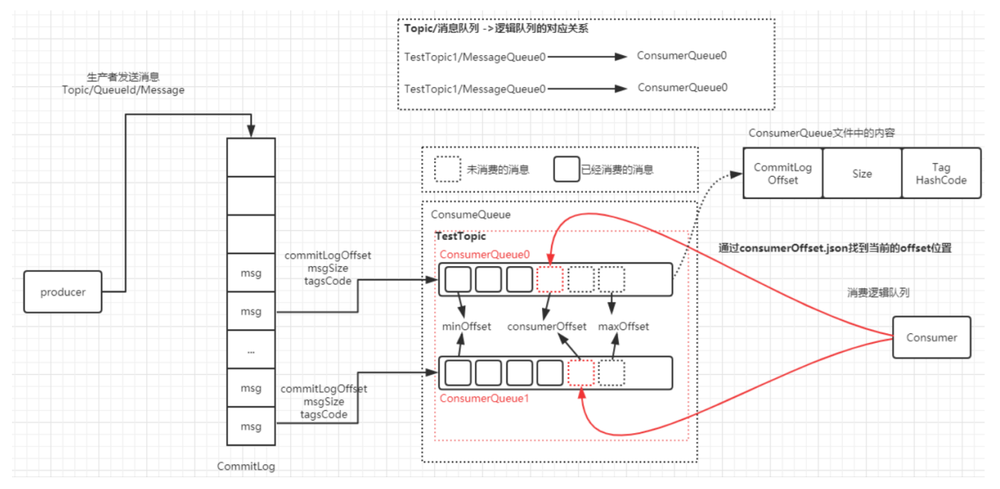
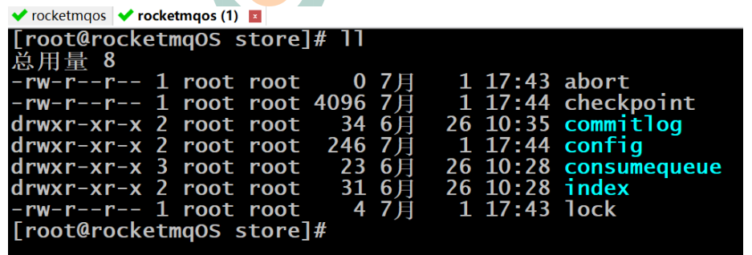
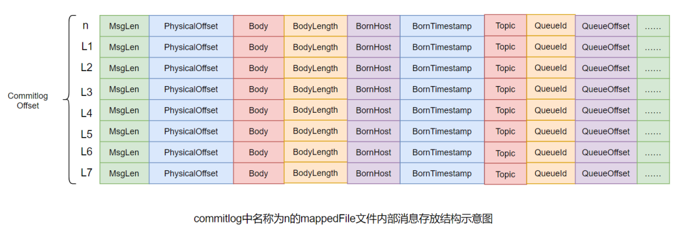
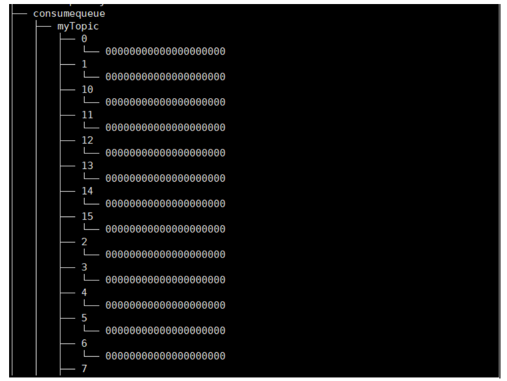
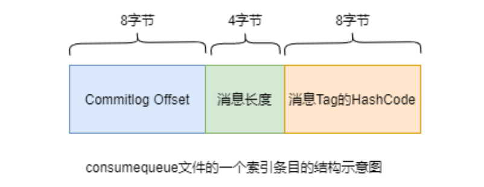

# RocketMQ

## 安装

## 角色

### 1、Broker

- Broker面向producer和consumer接收和发送消息。
  1. 向nameserver提交自己的信息。
  2. 是消息中间件的消息存储、转发服务器。
  3. 每个Broker节点，在启动时，都会遍历NameServer列表，与每个NameServer建立长连接，注册自己的信息，之后定时上报。
  
- 集群broker
  1. Broker高可用，可以配成Master/Slave结构，Master可写可读，Slave只可以读，Master将写入的数据同步给Slave。一个Master可以对应多个Slave，但是一个Slave只能对应一个Master。Master与Slave的对应关系通过指定相同的BrokerName，不同的BrokerId来定义。
  2. BrokerId为0表示Master，非0表示Slave。
  3. Master多机负载，可以部署多个broker，每个Broker与nameserver集群中的所有节点建立长连接，定时注册Topic信息到所有nameserver。
  
  
  
- Broker功能模块划分：

  

  1. Remoting Module：整个Broker的实体，负责处理来自clients端的请求。而这个Broker实体则由以下模块构成。
  2. Client Manager：客户端管理器。负责接收、解析客户端(Producer/Consumer)请求，管理客户端。例如，维护Consumer的Topic订阅信息。
  3. Store Service：存储服务。提供方便简单的API接口，处理消息存储到物理硬盘和消息查询功能。
  4. HA Service：高可用服务，提供Master Broker 和 Slave Broker之间的数据同步功能。
  5. Index Service：索引服务。根据特定的Message key，对投递到Broker的消息进行索引服务，同时也提供根据Message Key对消息进行快速查询的功能。

### 2、NameServer

- NameServer是注册中心、服务发现者。集群中的各个角色（producer、broker、consumer等）都需要定时向nameserver上报自己的状态，以便互相发现彼此，超时不上报的话，nameserver会把它从列表中剔除。
- Broker管理：接受Broker集群的注册信息并且保存下来作为路由信息的基本数据；提供心跳检测机制，检查Broker是否还存活。
- 路由信息管理：每个NameServer中都保存着Broker集群的整个路由信息和用于客户端查询的队列信息。Producer和Conumser通过NameServer可以获取整个Broker集群的路由信息，从而进行消息的投递和消费。

#### 路由注册

- NameServer通常也是以集群的方式部署，不过，NameServer是无状态的，即NameServer集群中的各个节点间是无差异的，各节点间相互不进行信息通讯，也没有主备的概念。
- 在Broker节点启动时，轮询NameServer列表，与每个NameServer节点建立长连接，发起注册请求。在NameServer内部维护着⼀个Broker列表，是内存式的内部存储，用来动态存储Broker、Topic的信息，并且不会进行持久化。
- 对于Broker，必须明确指出所有NameServer地址。否则未指出的将不会去注册。也正因为如此，NameServer并不能随便扩容。因为，若Broker不重新配置，新增的NameServer对于Broker来说是不可见的，其不会向这个NameServer进行注册。
- Broker节点为了证明自己是活着的，会维护与NameServer间的长连接，将最新的信息以心跳包的方式上报给NameServer，每30秒发送一次心跳。心跳包中包含 BrokerId、Broker地址(IP+Port)、Broker名称、Broker所属集群名称等等。NameServer在接收到心跳包后，会更新心跳时间戳，记录这个Broker的最新存活时间。

#### 路由发现

- RocketMQ的路由发现采用的是Pull模型。当Topic路由信息出现变化时，NameServer不会主动推送给客户端，而是客户端定时拉取主题最新的路由。默认客户端每30秒会拉取一次最新的路由。
  1. Push模型：推送模型。其实时性较好，是一个“发布-订阅”模型，需要维护一个长连接。而长连接的维护是需要资源成本的。该模型适合于的场景：实时性要求较高、Client数量不多，Server数据变化较频繁
  2. Pull模型：拉取模型。存在的问题是，实时性较差。
  3. Long Polling模型：长轮询模型。其是对Push与Pull模型的整合，充分利用了这两种模型的优势，屏蔽了它们的劣势。

#### 路由剔除

- 由于Broker关机、宕机或网络抖动等原因，NameServer没有收到Broker的心跳，NameServer可能会将其从Broker列表中剔除。
- NameServer中有⼀个定时任务，每隔10秒就会扫描⼀次Broker表，查看每一个Broker的最新心跳时间戳距离当前时间是否超过120秒，如果超过，则会判定Broker失效，然后将其从Broker列表中剔除。
- 当需要做Broker升级、运维等工作时，首先需要把Broker的读写权限关掉，一旦client(Consumer或Producer)向broker发送请求，都会收到broker的NO_PERMISSION响应，然后client会进行对其它Broker的重试。慢慢观察，直到Broker的流量为空时，就可以进行停机维护了。

#### 客户端选择策略

- 客户端在配置时必须要写上NameServer集群的地址，客户端连接NameServer节点时，首先会生产一个随机数，然后再与NameServer节点数量取模，此时得到的就是所要连接的节点索引，然后就会进行连接。如果连接失败，则会采用round-robin轮训策略，逐个尝试着去连接其它节点。
- 首先采用的是随机策略进行的选择，失败后采用的是轮询策略。

### 3、Producer

- 消息生产者，负责生产消息。Producer首先连接到nameServer，并通过MQ的负载均衡模块选择相应的Broker集群队列进行消息投递，投递的过程支持快速失败并且低延迟。
- RocketMQ中的消息生产者都是以生产者组（Producer Group）的形式出现的。生产者组Group是同一类生产者的集合，这类Producer的相关配置需要保持相同。一个生产者组可以同时发送多个主题的消息。
- Producer与nameServer集群中的其中一个节点（随机选择）建立长连接，获得Topic的路由信息，包括Topic下面有哪些Queue，这些Queue分布在哪些Broker上等，接下来与提供Topic服务的Master建立长连接，且定时向Master发送心跳。
- 每次需要连接broker的时候。都要先连接nameserver，通过nameserver获取分配的broker地址。
- Producer只会与master建立连接，因为只有master才会允许消息写入。

### 4、Consumer

- 消息的消费者，通过NameServer集群获得Topic的路由信息，连接到对应的Broker上消费消息。

- 由于Master和Slave都可以读取消息，因此Consumer会与Master和Slave都建立连接。

- RocketMQ中的消息消费者都是以消费者组（Consumer Group）的形式出现的。消费者组是同一类消
  费者的集合，这类Consumer必须消费的是同一个Topic类型的消息，并且每个Consumer的配置都应该相同。消费者组使得在消息消费方面，实现负载均衡和容错的目标变得非常容易。

- 负载均衡：默认的负载均衡策略将一个Topic中的不同的Queue平均分配给同一个Consumer Group的不同的Consumer，注意，并不是将消息负载均衡。

- 消费者组中Consumer的数量应该小于等于订阅Topic的Queue数量。如果超出Queue数量，则多出的Consumer将不能消费消息。

  

- 容错：一个Consmer挂了，该Consumer Group中的其它Consumer可以接着消费原Consumer消费的Queue。

- 一个Topic类型的消息可以被多个消费者组同时消费。

- 消费者组只能消费一个Topic的消息，不能同时消费多个Topic消息。

### 5、系统架构

- 主要由Producer、NameServer、Broker、Consumer组成。

  

## 基本概念

### Message

- 消息：消息系统所传输信息的物理载体，生产和消费数据的最小单位，每条消息必须属于一个主题。

### Topic

- Topic表示一类消息的集合，每个主题包含若干条消息，每条消息只能属于一个主题，是RocketMQ进行消息订阅的基本单位。

- 一个生产者可以同时发送多种Topic的消息，而一个消费者只可以订阅一个Topic。

- Topic属于逻辑上的概念，实际上在Broker中是以queue队列的形式进行存储的。一个topic可以对应多个队列。并且可以在创建topic时进行队列数的指定。

  
  
- 手动创建Topic时，有两种模式：

  1. 集群模式：该模式下创建的Topic在该集群中，所有Broker中的Queue数量是相同的。

  2. Broker模式：该模式下创建的Topic在该集群中，每个Broker中的Queue数量可以不同。

     自动创建Topic时，默认采用的是Broker模式，会为每个Broker默认创建4个Queue。

- 读/写队列

  1. 从物理上来讲，读/写队列是同一个队列。所以，不存在读/写队列数据同步问题。读/写队列是逻辑上进行区分的概念。一般情况下，读/写队列数量是相同的。例如，创建Topic时设置的写队列数量为8，读队列数量为4，此时系统会创建8个Queue，分别是0 1 2 3 4 5 6 7。Producer会将消息写入到这8个队列，但Consumer只会消费0 1 2 3这4个队列中的消息，4 5 6 7中的消息是不会被消费到的。再如，创建Topic时设置的写队列数量为4，读队列数量为8，此时系统会创建8个Queue，分别是0 1 2 3 4 5 6 7。Producer会将消息写入到0 1 2 3 这4个队列，但Consumer只会消费0 1 2 3 4 5 6 7这8个队列中的消息，但是4 5 6 7中是没有消息的。此时假设Consumer Group中包含两个Consumer，Consumer1消费0 1 2 3，而Consumer2消费4 5 6 7。但实际情况是，Consumer2是没有消息可消费的。也就是说，队列数会以读写队列的最大数进行设置，并且当读/写队列数量设置不同时，总是有问题的。
  2. 那么，为什么要这样设计呢？其这样设计的目的是为了，方便Topic的Queue的缩容。
     例如，原来创建的Topic中包含16个Queue，如何能够使其Queue缩容为8个，还不会丢失消息？可以动态修改写队列数量为8，读队列数量不变。此时新的消息只能写入到前8个队列，而消费都消费的却是16个队列中的数据。当发现后8个Queue中的消息消费完毕后，就可以再将读队列数量动态设置为8。整个缩容过程，没有丢失任何消息。

- perm用于设置对当前创建Topic的操作权限：2表示只写，4表示只读，6表示读写。

### Queue

- 存储消息的物理实体。一个Topic中可以包含多个Queue，每个Queue中存放的就是该Topic的消息。一个Topic的Queue也被称为一个Topic中消息的分区（Partition）。
- 一个Topic的Queue中的消息只能被一个消费者组中的一个消费者消费。一个Queue中的消息不允许同一个消费者组中的多个消费者同时消费。
- Queue存在于commitLog中。

### Tag

- Tag是为消息设置的标签，用于同一主题下区分不同类型的消息。来自同一业务单元的消息，可以根据不同业务目的在同一主题下设置不同标签。
- 标签能够有效地保持代码的清晰度和连贯性，并优化RocketMQ提供的查询系统。消费者可以根据Tag实现对不同子主题的不同消费逻辑，实现更好的扩展性。
- Topic是消息的一级分类，Tag是消息的二级分类。
- 比如城市消费金额统计数据信息，Topic是消费金额统计，Tag就可以是二级分类，比如北京、上海、长春等。

### Key

- 每条消息可以设置按照业务逻辑，设置相关的业务的key。


## 消息的存储机制

- RocketMQ中的消息存储在本地文件系统中，这些相关文件默认在当前用户主目录下的store目录中。一般都需要自定义存储位置。



- Producer发送数据到Broker，数据会被记录到commitLog里，并且会更新当前offset消费记录。

- 文件列表

  

  1. abort

  2. checkpoint

  3. commitLog

     数据存储真正的物理单元。一个commitLog大小为1g，commitLog目录中存放着很多的mappedFile文件，当前Broker中的所有消息都是落盘到这些mappedFile文件中的。mappedFile文件大小为1G（小于等于1G），文件名由20位十进制数构成，表示当前文件的第一条消息的起始位移偏移量。

     ```
     第一个文件名一定是20位0构成的。因为第一个文件的第一条消息的偏移量commitlog offset为0
     当第一个文件放满时，则会自动生成第二个文件继续存放消息。假设第一个文件大小是1073741820字节（1G = 1073741824字节），则第二个文件名就是00000000001073741824。
     以此类推，第n个文件名应该是前n-1个文件大小之和。
     一个Broker中所有mappedFile文件的commitlog offset是连续的
     ```

     需要注意的是，一个Broker中仅包含一个commitlog目录，所有的mappedFile文件都是存放在该目录中的。即无论当前Broker中存放着多少Topic的消息，这些消息都是被顺序写入到了mappedFile文件中的。也就是说，这些消息在Broker中存放时并没有被按照Topic进行分类存放。

     

     mappedFile文件内容由一个个的消息单元构成。每个消息单元中包含消息总长度MsgLen、消息的物理位置physicalOffset、消息体内容Body、消息体长度BodyLength、消息主题Topic、Topic长度TopicLength、消息生产者BornHost、消息发送时间戳BornTimestamp、消息所在的队列QueueId、消息在Queue中存储的偏移量QueueOffset等近20余项消息相关属性。

  4. config

  5. consumequeue

     consumequeue的物理结构是按照每个topic的名称进行分类，树状结构的文件夹，每个topic下还会按照每个queue的queueId进行分类，每个queue下是具体的文件。

     consumequeue文件名也由20位数字构成，表示当前文件的第一个索引条目的起始位移偏移量。与mappedFile文件名不同的是，其后续文件名是固定的。因为consumequeue文件大小是固定不变的。

     

     每个consumequeue文件可以包含30w个索引条目，每个索引条目包含了三个消息重要属性：消息在mappedFile文件中的偏移量CommitLog Offset、消息长度、消息Tag的hashcode值。这三个属性占20个字节，所以每个文件的大小是固定的30w * 20字节。

     

  6. index

     indexFile提供了通过key和时间戳来查找消息的功能。

  7. lock

- dd

- d

- d

- 

## 数据零拷贝
