# Zookeeper

## 作用

- 3.7.0
- Zookeeper是一个基于观察者模式设计的分布式服务管理框架，为其他分布式框架提供协调服务。
- 负责存储和管理各分布式节点都关心的数据，并且接受观察者的注册，一旦这些数据状态发生变化，zookeeper就将负责通知已经注册的观察者。

## 特点

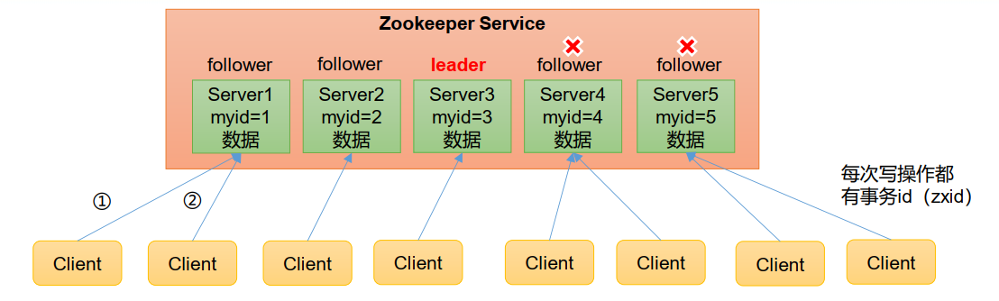

- zookeeper集群中一个领导者（leader），多个跟随者（follower），写操作只能通过leader完成，读操作可以通过任意节点完成。
- 集群中只要有半数以上的节点存活，zookeeper集群就能正常工作，因此需要2N+1台机器。至少是3台机器。
- 集群只有两种状态，可用、不可用。
- 集群是通过半数通过的形式产生leader。
- 全局数据一致：每个server保存一份相同的数据副本，Client无论连接到哪个server，数据都是一致的。
- 更新请求顺序执行，来自同一个client的更新请求，按其发送顺序依次执行。
- 数据更新原子性，一次数据更新要么成功、要么失败。
- 实时性，在一定时间范围内，client能读到最新数据。因为zookeeper过半成功就可以，所以有可能正好访问到失败的节点，最终的数据会一致，但是在这个同步的期间，数据有可能不一致，可以调用sync等待同步之后再返回数据。

## 数据结构

### 1、目录结构

- ZooKeeper数据模型的结构与Unix文件系统很类似，整体上可以看作是一棵树，每个节点称做一个 ZNode。每一个ZNode默认能够存储 1MB 的数据，每个 ZNode 都可以通过其路径唯一标识。

  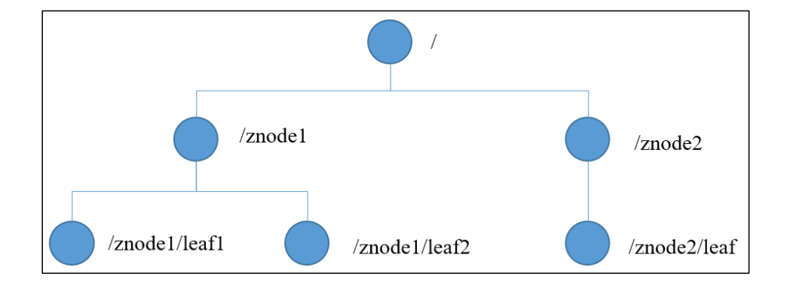

### 2、节点信息

- 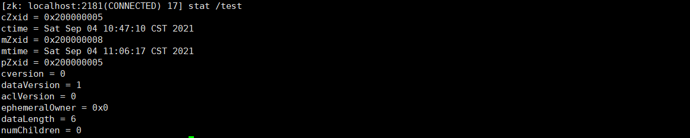

- ```bash
  [zk: localhost:2181(CONNECTED) 17] stat /test
  cZxid = 0x200000005
  ctime = Sat Sep 04 10:47:10 CST 2021
  mZxid = 0x200000008
  mtime = Sat Sep 04 11:06:17 CST 2021
  pZxid = 0x200000005
  cversion = 0
  dataVersion = 1
  aclVersion = 0
  ephemeralOwner = 0x0
  dataLength = 6
  numChildren = 0
  ```

- czxid：创建节点的事务zxid（事务id）。

  每次修改ZooKeeper状态都会产生一个ZooKeeper事务ID。事务ID是ZooKeeper中所有修改总的次序。每次修改都有唯一的zxid，如果zxid1小于zxid2，那么zxid1在zxid2之前发生。

  czxid总共64位。前32位，代表leader的纪元，每换一次leader，就加1，代表是第几个leader。后32位代表增删改的事务id，每次的增删改操作，都会加1。

- ctime：znode被创建的时间.

- mzxid：znode最后更新的事务zxid。

- mtime：znode最后修改的时间。

- pZxid：znode最后更新的子节点zxid。

- cversion：znode 子节点变化号，znode子节点修改次数。

- dataversion：znode数据变化号。

- aclVersion： znode 访问控制列表的变化号。

- ephemeralOwner：如果是临时节点，这个是znode拥有者的 session id。如果不是临时节点则是 0。

- dataLength：znode 的数据长度。

- numChildren：znode 子节点数量。

### 3、节点类型

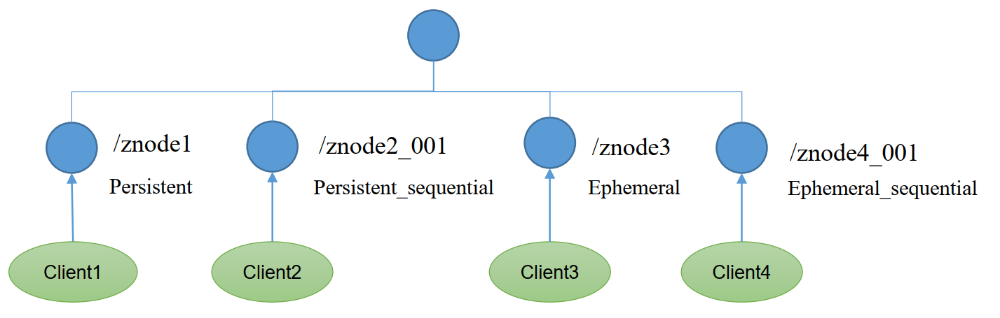

- 持久节点（Persistent）：客户端和服务器端断开连接后，创建的节点不删除

  1. 持久化目录节点

     客户端与Zookeeper断开连接后，该节点依旧存在。

  2. 持久化顺序编号目录节点
     客户端与Zookeeper断开连接后，该节点依旧存在，只是Zookeeper给该节点名称进行顺序编号。

- 临时节点（Ephemeral）：客户端和服务器端断开连接后，创建的节点自己删除

  1. 临时目录节点
     客户端与Zookeeper断开连接后，该节点被删除
  2. 临时顺序编号目录节点
     客户端与Zookeeper 断开连接后，该节点被删除，只是Zookeeper给该节点名称进行顺序编号。
  3. 临时节点随着session的存在而存在，session断开，临时节点就会被删除。

- 说明：

  创建znode时设置顺序标识，znode名称后会附加一个值，顺序号是一个单调递增的计数器，由父节点维护。

  如果节点名称相同，会进行有序递增。如果节点名称不同，会在递增序号最前面的位置，记录递增序号

  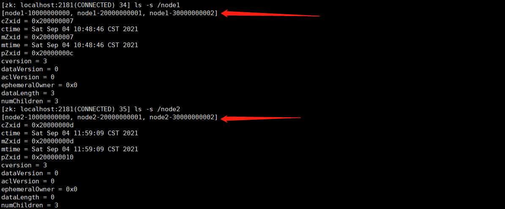

- 注意：

  在分布式系统中，顺序号可以被用于为所有的事件进行全局排序，这样客户端可以通过顺序号推断事件的顺序。

## 应用场景

### 1、统一配置管理

- 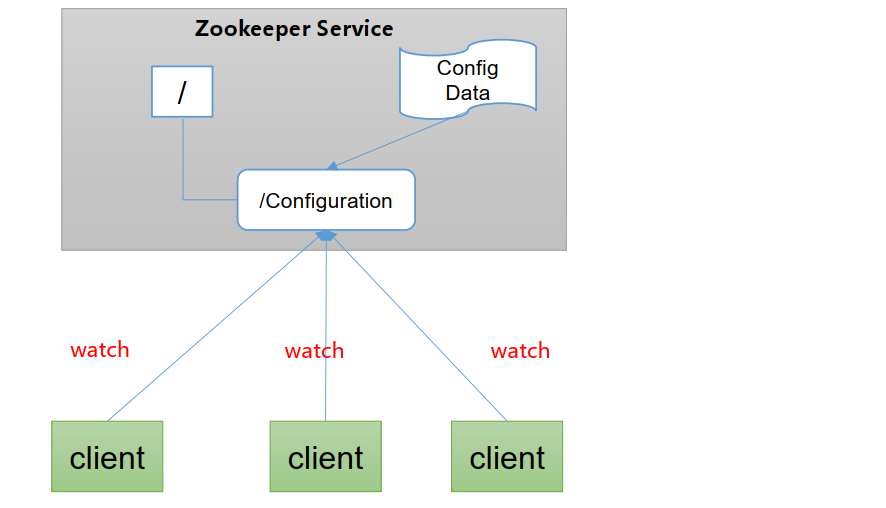
- 分布式环境下，配置文件同步非常常见
  - 一般要求一个集群中，所有节点的配置信息是一致的，比如Kafka集群。
  - 对配置文件进行修改后，希望能够快速同步到各个节点上。
- 配置管理可交由zookeeper实现
  1. 可将配置文件信息写入zookeeper上的一个znode。
  2. 各个客户端服务器监听这个znode。
  3. 一旦znode中的数据被修改，zookeeper将通知各个客户端服务器。
  4. 各客户端对事件进行响应，进行配置的实时更新。

### 2、统一集群管理

- 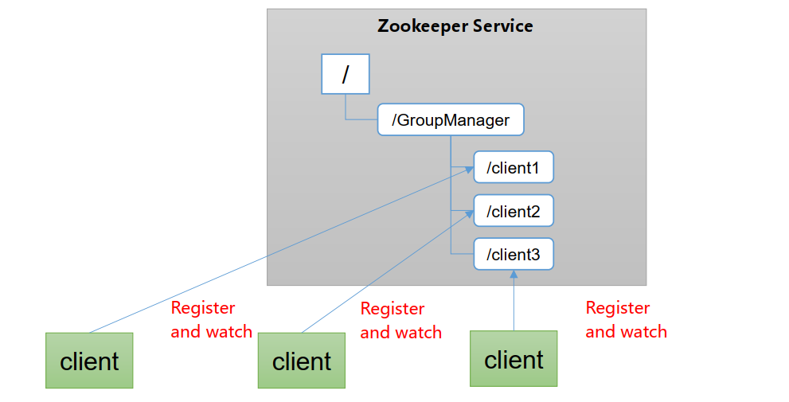
- 分布式环境中，实时掌握各个节点的状态是必要的，可根据节点的实时状态做出一些调整。
- zookeeper可以实现实时监控节点状态变化。
  1. 可将节点信息写入zookeeper上的一个znode。
  2. 监听这个znode可以获取它的实时状态的变化。

### 3、服务器节点动态上下线

- 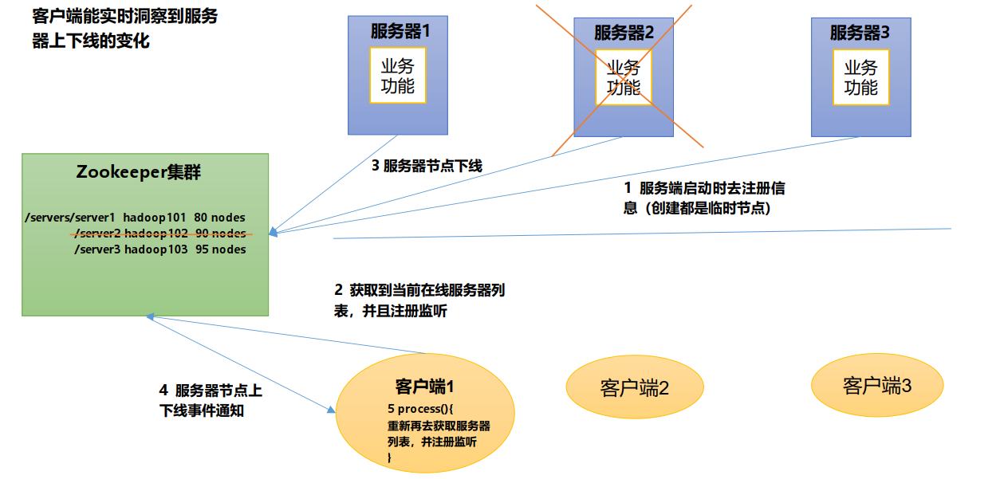

### 4、软负载均衡

- 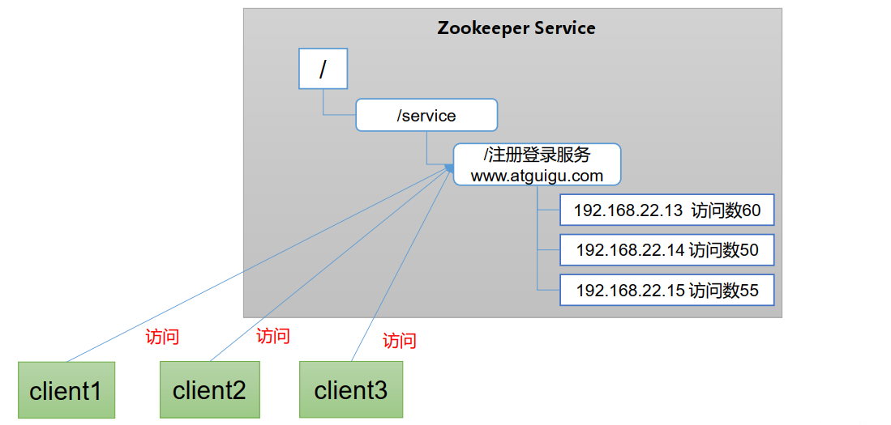
- 在zookeeper中记录每台服务器的访问数，让访问数最少的服务器去处理最新的客户端请求。

## 选举机制

- zookeeper选举时三要素

  1. SID：服务器ID。用来唯一标识一台ZooKeeper集群中的机器，每台机器不能重复，和myid一致。
  2. ZXID：事务ID。ZXID是一个事务ID，用来标识一次服务器状态的变更。 在某一时刻，集群中的每台机器的ZXID值不一定完全一
     致，这和ZooKeeper服务器对于客户端“更新请求”的处理逻辑有关。
  3. Epoch： 每个Leader任期的代号。没有Leader时，同一轮投票过程中的逻辑时钟值是相同的。每投完一次票这个数据就会增加

- 第一次启动

  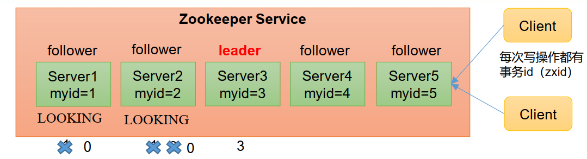

  1. 准备5台服务器。
  2. 服务器1启动，发起一次选举。服务器1投自己一票。此时服务器1票数一票，不够半数以上（3票），选举无法完成，服务器1状态保持为LOOKING；
  3. 服务器2启动，再发起一次选举。服务器1和2分别投自己一票并交换选票信息：此时服务器1发现服务器2的myid比自己目前投票推举的（服务器1）大，更改选票为推举服务器2。此时服务器1票数0票，服务器2票数2票，没有半数以上结果，选举无法完成，服务器1，2状态保持LOOKING。
  4. 服务器3启动，发起一次选举。此时服务器1和2都会更改选票为服务器3。此次投票结果：服务器1为0票，服务器2为0票，服务器3为3票。此时服务器3的票数已经超过半数，服务器3当选Leader。服务器1，2更改状态为FOLLOWING，服务器3更改状态为LEADING。
  5. 服务器4启动，发起一次选举。此时服务器1，2，3已经不是LOOKING状态，不会更改选票信息。交换选票信息结果：服务器3为3票，服务器4为1票。此时服务器4服从多数，更改选票信息为服务器3，并更改状态为FOLLOWING。
  6. 服务器5启动，同4一样为FOLLOWING。

- 非第一次启动

  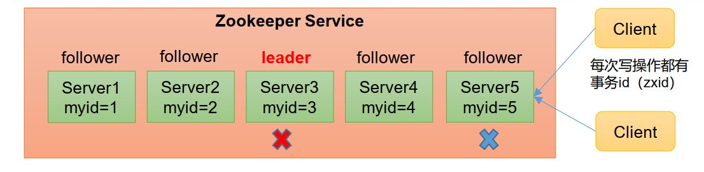

  当ZooKeeper集群中的一台服务器出现以下两种情况之一时，就会开始进入Leader选举：

  - 服务器初始化启动。
  - 服务器运行期间无法和Leader保持连接。

  而当一台机器进入Leader选举流程时，当前集群也可能会处于以下两种状态：

  1. 集群中本来就已经存在一个Leader。

     对于已经存在Leader的情况，机器试图去选举Leader时，会被告知当前服务器的Leader信息，对于该机器来说，仅仅需要和Leader机器建立连接，并进行状态同步即可。

  2. 集群中确实不存在Leader。
     假设ZooKeeper由5台服务器组成，SID分别为1、2、3、4、5，ZXID分别为8、8、8、7、7，并且此时SID为3的服务器是Leader。某一时刻，3和5服务器出现故障，因此开始进行Leader选举。

     | 服务节点 | EPOCH | ZXID | SID  |
     | -------- | ----- | ---- | ---- |
     | 1        | 1     | 8    | 1    |
     | 2        | 1     | 8    | 2    |
     | 4        | 1     | 7    | 4    |

     选举Leader规则： 

     1. EPOCH大的直接胜出
     2. EPOCH相同，事务id大的胜出
     3. 事务id相同，服务器id大的胜出

## 监听机制

客户端注册监听它关心的目录节点，当目录节点发生变化（数据改变、节点删除、子目录节点增加删除）时，ZooKeeper 会通知客户端。监听机制保证ZooKeeper 保存的任何的数据的任何改变都能快速的响应到监听了该节点的应用程序。

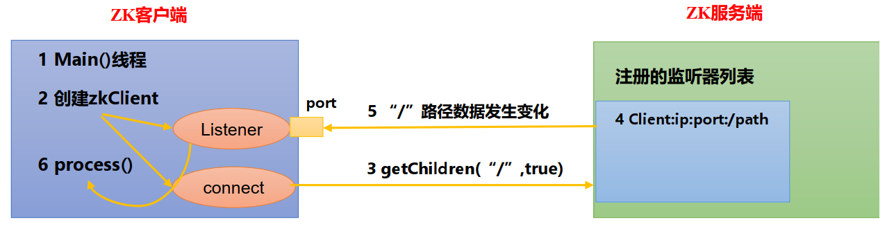

### 1、监听原理详解 

1. 首先要有一个main()线程
2. 在main线程中创建Zookeeper客户端，这时就会创建两个线程，一个负责网络连接通信（connet），一个负责监听（listener）。
3. 通过connect线程将注册的监听事件发送给Zookeeper。
4. 在Zookeeper的注册监听器列表中将注册的监听事件添加到列表中。
5. Zookeeper监听到有数据或路径变化，就会将这个消息发送给listener线程。
6. listener线程内部调用了process()方法。

### 2、常见的监听

1. 监听节点数据的变化
   get path [watch]
2. 监听子节点增减的变化
   ls path [watch]

### 3、监听机制

- 注册一次，只能监听一次。想再次监听，需要再次注册。

## 数据写入流程

### 1、写入请求发送到leader

1. 客户端将写入请求发送到leader，leader将数据同步发送到其余节点。
2. 当半数节点返回写入成功的响应，leader发起commit。提交数据。
3. leader返回给客户端ack。

### 2、写入请求发送到follower

1. 客户端将写入请求发送到follower，follower将请求转发给leader。
2. leader将数据同步发送到其余节点。
3. 当半数节点返回写入成功的响应，leader发起commit。提交数据。
4. leader将响应转发给follower，由follower给客户端返回ack。

## 角色划分

1. leader：决策者，只有leader能接收写操作，其他角色只能接收读操作。
2. follower：追随者，追随者有权在主节点挂掉之后，参与投票，选举出新的leader。
3. observer：观察者，只能提供读数据的请求，没有权利参与投票。

- zk集群是读写分离的。observer的存在，可以放大查询能力，并且限制小数量的follower，可以提升快速恢复的能力，因为少量机器选举速度肯定比大量机器选举速度快。
- server.1=node01:2888:3888:observer，只需要在最后加上observer，配置的既是观察者。

## Paxos算法

- 参考文章地址https://www.douban.com/note/208430424/

- 先说Paxos，它是一个基于消息传递的一致性算法，Leslie Lamport在1990年提出，近几年被广泛应用于分布式计算中，Google的Chubby，Apache的Zookeeper都是基于它的理论来实现的，Paxos还被认为是到目前为止唯一的分布式一致性算法，其它的算法都是Paxos的改进或简化。有个问题要提一下，Paxos有一个前提：没有拜占庭将军问题。就是说Paxos只有在一个可信的计算环境中才能成立，这个环境是不会被入侵所破坏的。

- 关于Paxos的具体描述可以在Wiki中找到：http://zh.wikipedia.org/zh-cn/Paxos算法。网上关于Paxos分析的文章也很多。这里希望用最简单的方式加以描述并建立起Paxos和ZK Server的对应关系。

- Paxos描述了这样一个场景，有一个叫做Paxos的小岛(Island)上面住了一批居民，岛上面所有的事情由一些特殊的人决定，他们叫做议员(Senator)。议员的总数(Senator Count)是确定的，不能更改。岛上每次环境事务的变更都需要通过一个提议(Proposal)，每个提议都有一个编号(PID)，这个编号是一直增长的，不能倒退。每个提议都需要超过半数((Senator Count)/2 +1)的议员同意才能生效。每个议员只会同意大于当前编号的提议，包括已生效的和未生效的。如果议员收到小于等于当前编号的提议，他会拒绝，并告知对方：你的提议已经有人提过了。这里的当前编号是每个议员在自己记事本上面记录的编号，他不断更新这个编号。整个议会不能保证所有议员记事本上的编号总是相同的。现在议会有一个目标：保证所有的议员对于提议都能达成一致的看法。

- 好，现在议会开始运作，所有议员一开始记事本上面记录的编号都是0。有一个议员发了一个提议：将电费设定为1元/度。他首先看了一下记事本，嗯，当前提议编号是0，那么我的这个提议的编号就是1，于是他给所有议员发消息：1号提议，设定电费1元/度。其他议员收到消息以后查了一下记事本，哦，当前提议编号是0，这个提议可接受，于是他记录下这个提议并回复：我接受你的1号提议，同时他在记事本上记录：当前提议编号为1。发起提议的议员收到了超过半数的回复，立即给所有人发通知：1号提议生效！收到的议员会修改他的记事本，将1好提议由记录改成正式的法令，当有人问他电费为多少时，他会查看法令并告诉对方：1元/度。

- 现在看冲突的解决：假设总共有三个议员S1-S3，S1和S2同时发起了一个提议:1号提议，设定电费。S1想设为1元/度, S2想设为2元/度。结果S3先收到了S1的提议，于是他做了和前面同样的操作。紧接着他又收到了S2的提议，结果他一查记事本，咦，这个提议的编号小于等于我的当前编号1，于是他拒绝了这个提议：对不起，这个提议先前提过了。于是S2的提议被拒绝，S1正式发布了提议: 1号提议生效。S2向S1或者S3打听并更新了1号法令的内容，然后他可以选择继续发起2号提议。

- 好，我觉得Paxos的精华就这么多内容。现在让我们来对号入座，看看在ZK Server里面Paxos是如何得以贯彻实施的。

  1. 小岛(Island)——ZK Server Cluster
  2. 议员(Senator)——ZK Server
  3. 提议(Proposal)——ZNode Change(Create/Delete/SetData…)
  4. 提议编号(PID)——Zxid(ZooKeeper Transaction Id)
  5. 正式法令——所有ZNode及其数据

- 貌似关键的概念都能一一对应上，但是等一下，Paxos岛上的议员应该是人人平等的吧，而ZK Server好像有一个Leader的概念。没错，其实Leader的概念也应该属于Paxos范畴的。如果议员人人平等，在某种情况下会由于提议的冲突而产生一个“活锁”（所谓活锁我的理解是大家都没有死，都在动，但是一直解决不了冲突问题）。Paxos的作者Lamport在他的文章”The Part-Time Parliament“中阐述了这个问题并给出了解决方案——在所有议员中设立一个总统，只有总统有权发出提议，如果议员有自己的提议，必须发给总统并由总统来提出。好，我们又多了一个角色：总统。

- 现在我们假设总统已经选好了，下面看看ZK Server是怎么实施的。

  1. 情况一：

     屁民甲(Client)到某个议员(ZK Server)那里询问(Get)某条法令的情况(ZNode的数据)，议员毫不犹豫的拿出他的记事本(local storage)，查阅法令并告诉他结果，同时声明：我的数据不一定是最新的。你想要最新的数据？没问题，等着，等我找总统Sync一下再告诉你。

  2. 情况二：

     屁民乙(Client)到某个议员(ZK Server)那里要求政府归还欠他的一万元钱，议员让他在办公室等着，自己将问题反映给了总统，总统询问所有议员的意见，多数议员表示欠屁民的钱一定要还，于是总统发表声明，从国库中拿出一万元还债，国库总资产由100万变成99万。屁民乙拿到钱回去了(Client函数返回)。

  3. 情况三：

     总统突然挂了，议员接二连三的发现联系不上总统，于是各自发表声明，推选新的总统，总统大选期间政府停业，拒绝屁民的请求。

## zab协议

### 1、什么是zab协议

Zab 借鉴了Paxos 算法，是特别为Zookeeper 设计的支持崩溃恢复的原子广播协议。基于该协议，Zookeeper 设计为只有一台客户端（Leader）负责处理外部的写事务请求，然后Leader 客户端将数据同步到其他Follower 节点。即Zookeeper 只有一个Leader 可以发起提案。

### 2、广播消息

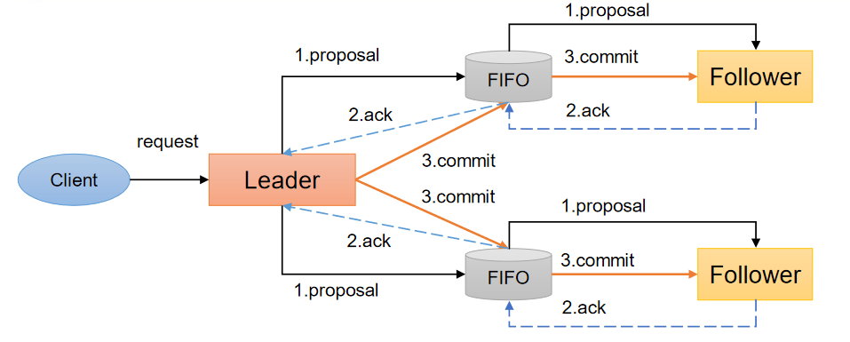

1. 客户端发起一个写操作请求。
2. Leader服务器将客户端的请求转化为事务Proposal 提案，同时为每个Proposal 分配一个全局的ID，即zxid。
3. Leader服务器为每个Follower服务器分配一个单独的队列，然后将需要广播的 Proposal依次放到队列中去，并且根据FIFO策略进行消息发送。
4. Follower接收到Proposal后，会首先将其以事务日志的方式写入本地磁盘中，写入成功后向Leader反馈一个Ack响应消息。
5. Leader接收到超过半数以上Follower的Ack响应消息后，即认为消息发送成功，可以发送commit消息。
6. Leader向所有Follower广播commit消息，同时自身也会完成事务提交。Follower 接收到commit消息后，会将上一条事务提交。
7. Zookeeper采用Zab协议的核心，就是只要有一台服务器提交了Proposal，就要确保所有的服务器最终都能正确提交Proposal。

### 3、崩溃恢复

一旦Leader服务器出现崩溃或者由于网络原因导致Leader服务器失去了与过半Follower的联系，那么就会进入崩溃恢复模式。

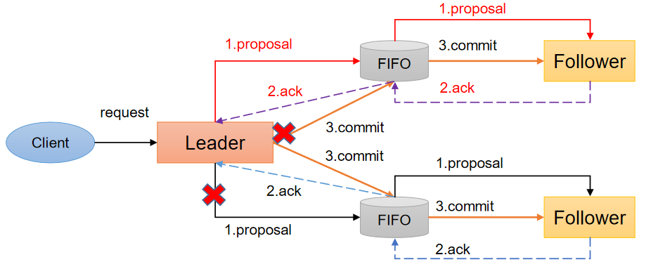

1. 假设两种服务器异常情况：
   - 假设一个事务在Leader提出之后，Leader挂了。
   - 一个事务在Leader上提交了，并且过半的Follower都响应Ack了，但是Leader在Commit消息发出之前挂了。
2. Zab协议崩溃恢复要求满足以下两个要求：
   - 确保已经被Leader提交的提案Proposal，必须最终被所有的Follower服务器提交。 （已经产生的提案，Follower必须执行）
   - 确保丢弃已经被Leader提出的，但是没有被提交的Proposal。（丢弃胎死腹中的提案）

#### 3.1、leader选举

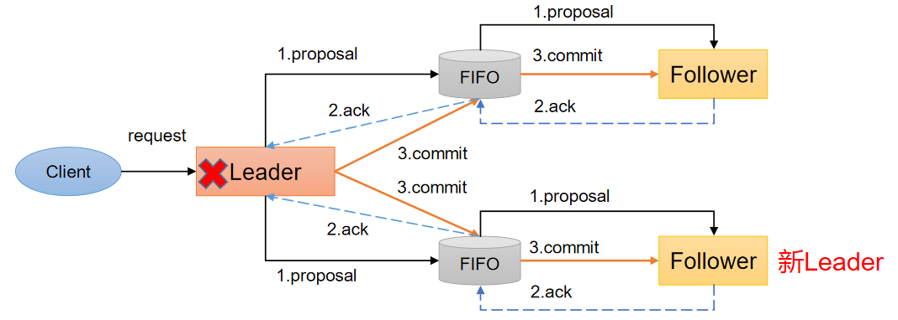

当leader挂掉之后，就会执行leader选举机制

Zab协议需要保证选举出来的Leader需要满足以下条件：

1. 新选举出来的Leader不能包含未提交的Proposal。即新Leader必须都是已经提交了Proposal的Follower服务器节点。
2. 新选举的Leader节点中含有最大的zxid。这样做的好处是可以避免Leader服务器检查Proposal的提交和丢弃工作。

#### 3.2、数据恢复

1. 完成Leader选举后，在正式开始工作之前（接收事务请求，然后提出新的Proposal），Leader服务器会首先确认事务日
   志中的所有的Proposal 是否已经被集群中过半的服务器Commit。
2. Leader服务器需要确保所有的Follower服务器能够接收到每一条事务的Proposal，并且能将所有已经提交的事务Proposal
   应用到内存数据中。等到Follower将所有尚未同步的事务Proposal都从Leader服务器上同步过，并且应用到内存数据中以后，
   Leader才会把该Follower加入到真正可用的Follower列表中。

## CAP理论

- CAP理论告诉我们，一个分布式系统不可能同时满足以下三种

  1. 一致性（C:Consistency）
  2. 可用性（A:Available）
  3. 分区容错性（P:Partition Tolerance ）

- 这三个基本需求，最多只能同时满足其中的两项，因为P是必须的，因此往往选择就在CP或者AP中。

- 一致性（C:Consistency ）

  在分布式环境中，一致性是指数据在多个副本之间是否能够保持数据一致的特性。在一致性的需求下，当一个系统在数
  据一致的状态下执行更新操作后，应该保证系统的数据仍然处于一致的状态。

- 可用性（A:Available）
  可用性是指系统提供的服务必须一直处于可用的状态，对于用户的每一个操作请求总是能够在有限的时间内返回结果。

- 分区容错性（P:Partition Tolerance）
  分布式系统在遇到任何网络分区故障的时候，仍然需要能够保证对外提供满足一致性和可用性的服务，除非是整个网络
  环境都发生了故障。

- ZooKeeper保证的是CP

  1. ZooKeeper不能保证每次服务请求的可用性。（注：在极端环境下，ZooKeeper可能会丢弃一些请求，消费者程序需要
     重新请求才能获得结果）。所以说，ZooKeeper不能保证服务可用性。
  2. 进行Leader选举时集群都是不可用。


