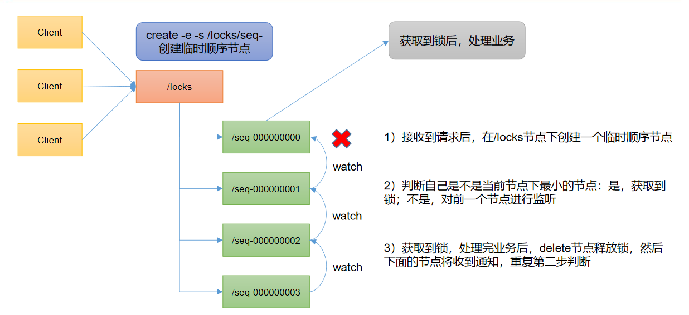

# zookeeper实现分布式锁

zookeeper实现分布式锁的优势

1. 获得锁的人出问题了怎么办？因为每个连接都会创建一个session。如果创建了临时节点，当连接断开的时候，session消失，节点会自动删除。可以避免锁一直不被释放的问题。
2. 获得锁的人成功了，释放锁的话，只需要断开连接就可以了。
3. 锁被释放的话，其他节点怎么能够知道？
   - 如果都主动轮询的话，会给zk造成很大的压力，并且也会有延迟的问题。
   - watch的话，999个客户端watch，就会给999个客户端发送消息。然后999个客户端再竞争。还是会有压力的问题。
4. 解决方案：使用sequence序列节点+watch的形式，每个client都watch前一个node。序列号最小的那个获得锁，当释放锁的时候，其他的client会挨个排着队获取锁。zk只会发送一个watch回调。成本很低。



- 解决思路
  1. 创建根节点
  2. 接收到请求后，在根节点下创建带序号的临时节点。
  3. 判断自己是不是最小的节点，如果是，获取到锁，不是的话，对前一个节点进行监听。
  4. 获取到锁，执行完业务，要删除节点，释放锁。
  5. 没有获取到锁，监听前一个节点，如果前一个节点的持有者获取到了锁，并执行完业务逻辑，会释放锁，释放锁之后会发送delete事件，监听到delete事件之后，可以判断自己是否可以获取到锁。
  6. 监听到前一个节点的delete事件之后，仍需要判断自己是不是最小的，因为如果因为网络原因或者其他原因，导致等待的进程宕机，或者session被释放，也会造成节点删除事件，所以监听到事件之后，仍需要做最小判断。
- 因为只watch自己的前一个节点，zk也只需要发送一个watch事件，所以效率较好。

- 简易原生实现

  ```java
  public class DistributedLock {
      // zookeeper server 列表
      private String connectString = "192.168.73.101:2181,192.168.73.102:2181,192.168.73.103:2181";
      // 超时时间
      private int sessionTimeout = 2000;
      private ZooKeeper zk;
      private String rootNode = "locks";
      private String subNode = "seq-";
      // 当前client等待的子节点
      private String waitPath;
      //ZooKeeper 连接
      private CountDownLatch connectLatch = new CountDownLatch(1);
      //ZooKeeper 节点等待
      private CountDownLatch waitLatch = new CountDownLatch(1);
      // 当前client 创建的子节点
      private String currentNode;
  
      /**
       * 和zk 服务建立连接，并创建根节点
       *
       * @throws IOException
       * @throws InterruptedException
       * @throws KeeperException
       */
      public DistributedLock() throws IOException, InterruptedException, KeeperException {
          zk = new ZooKeeper(connectString, sessionTimeout, new Watcher() {
              @Override
              public void process(WatchedEvent event) {
                  // 连接建立时, 打开latch, 唤醒wait 在该latch 上的线程
                  if (event.getState() ==
                          Event.KeeperState.SyncConnected) {
                      connectLatch.countDown();
                  }
                  // 发生了waitPath 的删除事件
                  if (event.getType() ==
                          Event.EventType.NodeDeleted && event.getPath().equals(waitPath)) {
                      waitLatch.countDown();
                  }
              }
          });
          // 等待连接建立
          connectLatch.await();
          //获取根节点状态
          Stat stat = zk.exists("/" + rootNode, false);
          //如果根节点不存在，则创建根节点，根节点类型为永久节点
          if (stat == null) {
              System.out.println("根节点不存在");
              zk.create("/" + rootNode, new byte[0], ZooDefs.Ids.OPEN_ACL_UNSAFE, CreateMode.PERSISTENT);
          }
      }
  
      // 加锁方法
      public void zkLock() {
          try {
              //在根节点下创建临时顺序节点，返回值为创建的节点路径
              currentNode = zk.create("/" + rootNode + "/" + subNode, null, ZooDefs.Ids.OPEN_ACL_UNSAFE, CreateMode.EPHEMERAL_SEQUENTIAL);
              // wait 一小会, 让结果更清晰一些
              Thread.sleep(10);
              // 注意, 没有必要监听"/locks"的子节点的变化情况
              List<String> childrenNodes = zk.getChildren("/" + rootNode, false);
              //  列表中只有一个子节点,  那肯定就是 currentNode  ,  说明client 获得锁
              if (childrenNodes.size() == 1) {
                  return;
              } else {
                  //对根节点下的所有临时顺序节点进行从小到大排序
                  Collections.sort(childrenNodes);
                  //当前节点名称
                  String thisNode = currentNode.substring(("/" + rootNode + "/").length());
                  //获取当前节点的位置
                  int index = childrenNodes.indexOf(thisNode);
                  if (index == -1) {
                      System.out.println("数据异常");
                  } else if (index == 0) {
                      //  index  ==  0,  说明 thisNode 在列表中最小,  当前client 获得锁
                      return;
                  } else {
                      // 获得排名比currentNode 前1 位的节点
                      this.waitPath = "/" + rootNode + "/" + childrenNodes.get(index - 1);
                      //  在 waitPath 上注册监听器,  当 waitPath 被删除时, zookeeper 会回调监听器的process 方法
                      zk.getData(waitPath, true, new Stat());
                      //进入等待锁状态
                      waitLatch.await();
                      return;
                  }
              }
          } catch (KeeperException e) {
              e.printStackTrace();
          } catch (InterruptedException e) {
              e.printStackTrace();
          }
      }
  
      /**
       * 解锁
       */
      public void zkUnlock() {
          try {
              zk.delete(this.currentNode, -1);
          } catch (InterruptedException | KeeperException e) {
              e.printStackTrace();
          }
      }
  }
  ```

- 已有框架Curator实现

  添加依赖，注意与zookeeper版本的兼容性

  ```xml
  <dependency> 
      <groupId>org.apache.curator</groupId> 
      <artifactId>curator-framework</artifactId> 
      <version>4.3.0</version> 
  </dependency> 
  <dependency> 
      <groupId>org.apache.curator</groupId> 
      <artifactId>curator-recipes</artifactId> 
      <version>4.3.0</version> 
  </dependency> 
  <dependency> 
      <groupId>org.apache.curator</groupId> 
      <artifactId>curator-client</artifactId> 
      <version>4.3.0</version> 
  </dependency>
  ```

  ```java
  public class CuratorLockTest {
      private String rootNode = "/locks";
      // zookeeper server 列表
      private String connectString = "192.168.73.101:2181,192.168.73.102:2181,192.168.73.103:2181";
      // connection 超时时间
      private int connectionTimeout = 15000;
      // session 超时时间
      private int sessionTimeout = 60000;
  
      public static void main(String[] args) {
          new CuratorLockTest().test();
      }
  
      // 测试
      private void test() {
          // 创建分布式锁1
          InterProcessLock lock1 = new InterProcessMutex(getCuratorFramework(), rootNode);
          // 创建分布式锁2
          InterProcessLock lock2 = new InterProcessMutex(getCuratorFramework(), rootNode);
          new Thread(() -> {
              // 获取锁对象
              try {
                  lock1.acquire();
                  System.out.println("线程1 获取锁");
                  // 测试锁重入
                  lock1.acquire();
                  System.out.println("线程1 再次获取锁");
                  Thread.sleep(5 * 1000);
                  lock1.release();
                  System.out.println("线程1 释放锁");
                  lock1.release();
                  System.out.println("线程1 再次释放锁");
              } catch (Exception e) {
                  e.printStackTrace();
              }
          }).start();
  
          new Thread(() -> {
              // 获取锁对象
              try {
                  lock2.acquire();
                  System.out.println("线程2 获取锁");
                  // 测试锁重入
                  lock2.acquire();
                  System.out.println("线程2 再次获取锁");
                  Thread.sleep(5 * 1000);
                  lock2.release();
                  System.out.println("线程2 释放锁");
                  lock2.release();
                  System.out.println("线程2 再次释放锁");
              } catch (Exception e) {
                  e.printStackTrace();
              }
          }).start();
      }
  
      // 分布式锁初始化
      public CuratorFramework getCuratorFramework() {
          //重试策略，初试时间3 秒，重试3 次
          RetryPolicy policy = new ExponentialBackoffRetry(3000, 3);
          //通过工厂创建Curator
          CuratorFramework client =
                  CuratorFrameworkFactory.builder()
                          .connectString(connectString)
                          .connectionTimeoutMs(connectionTimeout)
                          .sessionTimeoutMs(sessionTimeout)
                          .retryPolicy(policy).build();
          //开启连接
          client.start();
          System.out.println("zookeeper 初始化完成...");
          return client;
      }
  }
  ```