# Zookeeper

## 作用

- 3.7.0
- Zookeeper是一个基于观察者模式设计的分布式服务管理框架，为其他分布式框架提供协调服务。
- 负责存储和管理各分布式节点都关心的数据，并且接受观察者的注册，一旦这些数据状态发生变化，zookeeper就将负责通知已经注册的观察者。

## 特点


- zookeeper集群中一个领导者（leader），多个跟随者（follower），写操作只能通过leader完成，读操作可以通过任意节点完成。
- 集群中只要有半数以上的节点存活，zookeeper集群就能正常工作，因此需要2N+1台机器。至少是3台机器。
- 集群只有两种状态，可用、不可用。
- 集群是通过半数通过的形式产生leader。
- 全局数据一致：每个server保存一份相同的数据副本，Client无论连接到哪个server，数据都是一致的。
- 更新请求顺序执行，来自同一个client的更新请求，按其发送顺序依次执行。
- 数据更新原子性，一次数据更新要么成功、要么失败。
- 实时性，在一定时间范围内，client能读到最新数据。因为zookeeper过半成功就可以，所以有可能正好访问到失败的节点，最终的数据会一致，但是在这个同步的期间，数据有可能不一致，可以调用sync等待同步之后再返回数据。

## 数据结构

### 1、目录结构

- ZooKeeper数据模型的结构与Unix文件系统很类似，整体上可以看作是一棵树，每个节点称做一个 ZNode。每一个ZNode默认能够存储 1MB 的数据，每个 ZNode 都可以通过其路径唯一标识。

  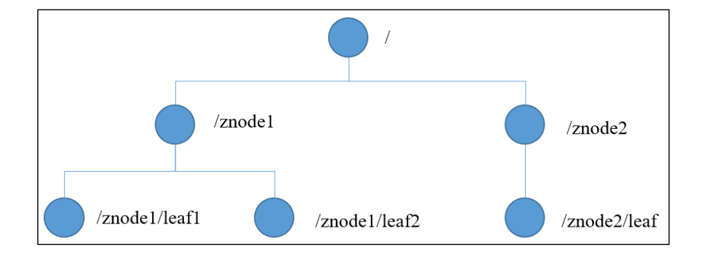

### 2、节点信息

- 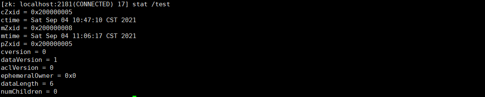

- ```bash
  [zk: localhost:2181(CONNECTED) 17] stat /test
  cZxid = 0x200000005
  ctime = Sat Sep 04 10:47:10 CST 2021
  mZxid = 0x200000008
  mtime = Sat Sep 04 11:06:17 CST 2021
  pZxid = 0x200000005
  cversion = 0
  dataVersion = 1
  aclVersion = 0
  ephemeralOwner = 0x0
  dataLength = 6
  numChildren = 0
  ```

- czxid：创建节点的事务zxid（事务id）。

  每次修改ZooKeeper状态都会产生一个ZooKeeper事务ID。事务ID是ZooKeeper中所有修改总的次序。每次修改都有唯一的zxid，如果zxid1小于zxid2，那么zxid1在zxid2之前发生。

- ctime：znode被创建的时间.

- mzxid：znode最后更新的事务zxid。

- mtime：znode最后修改的时间。

- pZxid：znode最后更新的子节点zxid。

- cversion：znode 子节点变化号，znode子节点修改次数。

- dataversion：znode数据变化号。

- aclVersion： znode 访问控制列表的变化号。

- ephemeralOwner：如果是临时节点，这个是znode拥有者的 session id。如果不是临时节点则是 0。

- dataLength：znode 的数据长度。

- numChildren：znode 子节点数量。

### 3、节点类型

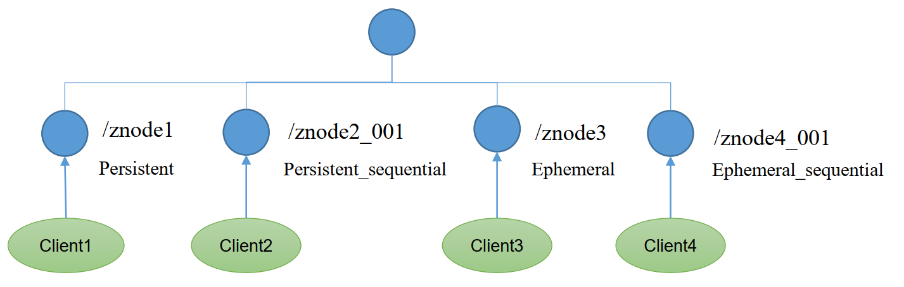

- 持久节点（Persistent）：客户端和服务器端断开连接后，创建的节点不删除

  1. 持久化目录节点

     客户端与Zookeeper断开连接后，该节点依旧存在。

  2. 持久化顺序编号目录节点
     客户端与Zookeeper断开连接后，该节点依旧存在，只是Zookeeper给该节点名称进行顺序编号。

- 临时节点（Ephemeral）：客户端和服务器端断开连接后，创建的节点自己删除

  1. 临时目录节点
     客户端与Zookeeper断开连接后，该节点被删除
  2. 临时顺序编号目录节点
     客户端与Zookeeper 断开连接后，该节点被删除，只是Zookeeper给该节点名称进行顺序编号。

- 说明：

  创建znode时设置顺序标识，znode名称后会附加一个值，顺序号是一个单调递增的计数器，由父节点维护。

  如果节点名称相同，会进行有序递增。如果节点名称不同，会在递增序号最前面的位置，记录递增序号

  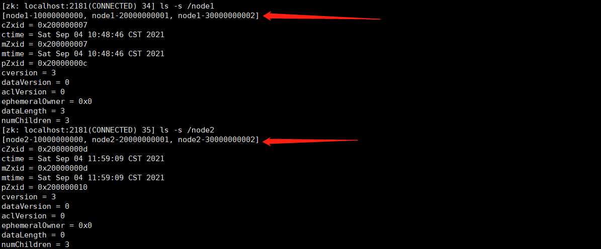

- 注意：

  在分布式系统中，顺序号可以被用于为所有的事件进行全局排序，这样客户端可以通过顺序号推断事件的顺序。

## 应用场景

### 1、统一配置管理

- 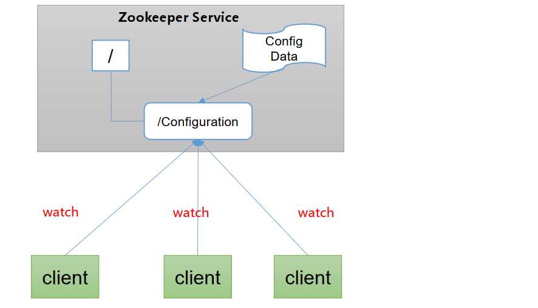
- 分布式环境下，配置文件同步非常常见
  - 一般要求一个集群中，所有节点的配置信息是一致的，比如Kafka集群。
  - 对配置文件进行修改后，希望能够快速同步到各个节点上。
- 配置管理可交由zookeeper实现
  1. 可将配置文件信息写入zookeeper上的一个znode。
  2. 各个客户端服务器监听这个znode。
  3. 一旦znode中的数据被修改，zookeeper将通知各个客户端服务器。
  4. 各客户端对事件进行响应，进行配置的实时更新。

### 2、统一集群管理

- 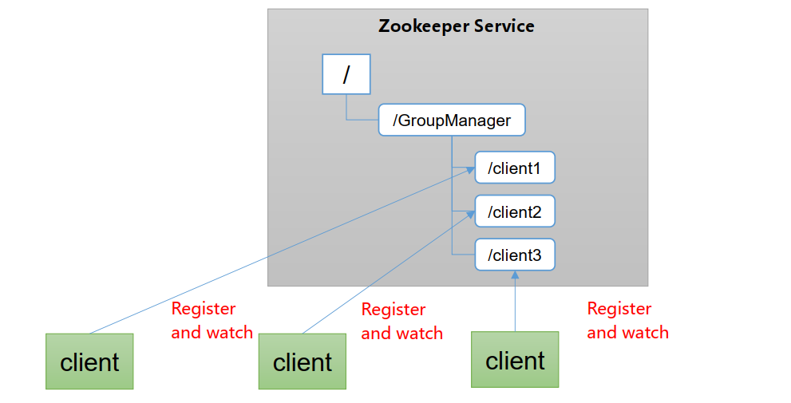
- 分布式环境中，实时掌握各个节点的状态是必要的，可根据节点的实时状态做出一些调整。
- zookeeper可以实现实时监控节点状态变化。
  1. 可将节点信息写入zookeeper上的一个znode。
  2. 监听这个znode可以获取它的实时状态的变化。

### 3、服务器节点动态上下线

- 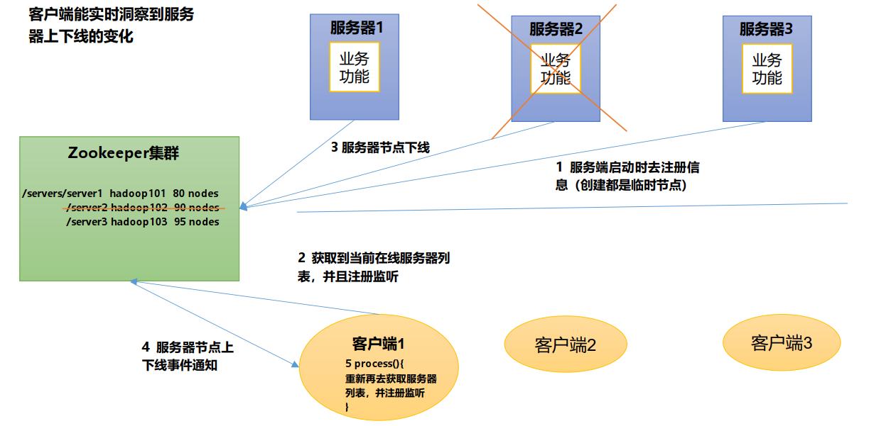

### 4、软负载均衡

- 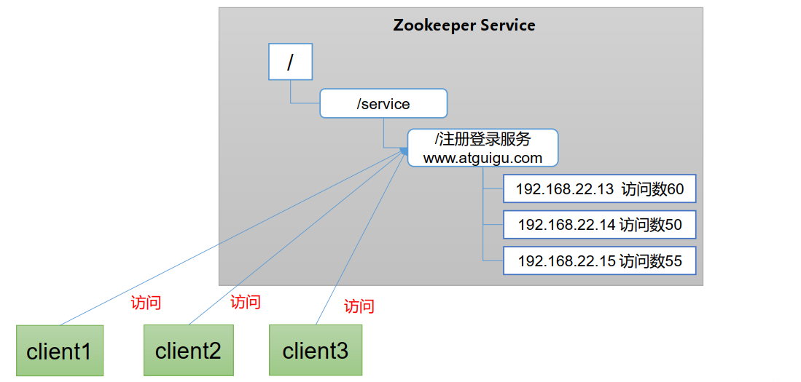
- 在zookeeper中记录每台服务器的访问数，让访问数最少的服务器去处理最新的客户端请求。

## 选举机制

- zookeeper选举时三要素

  1. SID：服务器ID。用来唯一标识一台ZooKeeper集群中的机器，每台机器不能重复，和myid一致。
  2. ZXID：事务ID。ZXID是一个事务ID，用来标识一次服务器状态的变更。 在某一时刻，集群中的每台机器的ZXID值不一定完全一
     致，这和ZooKeeper服务器对于客户端“更新请求”的处理逻辑有关。
  3. Epoch： 每个Leader任期的代号。没有Leader时，同一轮投票过程中的逻辑时钟值是相同的。每投完一次票这个数据就会增加

- 第一次启动

  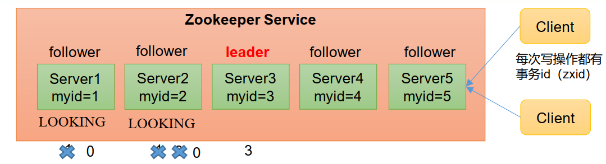

  1. 准备5台服务器。
  2. 服务器1启动，发起一次选举。服务器1投自己一票。此时服务器1票数一票，不够半数以上（3票），选举无法完成，服务器1状态保持为LOOKING；
  3. 服务器2启动，再发起一次选举。服务器1和2分别投自己一票并交换选票信息：此时服务器1发现服务器2的myid比自己目前投票推举的（服务器1）大，更改选票为推举服务器2。此时服务器1票数0票，服务器2票数2票，没有半数以上结果，选举无法完成，服务器1，2状态保持LOOKING。
  4. 服务器3启动，发起一次选举。此时服务器1和2都会更改选票为服务器3。此次投票结果：服务器1为0票，服务器2为0票，服务器3为3票。此时服务器3的票数已经超过半数，服务器3当选Leader。服务器1，2更改状态为FOLLOWING，服务器3更改状态为LEADING。
  5. 服务器4启动，发起一次选举。此时服务器1，2，3已经不是LOOKING状态，不会更改选票信息。交换选票信息结果：服务器3为3票，服务器4为1票。此时服务器4服从多数，更改选票信息为服务器3，并更改状态为FOLLOWING。
  6. 服务器5启动，同4一样为FOLLOWING。

- 非第一次启动

  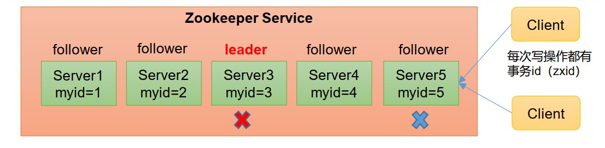

  当ZooKeeper集群中的一台服务器出现以下两种情况之一时，就会开始进入Leader选举：

  - 服务器初始化启动。
  - 服务器运行期间无法和Leader保持连接。

  而当一台机器进入Leader选举流程时，当前集群也可能会处于以下两种状态：

  1. 集群中本来就已经存在一个Leader。

     对于已经存在Leader的情况，机器试图去选举Leader时，会被告知当前服务器的Leader信息，对于该机器来说，仅仅需要和Leader机器建立连接，并进行状态同步即可。

  2. 集群中确实不存在Leader。
     假设ZooKeeper由5台服务器组成，SID分别为1、2、3、4、5，ZXID分别为8、8、8、7、7，并且此时SID为3的服务器是Leader。某一时刻，3和5服务器出现故障，因此开始进行Leader选举。

     | 服务节点 | EPOCH | ZXID | SID  |
     | -------- | ----- | ---- | ---- |
     | 1        | 1     | 8    | 1    |
     | 2        | 1     | 8    | 2    |
     | 4        | 1     | 7    | 4    |

     选举Leader规则： 

     1. EPOCH大的直接胜出
     2. EPOCH相同，事务id大的胜出
     3. 事务id相同，服务器id大的胜出

## 监听机制

客户端注册监听它关心的目录节点，当目录节点发生变化（数据改变、节点删除、子目录节点增加删除）时，ZooKeeper 会通知客户端。监听机制保证ZooKeeper 保存的任何的数据的任何改变都能快速的响应到监听了该节点的应用程序。

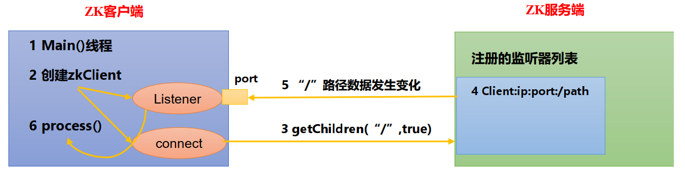

### 1、监听原理详解 

1. 首先要有一个main()线程
2. 在main线程中创建Zookeeper客户端，这时就会创建两个线程，一个负责网络连接通信（connet），一个负责监听（listener）。
3. 通过connect线程将注册的监听事件发送给Zookeeper。
4. 在Zookeeper的注册监听器列表中将注册的监听事件添加到列表中。
5. Zookeeper监听到有数据或路径变化，就会将这个消息发送给listener线程。
6. listener线程内部调用了process()方法。

### 2、常见的监听

1. 监听节点数据的变化
   get path [watch]
2. 监听子节点增减的变化
   ls path [watch]

### 3、监听机制

- 注册一次，只能监听一次。想再次监听，需要再次注册。