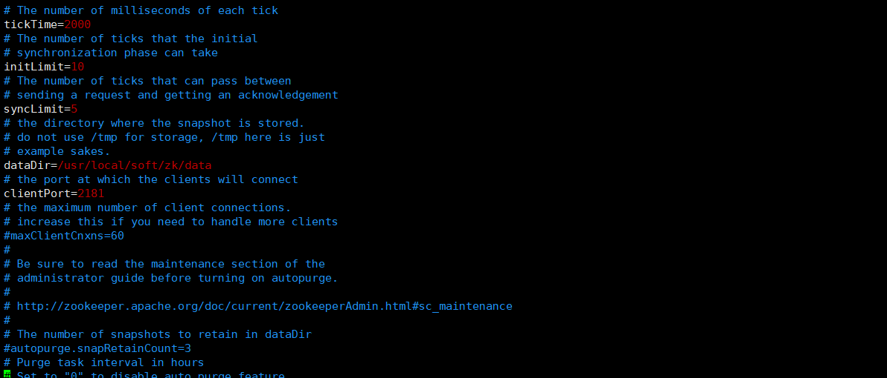
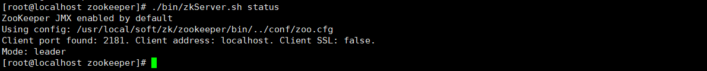

# ZooKeeper

## 一、安装

```bash
#首先要安装jdk环境
#创建目录
mkdir /usr/local/soft/zk
#下载
wget https://mirrors.tuna.tsinghua.edu.cn/apache/zookeeper/zookeeper-3.7.0/apache-zookeeper-3.7.0-bin.tar.gz
#解压
tar -xzf apache-zookeeper-3.7.0-bin.tar.gz
#重命名
mv apache-zookeeper-3.7.0-bin zookeeper
#进入conf目录，重命名文件名，否则启动报错
mv zoo_sample.cfg  zoo.cfg
vim zoo.cfg #修改dataDir为自己的目录，此目录为数据存放位置。
#启动
./bin/zkServer.sh start
#查看进程
jps -l
#停止
./bin/zkServer.sh stop
#启动客户端
./bin/zkCli.sh
#退出客户端
quit
```



## 二、配置解读

1. tickTime = 2000： 通信心跳时间， Zookeeper服务器与客户端心跳时间，单位毫秒。

   

2. initLimit = 10： Leader和Follower初始通信时限。

   

3. syncLimit = 5： Leader和Follower同步通信时限。

   

   Leader和Follower之间通信时间如果超过syncLimit * tickTime， Leader认为Follwer死掉，从服务器列表中删除Follwer。  

4. dataDir： 保存Zookeeper中数据的路径。

   注意： 默认的tmp目录，容易被Linux系统定期删除，所以一般不用默认的tmp目录。

5. clientPort = 2181：客户端连接端口，通常不做修改。

## 三、集群搭建

```bash
#集群最少要3台节点
#在存放data的目录下，创建myid文件
vi myid #在文件中添加与 server 对应的编号（注意：上下不要有空行，左右不要有空格）,三台分别设置为1，2，3
#编辑zoo.cfg配置文件
#######################cluster##########################
server.1=192.168.73.101:2888:3888
server.2=192.168.73.102:2888:3888
server.3=192.168.73.103:2888:3888
```

```bash
#cluster配置格式
server.A=B:C:D。
A 是一个数字，表示这个是第几号服务器；集群模式下配置一个文件 myid，这个文件在dataDir目录下，这个文件里面有一个数据就是A的值， Zookeeper启动时读取此文件，拿到里面的数据与zoo.cfg里面的配置信息比较从而判断到底是哪个server。
B 是这个服务器的地址；
C 是这个服务器Follower与集群中的Leader服务器交换信息的端口；
D 是万一集群中的Leader服务器挂了，需要一个端口来重新进行选举，选出一个新的Leader，而这个端口就是用来执行选举时服务器相互通信的端口。
```

- 启动后查看状态

  

## 四、客户端命令

| 命令基本语法 | 功能                                                         |
| ------------ | ------------------------------------------------------------ |
| help         | 显示所有操作命令                                             |
| ls path      | 使用  ls  命令来查看当前znode 的子节点  [可监听] <br/>-w    监听子节点变化 <br/>-s      附加次级信息 |
| create       | 普通创建 <br/>-s    含有序列 <br/>-e    临时（重启或者超时消失）<br/> 后面还可以设置节点的数据 |
| get path     | 获得节点的值  [可监听] <br/>-w    监听节点内容变化 <br/>-s      附加次级信息 |
| set          | 设置节点的具体值                                             |
| stat         | 查看节点状态                                                 |
| delete       | 删除节点                                                     |
| deleteall    | 递归删除节点                                                 |

## 五、监听机制操作

### 1、监听节点数据变化


### 2、监听子节点路径变化


