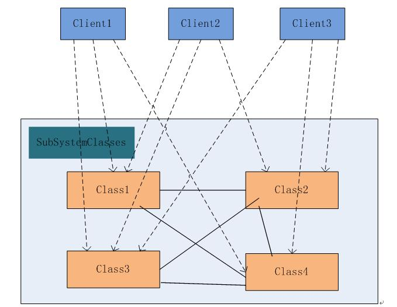
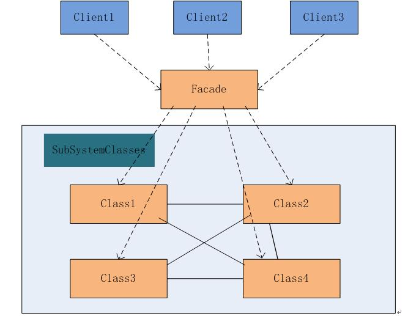
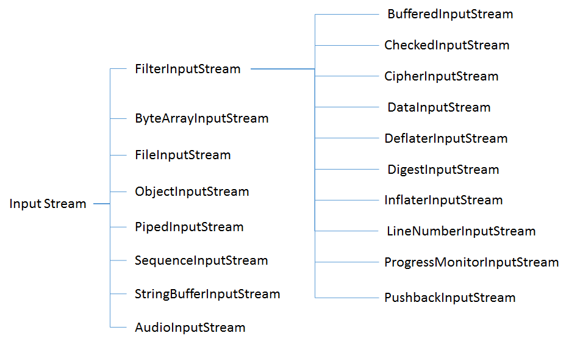
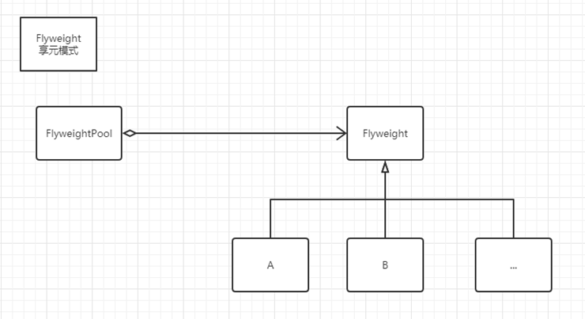
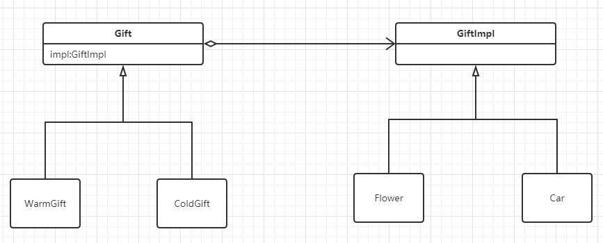
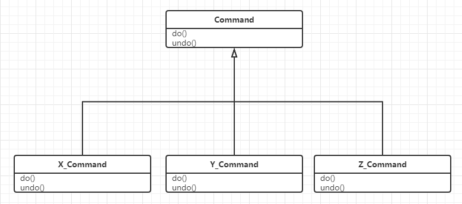
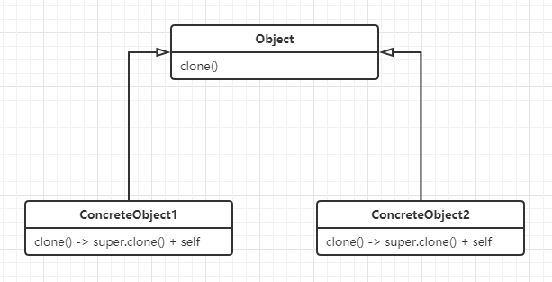
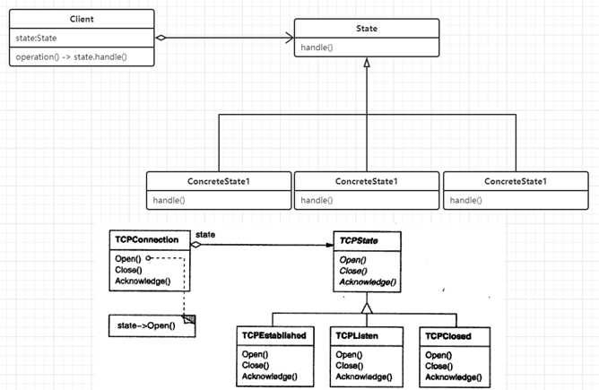
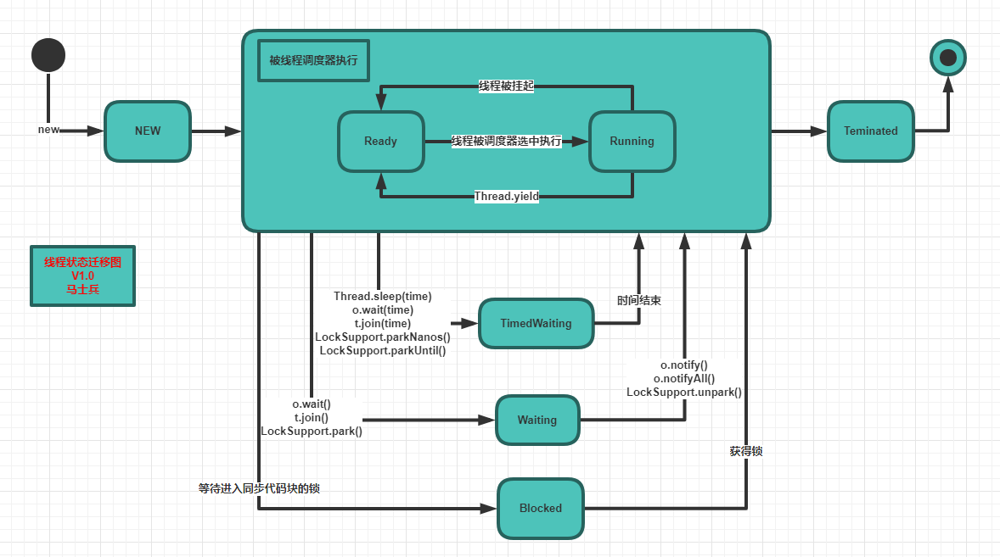

# 设计模式

## 一、单例模式

### 1.初级模式ver_1

- 操作流程：定义private 无参构造函数，防止外部可以进行实例化，内部定义静态变量，进行实例化类，可以在类加载的时候进行实例化，由虚拟机进行单例控制，一个类只会加载一次。简单方便


- 缺点：未使用类时，就已经进行了初始化，但是简单易用，还是不错的


- 代码：


```
public class Singleton01 {
	private static Singleton01 singleton01 = new Singleton01();

	private Singleton01() {
	}

	public static Singleton01 getInstance() {
		return singleton01;
	}
}
```

### 2.初级模式ver_2

- 操作流程：定义静态内部类，和模式v1类似，可以解决v1的缺点,静态内部类不会随着外部类一起进行加载，只会在外部类调用内部类的时候进行加载。推荐使用


- 代码：

  ```
  public class Singleton02 {
  	private static class Singleton02Factory {
  		private final static Singleton02 singleton02 = new Singleton02();
  	}
  
  	public static Singleton02 getInstance() {
  		return Singleton02Factory.singleton02;
  	}
  }
  ```

### 3.中级模式

- 操作流程：执行同步代码块，进行双重检查，防止A线程第一次判断实例为空，此时B线程进行访问，拿到锁，进行实例化，释放锁，最后A线程又拿到锁，重复进行实例化的问题。加volatile 可以防止指令重排。


- 代码：

  ```
  public class Singleton03 {
  	private static volatile Singleton03 singleton03;
  
  	private Singleton03() {
  	}
  
  	public static Singleton03 getInstance() {
  		if (singleton03 == null) {
  			synchronized (Singleton03.class) {
  				// **双重判断
  				if (singleton03 == null) {
  					singleton03 = new Singleton03();
  				}
  			}
  		}
  		return singleton03;
  	}
  }
  ```

### 4.高级模式

- 操作流程：定义枚举类型，只定义一个INSTANCE枚举项。jvm会控制单例，也可以访问枚举内部的方法。枚举因为没有构造方法，可以防止反序列化。


- 代码：

  ```
  public enum Singleton04 {
  	INSTANCE;
  
  	public void test() {
  		System.out.println("实例化后可执行方法");
  	}
  
  	public static void main(String[] args) {
  		for (int i = 0; i < 100; i++) {
  			new Thread(() -> {
  				Singleton04 singleton04 = Singleton04.INSTANCE;
  				System.out.println(Singleton04.INSTANCE.hashCode());
  				singleton04.test();
  			}).start();
  		}
  	}
  }
  ```

## 二、策略模式

思想：定义了一组算法，将每个算法都封装起来，并且使它们之间可以互换。

实现思路：某一种流程，比如开发票，A税率是10，B税率是12，C税率是13，整体流程一致，但是其中的具体开发票的行为，有一些差异，为了减少if else，也为了增加扩展性、清晰性，将开发票计算税率定义为一个接口。每个实现类实现自己的策略。总结起来就是将整体流程中某一个会变动的行为，抽象出来，定义接口实现。不同情况使用不同策略。

缺点：策略比较多的话，策略类也比较多，并且流程中需要清晰知道都有哪些策略。

代码：

1. 接口类，对行为进行抽象

   ```
   //将飞行定义为接口
   public interface Fly {
   	public void fly();
   }
   ```

2. 策略类

   ```
   /**
    * 慢慢的飞
    */
   class SlowFly implements Fly {
   	@Override
   	public void fly() {
   		System.out.println("慢点");
   	}
   }
   
   /**
    * 快速的飞
    */
   class FastFly implements Fly {
   	@Override
   	public void fly() {
   		System.out.println("快点");
   	}
   }
   ```

3. 使用

   ```
   class Bird {
   	public static void main(String[] args) {
   		// 我是鸟，我累了，我想慢点飞
   		Bird bird = new Bird();
   		bird.fly(new SlowFly());
   		System.out.println("终于快到达目的地了");
   		// 快到了，加速，快点飞
   		bird.fly(new FastFly());
   		System.out.println("抵达目的地");
   	}
   }
   ```

## 三、工厂模式

### 1.简单工厂（静态工厂）

- 思路：将创建类的过程交给工厂类，通过不同的参数，返回不同的实例化的子类，将创建类的过程与主要方法体进行解耦。

- 优势：简单。

- 缺点：结构单一，只能针对一种产品进行创建，并且违反了开闭原则。比如造车，新增加一个车类型，工厂类就要新增case一个条件，频繁的改动很麻烦。

- 代码：

  ```
  //1.汽车接口
  public abstract class Car {
  	public abstract String getName();
  }
  
  //具体的车型
  class BmX1Car extends Car {
  	@Override
  	public String getName() {
  		return "我是宝马X1";
  	}
  }
  
  class BmX2Car extends Car {
  	@Override
  	public String getName() {
  		return "我是宝马X2";
  	}
  }
  ```

  ```
  //2.根据不同的条件，创建不同型号的车
  class CarFactory {
  	public static Car getCar(String name) {
  		if ("X1".equals(name)) {
  			return new BmX1Car();
  		} else if ("X2".equals(name)) {
  			return new BmX2Car();
  		} else {
  			return null;
  		}
  	}
  }
  ```


### 2.工厂方法模式

- 思路：定义抽象工厂以及抽象产品。根据业务，实现具体的工厂以及具体的产品类，由具体的工厂生产具体的产品。

- 优势：对产品族友好。易于扩展产品。

- 缺点：类的数量会非常多，并且根据不同条件创建不同的工厂，提供不同的产品，这段逻辑还是很复杂，并且紧耦合

- 代码：

  ```
  //1.汽车接口
  abstract class Car {
  	public abstract String getName();
  }
  
  //具体的车型
  class BmX1Car extends Car {
  	@Override
  	public String getName() {
  		return "我是宝马X1";
  	}
  }
  
  class BmX2Car extends Car {
  	@Override
  	public String getName() {
  		return "我是宝马X2";
  	}
  }
  
  //2.定义工厂的超类
  interface AbstractCarFactory {
  	public Car getCar();
  }
  
  //2.根据不同的条件，创建不同型号的车
  class BmX1CarFactory implements AbstractCarFactory {
  	@Override
  	public Car getCar() {
  		return new BmX1Car();
  	}
  }
  
  //2.根据不同的条件，创建不同型号的车
  class BmX2CarFactory implements AbstractCarFactory {
  	@Override
  	public Car getCar() {
  		return new BmX2Car();
  	}
  }
  ```

### 3.抽象工厂模式

- 思路：和工厂模式类似，只不过在工厂超类中可以定义多个产品的实现接口。抽象工厂主要是对产品族起作用的。

- 优势：对产品族有较好扩展，比如针对汽车工厂，可以同时生产汽车、汽车的空调、汽车的座椅。适合抽象成一个工厂。比如游戏一键换肤，浏览器一键换肤，使用抽象工厂模式很有作用。规范建议->名词类使用抽象类，动词形容词类使用接口

- 备注：参考博客https://blog.csdn.net/hguisu/article/details/7505909

- 代码：

  ```
  //1.汽车接口
  abstract class Car {
  	public abstract String getName();
  }
  
  //具体的车型
  class BmX1Car extends Car {
  	@Override
  	public String getName() {
  		return "我是宝马X1";
  	}
  }
  
  class BmX2Car extends Car {
  	@Override
  	public String getName() {
  		return "我是宝马X2";
  	}
  }
  
  //2.座椅超类
  abstract class Chair {
  	public abstract String getName();
  }
  
  class LeatherwearChair extends Chair {
  	@Override
  	public String getName() {
  		return "我是皮革座椅";
  	}
  }
  
  class WoodChair extends Chair {
  	@Override
  	public String getName() {
  		return "我是木头座椅";
  	}
  }
  
  // 3.定义工厂的超类
  interface AbstractCarFactory {
  	// 生产汽车
  	public Car getCar();
  
  	// 生产汽车座椅
  	public Chair getChair();
  }
  
  // 根据不同的条件，创建不同型号的车
  class BmX1CarFactory implements AbstractCarFactory {
  	@Override
  	public Car getCar() {
  		return new BmX1Car();
  	}
  
  	@Override
  	public Chair getChair() {
  		return null;
  	}
  }
  
  // 根据不同的条件，创建不同型号的车
  class BmX2CarFactory implements AbstractCarFactory {
  	@Override
  	public Car getCar() {
  		return new BmX2Car();
  	}
  
  	@Override
  	public Chair getChair() {
  		return null;
  	}
  }
  ```

## 四、外观模式（Facade）

- 核心思想：各个子系统的调用很复杂，内部实现也很丰富，使用外观模式，定义高度集中的接口，统一管理各个子系统，将子系统内部复杂的逻辑进行封装，降低复杂性，提高可维护性。和Java思想中的封装比较类似
- 图例：
- 使用外观模式之前



- 使用外观模式之后



- 备注：参考博客https://blog.csdn.net/duchao123duchao/article/details/51425085

## 五、中介者模式(Mediator)

- 核心思想:一系列对象互相引用，改了其中的A，就有可能影响到B,C,D。改了B，就有可能影响C,D,E.为了改善这种紧耦合的情况，使用中介者模式，将类与类之间的相互引用相互调用关系，统一交给中介者类进行管理。可以降低耦合度。

- 优点：降低耦合度

- 缺点：有可能存在过度使用的情况，有时候类与类之间的复杂度并没有那么高，过度使用会反而增加了复杂度

- 代码示例：

  ```
  /** * 抽象中介者 */
  interface AbstractMediator {
  	void afterSetBNumber(int num);
  
  	void afterSetANumber(int num);
  }
  
  /** * 自定义中介者 */
  class MyMediator implements AbstractMediator {
  	private NumberB numberB;
  	private NumberA numberA;
  
  	public void setNumberB(NumberB numberB) {
  		this.numberB = numberB;
  	}
  
  	public void setNumberA(NumberA numberA) {
  		this.numberA = numberA;
  	}
  
  	@Override
  	public void afterSetBNumber(int num) {
  		numberB.setNum(num * 1000);
  	}
  
  	@Override
  	public void afterSetANumber(int num) {
  		numberA.setNum(num / 10);
  	}
  }
  
  class NumberA {
  	private int num = 0;
  	private AbstractMediator mediator;
  
  	public NumberA(AbstractMediator mediator) {
  		this.mediator = mediator;
  	}
  
  	public int getNum() {
  		return num;
  	}
  
  	/**
  	 * 将A-B类的关系交给中介者进行管理
  	 * 
  	 * @param num
  	 */
  	public void setNum(int num) {
  		this.num = num;
  		mediator.afterSetBNumber(num);
  	}
  }
  
  class NumberB {
  	private int num = 0;
  	private AbstractMediator mediator;
  
  	public NumberB(AbstractMediator mediator) {
  		this.mediator = mediator;
  	}
  
  	public int getNum() {
  		return num;
  	}
  
  	public void setNum(int num) {
  		this.num = num;
  	}
  }
  
  class Test {
  	public static void main(String[] args) {
  		MyMediator mediator = new MyMediator();
  		NumberA numberA = new NumberA(mediator);
  		NumberB numberB = new NumberB(mediator);
  		mediator.setNumberA(numberA);
  		mediator.setNumberB(numberB);
  		numberA.setNum(10);
  		System.out.println("A--" + numberA.getNum());
  		System.out.println("B--" + numberB.getNum());
  	}
  }
  ```

## 六、责任链模式

- 核心思想：可以按照工厂流水线的模式理解，一个产品从生产的开始到结束，只需要在流水线上经历一系列的处理，而每一个节点的处理，又是单独可拆卸的。每个节点负责一个业务、承担一个责任。比如表格导出Excel，设置单元格颜色、字体样式、行间距等，都是可插拔的节点，按照责任串成一条链条，逐级执行。

- 优点：将请求和处理进行分离，不需要知道内部是怎么实现的。

- 代码：

  ```
  class GameObject {
  	// 实体对象
  }
  
  //定义链条的接口
  interface TankChain {
  	public void doChain(GameObject gameObject);
  }
  
  //定义链条节点的集合
  class ChainColletion implements TankChain {
  	private List<TankChain> chains = new ArrayList<>();
  
  	public ChainColletion() {
  		// 增加处理类
  		chains.add(new Chain1());
  		chains.add(new Chain2());
  	}
  
  	/**
  	 * 添加节点
  	 * @param chain
  	 */
  	public void addChain(TankChain chain) {
  		chains.add(chain);
  	}
  
  	@Override
  	public void doChain(GameObject gameObject) {
  		for (int i = 0; i < chains.size(); i++) {
  			TankChain tankChain = chains.get(i);
  			tankChain.doChain(gameObject);
  		}
  	}
  
  	// 节点
  	class Chain1 implements TankChain {
  		@Override
  		public void doChain(GameObject gameObject) {
  		}
  	}
  
  	class Chain2 implements TankChain {
  		@Override
  		public void doChain(GameObject gameObject) {
  		}
  	}
  
  	class Test {
  		public void main(String[] args) {
  			ChainColletion chains = new ChainColletion();
  			GameObject object = new GameObject();
  			chains.doChain(object);
  		}
  	}
  }
  ```

  

## 七、过滤器模式

- 核心思想：针对一个请求，可以有多个对象对请求做出处理。可以类比servlet的filter 过滤器。一个请求，会由多个过滤器进行处理。每个过滤器做filter校验，校验不通过，则直接返回false。和责任链模式比较相似。也可以理解成坦克大战中，一颗子弹是否会消亡，需要经过多个判断，比如是否撞上坦克，是否撞墙上，等等，这些处理就可以通过一个链条来实现。当某一步判断消亡，就不再进行下去。

- 代码：

  ```
  class GameObject {
  	// 实体对象
  }
  
  //定义链条的接口
  interface TankChain {
  	public boolean doFilter(GameObject gameObject);
  }
  
  //定义链条节点的集合
  class ChainFilter implements TankChain {
  	private List<TankChain> filters = new ArrayList<>();
  
  	public ChainFilter() {
  		// 增加处理类
  		filters.add(new Filter1());
  		filters.add(new Filter2());
  	}
  
  	/** * 也可以放链条，也可以放某一个节点 * @param chain */
  	public void addChain(TankChain chain) {
  		filters.add(chain);
  	}
  
  	@Override
  	public boolean doFilter(GameObject gameObject) {
  		for (int i = 0; i < filters.size(); i++) {
  			TankChain tankChain = filters.get(i);
  			// 拿到链条中的节点，若节点处理结果为false，则不再进行下去
  			boolean result = tankChain.doFilter(gameObject);
  			if (!result) {
  				break;
  			}
  		}
  		return false;
  	}
  
  	// 节点
  	class Filter1 implements TankChain {
  		@Override
  		public boolean doFilter(GameObject gameObject) {
  			return false;
  		}
  	}
  
  	class Filter2 implements TankChain {
  		@Override
  		public boolean doFilter(GameObject gameObject) {
  			return false;
  		}
  	}
  
  	class Test {
  		public void main(String[] args) {
  			ChainFilter filter = new ChainFilter();
  			GameObject object = new GameObject();
  			// 过滤校验
  			filter.doFilter(object);
  		}
  	}
  }
  ```

## 八、装饰模式

- 核心思想：动态给一个对象添加一些额外的职责。一般可以用继承实现扩展功能，但是Java中只可以继承一个类，并且扩展一个功能增加一个子类，那如果功能比较多，子类也会很多。并且也不能满足需求，比如墙面需要红色，红色上还要白色花，这时候继承的方式就不灵活了。所以可以通过将扩展类和原始类实现同一个接口，一个扩展类扩展一个功能，并且功能可以嵌套使用，类似于Java中的I/O inputstream
- 优点：扩展功能可以更灵活
- 要点： 装饰者与被装饰者拥有共同的超类，继承的目的是继承类型，而不是行为。



1. ByteArrayInputStream负责处理字节数组
2. FileInputStream负责处理文件
3. ObjectInputStream负责处理被序列化的对象
4. PipedInputStream负责处理其他线程的输入流
5. SequenceInputStream负责处理多个输入流合并成一个流，比如含有流的集合
6. StringBufferInputStream负责读取StringBuffer中的数据
7. AudioInputStream负责处理音频流

- 代码：

  ```
  /** * 定义被装饰者 */
  interface Human {
  	public void wearClothes();
  
  	public void walkToWhere();
  }
  
  class Decorator_first implements Human {
  	private Human human;
  
  	public Decorator_first(Human human) {
  		this.human = human;
  	}
  
  	public void goClothespress() {
  		System.out.println("去衣柜找找看。。");
  	}
  
  	public void findPlaceOnMap() {
  		System.out.println("在Map上找找。。");
  	}
  
  	@Override
  	public void wearClothes() {
  		human.wearClothes();
  		goClothespress();
  	}
  
  	@Override
  	public void walkToWhere() {
  		human.walkToWhere();
  		findPlaceOnMap();
  	}
  }
  
  class Decorator_two implements Human {
  	private Human human;
  
  	public Decorator_two(Human human) {
  		this.human = human;
  	}
  
  	public void findClothes() {
  		System.out.println("找到一件D&G。。");
  	}
  
  	public void findTheTarget() {
  		System.out.println("在Map上找到神秘花园和城堡。。");
  	}
  
  	@Override
  	public void wearClothes() {
  		human.wearClothes();
  		findClothes();
  	}
  
  	@Override
  	public void walkToWhere() {
  		human.walkToWhere();
  		findTheTarget();
  	}
  }
  
  class Decorator_zero implements Human {
  	private Human human;
  
  	public Decorator_zero(Human human) {
  		this.human = human;
  	}
  
  	public void goHome() {
  		System.out.println("进房子。。");
  	}
  
  	public void findMap() {
  		System.out.println("书房找找Map。。");
  	}
  
  	@Override
  	public void wearClothes() {
  		human.wearClothes();
  		goHome();
  	}
  
  	@Override
  	public void walkToWhere() {
  		human.walkToWhere();
  		findMap();
  	}
  }
  
  class Person implements Human {
  	@Override
  	public void wearClothes() {
  		System.out.println("穿什么呢。。");
  	}
  
  	@Override
  	public void walkToWhere() {
  		System.out.println("去哪里呢。。");
  	}
  }
  
  class Test {
  	public static void main(String[] args) {
  		Human person = new Person();
  		// 类似于inputstream
  		Decorator_zero decorator = new Decorator_zero(new Decorator_first(new Decorator_two(person)));
  		decorator.wearClothes();
  		decorator.walkToWhere();
  	}
  }
  ```

## 九、观察者模式

- 核心思想：类似于eventListener，各种listener。被观察者发出一个事件，所有注册的观察者都可以接收到通知。需要注意的是，发出的事件中要带有事件源。这样观察者可以根据不同的事件源做出不同的反应，类似于各种事件监听中的event，都会带有事件源。其中观察者和事件，都可以定义为超类，便于扩展。

- 优点：应用广泛，便于扩展，spring中的事件应用的就是观察者模式。

- 代码：

  ```
  /** * 定义观察者超类 */
  interface Observer {
  	public void doWork(Event event);
  }
  
  class FatherObserver implements Observer {
  	@Override
  	public void doWork(Event event) {
  		if (event instanceof CryEvent) {
  			System.out.println("爸爸抱");
  		}
  	}
  }
  
  /**
   * 事件超类
   * 
   * @author lenovo
   *
   * @param <T>
   */
  interface Event<T> {
  	public T getSource();
  }
  
  class CryEvent implements Event<Child> {
  	private Child child;
  
  	public CryEvent(Child child) {
  		this.child = child;
  	}
  
  	@Override
  	public Child getSource() {
  		return this.child;
  	}
  }
  
  class Child {
  	private List<Observer> list = new ArrayList<>();
  
  	public static void main(String[] args) {
  		Child child = new Child();
  		child.add(new FatherObserver());
  		if (child.isCry()) {
  			for (int i = 0; i < child.list.size(); i++) {
  				// 发送事件
  				CryEvent cryEvent = new CryEvent(child);
  				child.list.get(i).doWork(cryEvent);
  			}
  		}
  	}
  
  	private void add(Observer observer) {
  		this.list.add(observer);
  	}
  
  	public boolean isCry() {
  		return true;
  	}
  }
  ```

## 十、Composite组合模式

- 核心思想：

​             构建带层次的树状结构。Root ->Chapter1

​                                                                                     ->Node1-1

​                                                                                     ->Node1-2

​                                                                      ->Chapter2

​                                                                                     ->Node2-1

​                                                                                     ->Node2-2

​                 分支内部可以存储节点。

- 代码：

  ```
  /** * 定义树节点 */
  abstract class Node {
  	abstract public void p();
  }
  
  class BranchNode extends Node {
  	private String content;
  	// 组合
  	private List<Node> list = new ArrayList<>();
  
  	public BranchNode(String content) {
  		this.content = content;
  	}
  
  	@Override
  	public void p() {
  		System.out.println(content);
  	}
  
  	public void addNode(Node node) {
  		this.list.add(node);
  	}
  
  	public List<Node> getLeafs() {
  		return list;
  	}
  }
  
  class LeafNode extends Node {
  	private String content;
  
  	public LeafNode(String content) {
  		this.content = content;
  	}
  
  	@Override
  	public void p() {
  		System.out.println(content);
  	}
  }
  
  class Test {
  	public static void main(String[] args) {
  		BranchNode root = new BranchNode("root");
  		BranchNode chapter1 = new BranchNode("chapter1");
  		BranchNode chapter2 = new BranchNode("chapter2");
  		LeafNode leafNode1 = new LeafNode("leaf1-1");
  		LeafNode leafNode2 = new LeafNode("leaf1-2");
  		LeafNode leafNode3 = new LeafNode("leaf2-1");
  		LeafNode leafNode4 = new LeafNode("leaf1-2");
  		root.addNode(chapter1);
  		root.addNode(chapter2);
  		chapter1.addNode(leafNode1);
  		chapter1.addNode(leafNode2);
  		chapter2.addNode(leafNode3);
  		chapter2.addNode(leafNode4);
  		tree(root);
  	}
  
  	private static void tree(Node root) {
  		root.p();
  		if (root instanceof BranchNode) {
  			BranchNode branchNode = (BranchNode) root;
  			List<Node> leafs = branchNode.getLeafs();
  			leafs.stream().forEach(item -> {
  				tree(item);
  			});
  		}
  	}
  }
  ```

## 十一、Flyweight享元模式

- 核心思想：类似于池化的思想，在一个池子里放置许多对象，谁用谁取，用完再放回来

- 优点：池化。JAVA中的string用的就是享元模式。

- 缺点： 用的比较少，一般用做代码编译器开发，类似于IDEA

- 类图：

  

## 十二、Builder构建器模式

- 核心思想：分离复杂对象的构建和表示，同样的构建过程可以创建不同的表示。适用于有超多个参数需要设置的情况。并且每个方法可以返回构建器本身，这样就可以链式调用了，es java客户端构建条件、stringbuilder的append。

- 代码：

  ```
  /** * 要构建的对象 */
  class Person {
  	private String name;
  	private String sex;
  	private String age;
  	private String face;
  	private String foot;
  
  	/** * 构建器 */
  	interface PersonBuilder {
  		// 返回自身，方便链式构建
  		PersonBuilder builderBase();
  
  		PersonBuilder builderCloth();
  
  		Person build();
  	}
  }
  
  class HandsomeBuilder implements PersonBuilder {
  	Person person = new Person();
  
  	@Override
  	public PersonBuilder builderBase() {
  		person.setName("张三");
  		person.setAge("26");
  		return this;
  	}
  
  	@Override
  	public PersonBuilder builderCloth() {
  		person.setSex("男");
  		return this;
  	}
  
  	@Override
  	public Person build() {
  		return person;
  	}
  }
  
  class Test {
  	public static void main(String[] args) {
  		PersonBuilder builder = new HandsomeBuilder();
  		// 链式构建
  		Person person = builder.builderBase().builderCloth().build();
  		System.out.println(person);
  	}
  }
  ```

## 十三、适配器模式

## 十四、Bridge桥接模式

- 核心思想：用聚合代替继承，分离抽象和具体。两边同时发展，通过中间桥进行连接。（聚合方式）比如礼物，有书，有花，有温柔的书，温柔的花。就分两个分支，一个是书、花具体的事物，一个是温柔的、冷酷的，抽象的分支。并行发展，最终通过聚合，实现温柔（书） 温柔（花），冷酷（书），冷酷（花）

- 优点： 避免类数量太多，类爆炸。

- 类图：

  

- 代码：

  ```
  /** * 两个分支的共同超类，实现聚合，需要内部有引用 */
  abstract class Gift {
  	GiftImpl impl;
  }
  
  class GiftImpl extends Gift {
  }
  
  /** * 抽象分支 */
  class WarmGift extends Gift {
  	public WarmGift(GiftImpl impl) {
  		this.impl = impl;
  	}
  }
  
  /** * 抽象分支 */
  class WildGift extends Gift {
  	public WildGift(GiftImpl impl) {
  		this.impl = impl;
  	}
  }
  
  /** * 具体的分支 */
  class Flower extends GiftImpl {
  }
  
  /** * 具体的分支 */
  class Book extends GiftImpl {
  }
  
  class Test {
  	public static void main(String[] args) {
  		// 温暖的花
  		Gift g = new WarmGift(new Flower());
  	}
  }
  ```

## 十五、Command封装命令

- 设计思想：主要用来做undo事件，事件回退，Ctrl+Z .主要是要记录当前做了什么，以及加一个回退的方法。比如记录了字符串+111.这个111就要缓存起来，undo的时候，字符串+111得到的新字符串再-111 又变成原先的样子了。多次undo，可以和责任链模式组合起来用。

- 类图：

  

- 代码：

  ```
  /** * 定义接口，定义undo回退 */
  interface StrOperation {
  	void append(String str);
  
  	void undo();
  }
  
  class Command_1 implements StrOperation {
  	String str = "";
  	// 记录下来操作
  	String contentTemp;
  
  	@Override
  	public void append(String str) {
  		this.str = str;
  		this.contentTemp = str;
  	}
  
  	@Override
  	public void undo() {
  		// 把增加的操作，减回去
  		this.str.substring(0, this.str.length() - this.contentTemp.length());
  	}
  }
  ```

## 十六、Prototype原型模式

- 核心思想：克隆对象，实现Cloneable接口。重写clone()方法

- 类图：

  

- 代码：

  ```
  /**
   * 需要注意引用对象克隆的时候也要克隆，否则是浅克隆。 * A克隆B A中的引用对象的引用变了，B中的也会跟着变。string不会
   * 
   * @author lijingyu
   *
   */
  class Person implements Cloneable {
  	@Override
  	protected Object clone() throws CloneNotSupportedException {
  		return super.clone();
  	}
  }
  ```

## 十七、模板方法设计模式

- 核心思想：对于一个固定流程的算法，可以定义一个超类进行实现，其中的某几个细节，可以开放给子类实现。这样就可以不改变算法的步骤，但是可以动态的扩展实现，这个方法用的比较多

- 代码：

  ```
  abstract class Template {
  	public void doWork() {
  		work1();
  		work2();
  		work3();
  	}
  
  	private void work1() {
  		System.out.println("1111");
  	}
  
  	private void work2() {
  		System.out.println("1111");
  	}
  
  	/** * 交给子类自定义实现 */
  	abstract void work3();
  }
  ```

## 十八、state状态模式

- 核心思想：许多个方法，根据状态的不同，会有不同的行为，此时可以将状态抽象出来。单独定义成抽象类，不同的状态行为组合，定义为子类，这样就可以调用子类实现行为了。

- 类图：

  



