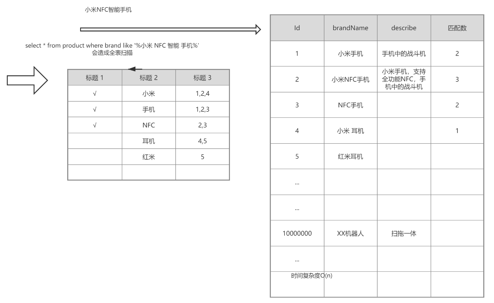
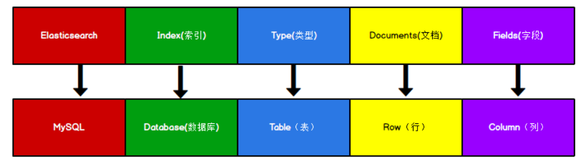

# **Elasticsearch**

## 一、核心概念

### 1.1倒排索引



关系型数据库的正向索引，根据id可以定位到具体的某一条数据，是key-value模型。

倒排索引是反过来，将数据进行分词拆分，查找的时候根据某个词汇，按照相关度最终定位到id。类似value-key模型。

比如对brandName字段建立倒排索引，会对每条记录进行分词，并记录这个词汇出现在哪条记录中，“小米”出现在1、2、3中，"NFC"出现在2、3中。

倒排索引的结构：

- 包含这个关键词的document list
- TF term frequency:词频，搜索的关键词在每个doc中出现的次数，次数越多，代表相关性越高
- IDF inverse doc frequency：搜索的关键词在整体倒排索引中出现的次数，出现的次数越多，代表相关性越低，关键词越不重要，比如“是”、“了”这类词汇，就是非常不重要的数据。
- 每个doc的长度：越长相关度越低。
- 包含这个关键词的所有doc的平均长度。

### 1.2优势

- 面向开发者友好，屏蔽了Lucene的复杂特性，集群自动发现（cluster discovery）
- 自动维护数据在多个节点上的建立
- 会帮我们做搜索请求的负载均衡
- 自动维护冗余副本，保证了部分节点宕机的情况下仍然不会有任何数据丢失
- ES基于Lucene提供了很多高级功能：复合查询、聚合分析、基于地理位置等。
- 对于大公司，可以构建几百台服务器的大型分布式集群，处理PB级别数据；对于小公司，开箱即用，门槛低上手简单。
- 相比较传统数据库，提供了全文检索，同义词处理（美丽的cls>漂亮的cls），相关度排名。聚合分析以及海量数据的近实时（NTR）处理，这些传统数据库完全做不到。

### 1.3核心关键词



#### elasticsearch

elasticsearch相当于关系型数据库MySQL，是一个存储数据、提供搜索查询功能的整体应用程序。

#### index

索引。类似于数据库——它是我们存储和索引关联数据的地方。其实也可以按照一张数据库表的概念来理解。一个index会存储一类事务的数据，比如dog_index，会存储所有dog的数据。

```
提示：事实上，我们的数据被存储和索引在分片(shards)中，索引只是一个把一个或多个分片分组在一起的逻辑空间。然而，这只是一些内部细节——我们的程序完全不用关心分片。对于我们的程序而言，文档存储在索引(index)中。剩下的细节由Elasticsearch关心既可。
```

#### type

类型。可参照数据库中的table表的概念来理解，拥有自己的mapping结构。拥有field字段、属性等信息，但是在es7中逐渐被废弃，在es8中将被彻底废弃。一般es会默认设置type值为_doc。

#### document

- 存储在Elasticsearch中的主要实体叫文档（document）。用关系型数据库来类比的话，一个文档相当于数据库表中的一行记录，是json格式。
- Elasticsearch中的文档，可以有不同的mapping结构，但Elasticsearch的文档中，相同字段必须有相同类型。比如存储两条数据的时候，name字段的类型必须相同，不能一个是string，另一个integer。
- 文档由多个字段组成，每个字段可能多次出现在一个文档里，这样的字段叫多值字段（multivalued）。 每个字段的类型，可以是文本、数值、日期等。字段类型也可以是复杂类型，一个字段包含其他子文档或者数组。

#### field

字段。和MySQL中的字段类似，也有自己的类型，数据结构。

#### node

节点，一个ES实例就是一个node。不同的node可以建立在同一台物理机上，但是为了更好的性能，一般一台物理机上只会配置一个es实例，不会安装其他服务。

### 1.4shard分片和副本

为了将数据添加到Elasticsearch，我们需要索引(index)——一个存储关联数据的地方。实际上，索引只是一个用来指向一个或多个分片(shards)的“逻辑命名空间(logical namespace)”.

- 一个分片(shard)是一个最小级别“工作单元(worker unit)”,它只是保存了索引中所有数据的一部分。
- 我们需要知道是分片就是一个Lucene实例，并且它本身就是一个完整的搜索引擎。应用程序不会和它直接通信。
- 分片可以是主分片(primary shard)或者是复制分片(replica shard)。
- 索引中的每个文档属于一个单独的主分片，所以主分片的数量决定了索引最多能存储多少数据。
- 复制分片只是主分片的一个副本，它可以防止硬件故障导致的数据丢失，同时可以提供读请求，比如搜索或者从别的shard取回文档。
- 当索引创建完成的时候，主分片的数量就固定了，但是复制分片的数量可以随时调整。
- 副本分片可以提供硬件故障时的容灾以及防止数据丢失，所以主分片和副本分片是不能在同一个es 实例node中的。

## 二、安装和配置

